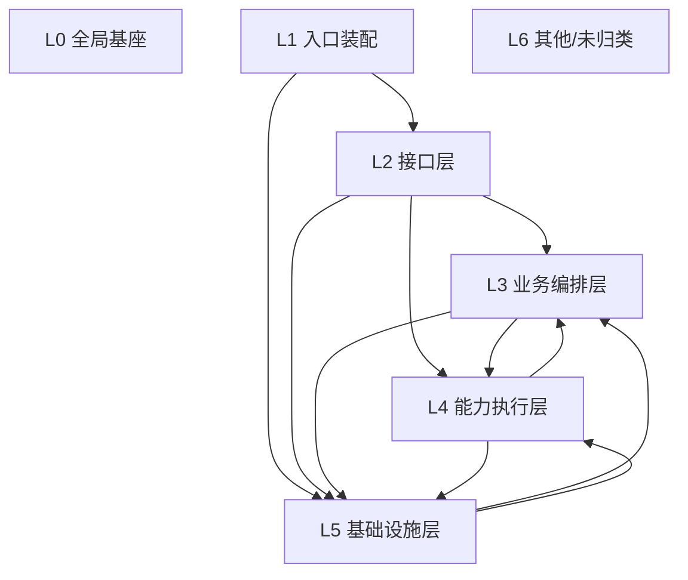

# AIDBM 代码图谱（Code Graph）

> **自动生成，请勿手改**：由 `scripts/gen_code_graph.py` 基于 AST 静态分析生成。  
> 生成时间：2026-09-19 11:24:47 ｜ Python 文件 172 个 ｜ 后端代码 72965 行 ｜ 模板 33 个（7972 行） ｜ 前端 JS 12 个（11913 行）  
> 机器可读索引：`docs/code_graph.json`。增量变更：`python scripts/gen_code_graph.py --diff`。

---

## 0. 五分钟速读（先读这里）

**技术栈**：Python + Flask（Jinja2 模板 + Bootstrap 5 + 原生 JS，复杂页用 Preact+htm 免构建） ｜ 元数据库 SQLite ｜ APScheduler 进程内调度 ｜ 远程执行走 SSH/paramiko。

**核心架构约束**（改代码前必须知道）：
1. 客户端零安装：所有工具/驱动/依赖只装在**平台侧**，远端数据库服务器不装任何 agent。  
2. 完全离线自足：禁止联网下载依赖，最终交付为离线包（含 PyInstaller 打包）。  
3. 不仿真：备份/恢复必须真实执行，失败就报失败（只剩显式 DEMO 场景允许仿真）。

**最该先认识的 10 个模块**：

| 模块 | 行数 | 为什么重要 |
|---|---|---|
| `app.py` | 382 | Flask 应用装配：注册蓝图、页面路由、全局异常/鉴权、登陆锁定 |
| `config.py` | 422 | 全局配置项与默认值（几乎所有环境变量开关在这里） |
| `core/db.py` | 1663 | 元数据库：连接、建表、加解密、日志写入 |
| `core/models.py` | 2874 | 备份任务/记录/恢复记录的唯一数据读写出口 |
| `core/scheduler.py` | 1486 | APScheduler 调度：触发备份、并发控制、reload |
| `core/engines/base.py` | 1680 | 所有数据库引擎的基类：run_backup/run_restore 统一契约 |
| `core/engines/__init__.py` | 291 | 引擎注册表：db_type -> Engine 类的动态分发 |
| `core/remote_dump.py` | 2895 | 远端/本机命令执行层：SSH、工具路径解析、流式落盘 |
| `core/storage.py` | 97 | 备份产物落盘与多后端存储抽象 |
| `core/rt_backup/db_rt.py` | 742 | 实时备份（CDC/CDP）任务编排核心 |

## 0.1 数据可信度（先看完这一段再信上面的表）

图谱里的条目来自三类来源，**可信度不同**：

| 来源 | 涵盖内容 | 说明 |
|---|---|---|
| ① AST 确证（可信事实） | 模块/符号/行号、import 依赖、@route 装饰器的 URL 与 handler、class/def 签名、docstring、CTE 之外的 SQL 表名 | 直接读 `ast.parse` 结果，与源码严格一致 |
| ② 行号/正则估计（可能偏） | §8 的读写次数（字符串计数，同一模板多处复用会重复计数）、§7 模板引用的静态资源、§13 第三方包 | 正则匹配，**可能重复或漏**，仅用于判断热度/范围，不是精确值 |
| ③ 人工维护的领域注解（会过期） | §0 核心模块、§5 运行时拓扑、§9 业务链路、§10 改动指引、§11 扩展点 | 写在脚本常量里，**每次生成都会校验**，失效即标记 ⚠/❌ |

### 本次生成发现 1 个可信度问题（ERROR 0 / WARN 1）

> 出现 ERROR 意味着图谱里有**不可信或缺失**的数据，`--strict` 模式下脚本会以非 0 退出（可用于 CI/提交钩子）。

| 级别 | 类型 | 说明 |
|---|---|---|
| WARN | 环枚举不完整 | 简单环枚举触达上限（只保留了长度 ≤5 的环），**完整结论请看上面的强连通分量**，不要把这里的数量当成全部 |

## 1. 分层架构

层职责速查：

| 层 | 职责 | 典型位置 |
|---|---|---|
| L0 全局基座 | 谁都能依赖的配置/元库/模型/鉴权 | config.py、auth.py、core/db.py、core/models.py |
| L1 入口装配 | Flask 应用装配与启动 | app.py、init_db.py |
| L2 接口层 | REST 路由、参数校验、JSON 出入参 | api/*.py |
| L3 业务编排层 | 备份/迁移/克隆/联动等跨模块流程 | core/ 下其余模块 |
| L4 能力执行层 | 数据库引擎、CDC、实时、同步、虚拟机、存储后端 | core/engines、core/cdc、core/rt_backup、core/sync、core/vm |
| L5 基础设施层 | 远端执行、RBAC、连接驱动、通知、插件包 | core/remote_dump.py、core/rbac.py、core/jdbc.py … |

**依赖方向规矩**：`L1 → L2 → L3 → L4 → L5`（数字越大越底层；允许跨层向下，禁止反向依赖更高层；`L0` 全局基座任何层都可以直接用）。实际违规见 §4.2。

## 2. 模块清单与依赖（按层）

列含义：**依赖↑** = 本文件 import 的内部模块数（出度）；**被依赖↓** = 有多少内部文件 import 了它（入度，越高越动不得）。

### L0 全局基座（6 个模块，5488 行）

| 模块 | 行数 | 依赖↑ | 被依赖↓ | 职责（模块 docstring） |
|---|---|---|---|---|
| `core/models.py` | 2874 | 3 | 66 | 数据访问层：备份任务、备份记录、恢复记录、系统日志的读写。 对外返回 dict（便于 JSON 序列化）。密码等敏感字段默认不回显， 仅当 include_secret=True（内部引擎/调度使用）才返回明文。 |
| `core/db.py` | 1663 | 2 | 92 | SQLite 元数据库封装：连接、建表、加密与工具函数。 AIDBM 自身元数据（任务、记录、日志）存放在 SQLite，零外部依赖、开箱即用。 真实数据库备份文件存放在 config.BACKUP_ROOT 下的本地或 |
| `core/logging_setup.py` | 436 | 1 | 6 | 统一日志基础设施（源码运行 / PyInstaller 可执行文件 / Docker 容器通用）。 设计目标：**任何一次失败都能在事后被定位**，不要求用户能复现。 关键能力 -------- 1. **日志目录可写性 |
| `config.py` | 422 | 1 | 58 | 全局配置。 优先级：代码默认值 < 环境变量 < config.json（若存在）。 生产环境请通过环境变量或 config.json 覆盖 SECRET_KEY / WEB_PASSWORD 等敏感项， 不要直接把明文 |
| `auth.py` | 90 | 2 | 35 | 登录鉴权：页面走 Flask session；外部系统走 Bearer API Token（api_tokens 表）。 session["user"] 结构（RBAC 后） ---------------------- |
| `core/__init__.py` | 3 | 0 | 0 | AIDBM（AI 原生智能数据库灾备管理平台）- 核心包。 |

### L1 入口装配（2 个模块，395 行）

| 模块 | 行数 | 依赖↑ | 被依赖↓ | 职责（模块 docstring） |
|---|---|---|---|---|
| `app.py` | 382 | 7 | 0 | Flask 应用主程序。 职责： - 初始化元数据数据库（SQLite） - 注册 REST API 蓝图 - 提供页面路由（仪表盘 / 任务 / 记录 / 恢复 / 设置 / 登录） |
| `init_db.py` | 13 | 2 | 0 | 初始化元数据数据库（SQLite）：创建任务、记录、恢复、日志等表。 用法： python init_db.py |

### L2 接口层（35 个模块，7737 行）

| 模块 | 行数 | 依赖↑ | 被依赖↓ | 职责（模块 docstring） |
|---|---|---|---|---|
| `api/system.py` | 1074 | 12 | 1 | 系统/仪表盘/调度/日志/元信息 API。 |
| `api/storage.py` | 537 | 7 | 1 | 存储目标管理 API：CRUD + 连接测试 + 三级复制。 路由前缀: /api/storage（通过共享 api_bp 注册） 提供存储目标的增删改查、连接测试、设为默认、手动触发复制等接口。 敏感字段（secret |
| `api/rt.py` | 461 | 4 | 1 | 准 CDP 实时备份 REST API。 统一挂载在 ``api_bp`` 上，对外路由前缀 ``/api/rt/``（不新建独立蓝图）。 路由一览： ================================== |
| `api/datamining.py` | 450 | 6 | 1 | 数据价值挖掘 API。 能力分层： 1) 资产盘点 /api/datamining/inventory —— 盘点 → 分级 → 价值评估 → 治理建议 2) 敏感发现 /api/datamining/sensors/s |
| `api/tasks.py` | 387 | 10 | 1 | 备份任务相关 API：增删改查、立即执行、模板下载、批量导入。 |
| `api/logs.py` | 365 | 7 | 1 | 日志与诊断 API。 排查入口（失败可定位） ---------------------- 1. 系统日志 GET /api/logs —— 已支持 task_id / record_id / q / since 过滤  |
| `api/link.py` | 354 | 4 | 1 | 容灾链路 HA API（DisasterLinkEngine）。 路由前缀: /api/disaster-links（通过共享 api_bp 注册） - GET /api/disaster-links 列表（含数据源回显 |
| `api/sync.py` | 350 | 7 | 1 | 数据同步 API（DataX/LinkUp 风格：Reader/Writer + 字段映射）。 |
| `api/records.py` | 348 | 5 | 1 | 备份记录与下载 API。 |
| `api/vm.py` | 299 | 5 | 1 | 虚拟机备份 REST API（路由前缀 /api/vm）。 设计原则：**所有能力都如实暴露**——前端据此禁用不支持的按钮，而不是让用户 点了才发现不支持。Provider 抛 VMProviderError 一律转  |
| `api/plugins.py` | 277 | 6 | 1 | 备份依赖插件管理 API：一键安装/卸载/查询外部备份客户端。 支持主机维度：通过 host_id 参数指定目标 SSH 主机，安装/卸载/查询均按 「主机 × 插件」二维维度操作。host_id 为空时兼容旧的平台本机 |
| `api/db_adapters.py` | 266 | 5 | 1 | 可插拔数据库类型（Database Adapter）的 CRUD/测试/模板 API。 |
| `api/data_compare.py` | 210 | 4 | 1 | 数据对比（恢复数据 vs 生产库）API。 |
| `api/jdbc.py` | 193 | 6 | 1 | JDBC 连接方式 API：连接测试、拉取库列表、能力状态。 设计：保持「原有连接方式（SSH/本机客户端）优先」，本模块提供显式的 JDBC 通道（测试/拉库），供任务表单、连接诊断与引擎兜底使用。 |
| `api/cdc.py` | 180 | 4 | 1 | 行级 CDC API：捕获流管理 + 事件查询 + CDP 任意时间点回放/回滚。 路由前缀 /api/cdc（通过共享 api_bp 注册）。 |
| `api/ai_alert.py` | 172 | 5 | 1 | AI 预测告警 API（AIPredictor）。 路由前缀: /api/alerts（通过共享 api_bp 注册） - GET /api/alerts/predictions 预测列表（支持 ?metric= 过滤） |
| `api/restore_extras_api.py` | 170 | 5 | 1 | 高级恢复 API：PITR / 对象级 / 副本克隆（VDB）。 |
| `api/ai_agent.py` | 135 | 7 | 1 | AI 智能助手 REST API 路由。 路由前缀: /api/agent（通过共享 api_bp 注册） - POST /api/agent/sessions 创建会话 - GET /api/agent/session |
| `api/migration.py` | 134 | 6 | 1 | 迁移全流程保护 API：迁移计划的增删查 + 三阶段（pre/mid/post）触发 + 黄金点验证。 路由前缀: /api/migration（通过共享 api_bp 注册） |
| `api/deploy.py` | 132 | 5 | 1 | 数据库部署 API：增删改查、立即执行、安装包上传。 |
| `api/rbac.py` | 132 | 3 | 1 | RBAC API：当前用户、用户 CRUD、权限点/角色定义、修改密码。 |
| `api/inspection.py` | 126 | 7 | 1 | 备份任务巡检 API：触发巡检、查询巡检记录、导出、调度。 |
| `api/policy.py` | 118 | 3 | 1 | 保护策略管理 API：CRUD + 任务绑定。 路由前缀: /api/policy（通过共享 api_bp 注册） 提供保护策略的增删改查，以及将策略批量绑定/解绑到备份任务的能力。 敏感字段脱敏风格保持与本平台一致（本 |
| `api/clone.py` | 112 | 3 | 1 | 克隆服务 API：克隆申请 / 审批 / 驳回 / 销毁 / 到期，以及查询。 路由前缀: /api/clone（通过共享 api_bp 注册） - POST /api/clone 申请克隆 - GET /api/clo |
| `api/drills.py` | 102 | 5 | 1 | 容灾演练 API：排程、执行、评估、趋势、基线。 |
| `api/restore.py` | 100 | 7 | 1 | 数据恢复 API。 |
| `api/restore_verify.py` | 99 | 4 | 1 | 恢复校验策略与恢复测试报告 API。 |
| `api/itsm.py` | 87 | 6 | 1 | ITSM 联动 API：工单查询 + 平台内审批（审批结果回写 clone_requests / migration_plans）。 路由前缀: /api/itsm（通过共享 api_bp 注册） - GET /api/ |
| `api/tape.py` | 82 | 4 | 1 | 磁带库（D2T）API。 路由前缀: /api/tape - GET /api/tape/status 磁带目标状态（设备 mt status / 模拟带列表） - GET /api/tape/files?target_ |
| `api/__init__.py` | 71 | 35 | 34 | REST API 蓝图聚合。 |
| `api/hosts.py` | 61 | 3 | 1 | SSH 主机纳管 API：增删改查 + 连接测试。 |
| `api/synthesize.py` | 52 | 4 | 1 | 自动合成全量 API：手动触发 / 状态概览。 落实 CDM "系统内自动合成全量"：永远增量 → 定期合成全量， 中间增量副本由 lifecycle 按 chain_status='merged' 回收。 路由前缀:  |
| `api/dedup.py` | 51 | 5 | 1 | 全局重删 API（参照鼎甲迪备白皮书 §2.4 全局重删）。 路由前缀: /api/dedup - GET /api/dedup/stats 全局重删统计（重删比 / 累计节省 / 唯一块数） - POST /api/d |
| `api/lifecycle.py` | 44 | 4 | 1 | 冷热分级生命周期 API：状态概览 / 策略配置 / 手动触发。 路由前缀: /api/lifecycle（通过共享 api_bp 注册） - GET /api/lifecycle 状态概览（各级备份集计数 / 容量 / |
| `api/synthetic.py` | 6 | 0 | 0 | 【已废弃】合成备份 API 统一使用 api/synthesize.py（/api/synthesize）。 本文件曾为重复实现，保留 shim 仅作转发兼容，勿在此新增逻辑。 |

### L3 业务编排层（36 个模块，13976 行）

| 模块 | 行数 | 依赖↑ | 被依赖↓ | 职责（模块 docstring） |
|---|---|---|---|---|
| `core/ai_alert.py` | 1935 | 5 | 4 | AI 预测告警引擎（AIPredictor）。 基于规则 + 轻量统计（滑动窗口失败率、线性趋势外推）预测五类风险： backup_fail 备份失败 storage_full 存储容量将满 link_degraded  |
| `core/scheduler.py` | 1486 | 30 | 8 | 调度与执行核心。 - run_task_now / run_restore_now：单次执行入口（供 API"立即备份/恢复"与调度触发共用） - start_scheduler / reload_scheduler / |
| `core/deploy.py` | 1142 | 3 | 1 | 数据库部署引擎：参考 00-【知识库】下的各数据库单机安装脚本，通过 SSH 在目标主机上 安装 MySQL / PostgreSQL / Oracle / Kingbase / Redis / Dameng。 通用流程 |
| `core/data_compare.py` | 730 | 0 | 5 | （无模块 docstring） |
| `core/sensitive_scan.py` | 585 | 0 | 1 | 敏感数据发现与分级分类（Sensitive Data Discovery & Classification）。 对标业界数据资产管理平台的「敏感数据发现(Discovery) + 分级分类(Classification) |
| `core/data_mining.py` | 550 | 3 | 1 | 数据价值挖掘：备份数据脱敏导出（Data Mining / Anonymized Export）。 把备份数据「脱敏后导出供分析」，提升数据资产价值（对应蓝图难点3解决方案）。 真实环境应从 backup_records |
| `core/asset_inventory.py` | 547 | 1 | 1 | 备份数据资产盘点与价值评估（Asset Inventory & Value Scoring）。 业界数据资产管理平台的通用路径是「盘点 → 分级 → 评估 → 治理 → 运营」。 本模块把这条路径落到**备份侧的真实元数 |
| `core/cross_host.py` | 533 | 1 | 2 | 跨主机恢复辅助：将备份文件 SFTP 推送到目标主机，SSH 远程执行恢复命令。 支持的恢复类型： - mysql : mysql / mariadb 客户端 - postgresql: psql / pg_restor |
| `core/clone_service.py` | 515 | 7 | 3 | 克隆服务（CloneService）：把零散的 `mysql_clone_to_test` / `pg_clone_to_test` + VDB 实例标准化为「申请 → 审批 → 拉起 VDB → 生命周期 → 自动销毁 |
| `core/db_migrate.py` | 493 | 6 | 1 | 一站式数据迁移计划引擎（对标阿里云 DTS / AWS DMS 迁移链路）。 阶段编排（对齐业界一站式迁移语义）： 1. precheck 预检查：源/目标连通性、目标库可写（MySQL 自动建库）、源对象统计 2. m |
| `core/restore_extras.py` | 460 | 1 | 4 | 高级恢复能力：PITR / 对象级 / 副本克隆。 PITR（Point-in-Time Recovery）： - MySQL：用 mysqlbinlog 解析 binlog，replay 到目标 timestamp - |
| `core/email_template.py` | 442 | 0 | 3 | 邮件 HTML 模板生成器。 设计原则： - 兼容主流邮箱（QQ/163/Gmail/Outlook/企业微信邮箱） - 全部用内联 CSS（外部 <style>/<head> 在很多客户端被剥除） - 移动端友好：ma |
| `core/drill.py` | 416 | 3 | 2 | 容灾演练引擎：排程→执行→评估→闭环。 |
| `core/custom_scripts.py` | 402 | 0 | 2 | 自定义备份/恢复脚本模板库（按数据库类型 + 备份范围）。 背景 ---- 平台的「自定义脚本」备份通道（core/engines/base.py 的 run_backup/run_restore） 把用户脚本经 SSH |
| `core/disaster_link.py` | 382 | 4 | 1 | 容灾链路 HA 引擎（DisasterLinkEngine）。 提供双运营商专线智能选路、日志间隙自动填补、备端只读一致性校验。 所有外部依赖（真实专线延迟、主备 LSN 比对、备端校验）在 DEMO_MODE 下 以仿 |
| `core/dump_format.py` | 311 | 0 | 5 | 备份产物导出格式（dump_format）统一定义与解析。 背景 ---- 此前各引擎把"导出格式"写死在代码里（PG/金仓固定 -Fc 自定义格式、MySQL 固定 mysqldump 标准 SQL、Oracle 固定 |
| `core/tier_replication.py` | 296 | 2 | 4 | 三级存储复制引擎：备份完成后自动执行 L1→L2→L3 的级联复制。 架构： L1 本地（备份第一落点，由引擎直接写入） ↓ 备份成功后自动触发 L2 MinIO 热数据（高频访问、快速恢复） ↓ 可选：热数据到期后 L |
| `core/lifecycle.py` | 277 | 5 | 2 | 冷热分级生命周期引擎（LifecycleEngine）。 按策略把备份集在 L1（MinIO 热数据）→ L2（S3 冷数据）间 流转 / 降级 / 到期清理（L3 源端本地路径为复制时的终态导出，不参与生命周期流转）。 |
| `core/rt/log_repo.py` | 242 | 2 | 1 | 日志仓库目录管理（LogRepository）—— 实时备份产物的本地 Tier1 落盘布局与生命周期。 与 core/rt_backup/repo.py 的 LogRepository 共享"日志仓库"概念，但本版本： |
| `core/reports.py` | 230 | 0 | 2 | 报告生成器：支持 CSV / Word(docx) / PDF 三种格式。 依赖：python-docx（Word）、reportlab（PDF） |
| `core/restore_extras_clone.py` | 214 | 0 | 1 | 克隆扩展能力：秒级 COW 模板克隆 / LVM 快照克隆 / Oracle schema 克隆。 - pg_template_clone：PostgreSQL CREATE DATABASE ... TEMPLATE  |
| `core/global_dedup.py` | 211 | 2 | 2 | 全局重删（Global Deduplication）引擎 —— 参照鼎甲迪备白皮书 §2.4。 核心思想（源端/全局重删）： - 备份产出按固定大小切片（默认 4MB），对每块计算内容哈希（sha256）； - 以 bl |
| `core/inspection.py` | 210 | 6 | 3 | 备份任务巡检引擎：对备份任务做健康体检，发现隐患第一时间通知。 巡检项： 1. 连通性：对源库做一次轻量连通性探测（core.probe） 2. 调度：是否启用且配置了调度（否则长期无备份） 3. 上次运行：最近一次状态 |
| `core/object_catalog.py` | 186 | 2 | 3 | 对象目录（Object Catalog，M2 恢复标准化）：备份成功后异步扫描产物内 的对象清单（表/视图等），落库 backup_objects 表，供恢复向导勾选 表级恢复，避免"恢复完才知道里面有什么"。 支持的解 |
| `core/retention_gfs.py` | 179 | 2 | 1 | GFS 保留策略（M5，Grandfather-Father-Son 祖孙父代保留法）： 按任务维度配置保留模板（extra_options.gfs_policy 或 system_config gfs_default_ |
| `core/ferry_inbox.py` | 169 | 6 | 1 | 摆渡收件箱（M4，离线环境单向网闸/摆渡盘场景）： 跨网段离线环境无法直连时，源侧平台/脚本把备份产物打成「增量包」： <task_id>_<finished_at>_<sha256>.inc.tar.gz + 同名 . |
| `core/migration.py` | 168 | 4 | 1 | 迁移全流程保护（MigrationPlan）：把"一次性迁移"变成可回退的三阶段编排。 三阶段 ------ - pre （迁移前）：对源端生产库做全量备份作为「黄金回退点」，记录 golden_backup_recor |
| `core/rt/journal.py` | 150 | 4 | 1 | PIT 恢复点日志（Recovery Journal）读写。 本类提供 T01 验收标准所需的方法接口： - record(rp) 写入一条恢复点 - list_by_task(...) 按任务查恢复点 - list_b |
| `core/restore_verify.py` | 124 | 5 | 2 | 恢复校验执行器。 提供恢复校验策略的调度入口与立即执行入口： - run_restore_verify_policy(policy_id): 对指定策略执行一次校验，生成测试报告。 |
| `core/hetero_convert.py` | 113 | 3 | 0 | 异构数据转换（hetero_convert）：将 Oracle 备份集转换为目标分布式库 （kingbase / dameng / mysql）可加载的备份集 / 脚本，产物作为迁移演练的「数据燃料」。 - 真实环境：调 |
| `core/sync.py` | 85 | 5 | 1 | 数据同步兼容入口。 新版同步引擎采用 DataX/LinkUp 风格：Source Reader → 统一 Java 类型 → Sink Writer， 支持表级同步、字段映射、写入模式（append/overwrite |
| `core/synthesize.py` | 82 | 3 | 3 | 自动合成全量调度封装（落实 CDM "系统内自动合成全量"）。 PDF 要点：永久增量（永远只做增量）→ 系统定期把增量链自动合成全量， 合成产物以原始格式可直接挂载即时恢复，中间增量副本由生命周期策略回收。 本模块提供 |
| `core/ai_secret.py` | 70 | 1 | 1 | AI 模型密钥加密模块。 采用 XOR + base64 加密方式，与 core/db.py 的 encrypt_secret/decrypt_secret 保持一致的轻量混淆风格（非高强度加密，生产环境请用密钥管理服务 |
| `core/rt/__init__.py` | 26 | 2 | 0 | 实时备份兼容子包（T01 验收用）。 本包是 core/rt_backup/ 的轻量兼容适配层，对外暴露 T01 验收所需的： - LogRepository 日志仓库目录管理（实为 core.rt_backup.rep |
| `core/plugins/__init__.py` | 8 | 0 | 0 | 插件系统包，参照 dbcheck 的插件架构。 约定： - 每个插件一份 JSON 清单（manifest），描述插件元数据、依赖与一键安装策略。 - 清单存放于 core/plugins/manifests/。 - c |
| `core/synthetic.py` | 7 | 1 | 0 | 【已废弃】合成备份统一使用 core/synthesize.py（调度）+ core/engines/base.synthesize_full_for_task（引擎合成链）。 本文件曾为重复实现，保留 shim 仅作转 |

### L4 能力执行层（76 个模块，36780 行）

| 模块 | 行数 | 依赖↑ | 被依赖↓ | 职责（模块 docstring） |
|---|---|---|---|---|
| `core/engines/mysql.py` | 2444 | 8 | 2 | MySQL / MariaDB 备份引擎实现。 继承 core.engines.base.BackupEngine，通过调用外部客户端 mysqldump 与 mysql 完成逻辑备份与恢复。 设计要点： - 明文密码绝 |
| `core/engines/file.py` | 2303 | 8 | 12 | 文件/目录备份引擎 — 支持本地与远程(SSH, 无Agent)两种源。 特性： - 全量备份：tar.gz 打包源路径下全部文件 - 增量备份：对比源/目标文件列表（size + mtime，容差 5s），仅传输变化/ |
| `core/engines/base.py` | 1680 | 10 | 17 | 备份引擎抽象基类与结果对象。 所有具体数据库引擎（MySQL / PostgreSQL / Oracle / Kingbase / DM / Redis / MongoDB）都继承 BackupEngine，实现 bac |
| `core/engines/oracle.py` | 1486 | 5 | 1 | Oracle 备份/恢复引擎（基于 Oracle 官方客户端）。 Oracle 客户端前置条件（重要）： - 必须在运行环境安装 Oracle 客户端工具，并正确配置环境变量 ORACLE_HOME（指向 Oracle  |
| `core/cdc/rowlevel.py` | 1423 | 2 | 1 | 行级 CDC 内核（对标 Debezium / Canal / Flink CDC / GoldenGate）。 与既有 :mod:`core.cdc` 的区别 ----------------------------- |
| `core/ai_agent/agent.py` | 1386 | 0 | 1 | （无模块 docstring） |
| `core/sync/engine.py` | 1201 | 7 | 5 | 数据同步引擎：把 Source Reader → 统一类型 → Sink Writer 串起来。 同时负责： - 把 sync_tasks 行转换为 SyncConfig，处理 managed 源类型 - 约束管理：写入 |
| `core/engines/neo4j.py` | 1180 | 4 | 1 | Neo4j 图数据库备份/恢复引擎。 适用版本 -------- Neo4j 5.x（社区版 Community / 企业版 Enterprise），同时兼容 4.4 的命令形态。 备份通道（三种，按 ``extra_o |
| `core/engines/dameng.py` | 883 | 6 | 1 | DM 达梦（Dameng）逻辑备份/恢复引擎。 本文件实现 DamengEngine，基于达梦官方逻辑导出/导入工具 dexp / dimp 完成 备份（backup）与恢复（restore）。仅依赖 Python 标准 |
| `core/engines/postgresql.py` | 836 | 6 | 1 | PostgreSQL 备份引擎。 基于 pg_dump / pg_restore / psql 客户端实现逻辑备份与恢复： - backup(): 使用 pg_dump 导出数据库，-Fc 自定义格式自带压缩；compr |
| `core/sync/type_matrix.py` | 745 | 1 | 4 | 异构数据库类型映射引擎（对标阿里 DTS《结构初始化涉及的数据类型映射关系》 与 AWS DMS datatype mapping 规则）。 功能： 1. 类型解析：把任意库型的列类型解析为规范结构 （家族 + 基类型  |
| `core/rt_backup/db_rt.py` | 742 | 9 | 1 | T03 数据库 CDC 捕获 worker（DbRtCapture）。 把 :mod:`core.cdc` 的守护进程粘合到「日志段封存 → Recovery Journal」链路： CDCDaemon(mysqlbin |
| `core/rt_backup/supervisor.py` | 710 | 6 | 2 | T03 实时备份守护总控（RtSupervisor）。 职责： 1. **单实例保证**：进程级 ``os.open(O_CREAT/O_EXCL)`` 文件锁， 多 worker 部署（gunicorn -w N）时只 |
| `core/engines/kingbase.py` | 634 | 6 | 1 | Kingbase 人大金仓 备份/恢复引擎。 KingbaseES 由人大金仓开发，兼容 PostgreSQL 协议，自带 sys_dump / sys_restore / ksql 三件套，用法分别与 pg_dump  |
| `core/engines/sqlserver.py` | 634 | 5 | 1 | SQL Server 备份/恢复引擎（Linux + Windows）。 严格遵循 Microsoft 官方 T-SQL 语法（BACKUP/RESTORE (Transact-SQL)）： - 完整备份：BACKUP  |
| `core/sync/plugins/mysql.py` | 610 | 2 | 1 | MySQL / MariaDB 同步插件。 |
| `core/logical_full.py` | 603 | 1 | 4 | 全实例逻辑备份/恢复 —— 本机实现（PG 系 / MySQL 系通用）。 与 core/remote_dump.py 的远端（SSH）实现语义一致： - 全实例备份 = 枚举库（默认排除系统库）→ 逐库 dump（每库 |
| `core/cdc/polling_base.py` | 591 | 3 | 2 | T06 拉取式（pull）CDC 守护抽象层。 与 T03 的流式守护（``mysqlbinlog --stop-never`` / ``pg_receivewal``）不同， Oracle LogMiner 与达梦 D |
| `core/sync/plugins/postgresql.py` | 580 | 2 | 1 | PostgreSQL 同步插件。 |
| `core/rt_backup/file_rt.py` | 569 | 7 | 1 | T02 文件近实时捕获引擎（FileRtCapture）。 把 :mod:`core.rt_backup.watchers` 产出的 :class:`ChangeBatch` 粘合到 「增量归档 → 日志仓库 → Rec |
| `core/sync/schema_compare.py` | 547 | 0 | 1 | Schema 兼容性比较（参考 pg2mysql validator/verifier 设计）。 提供： - SchemaBuilder：从数据库读取 columns 信息构建 Schema/Table/Column 对 |
| `core/cdc/oracle_logminer.py` | 543 | 2 | 1 | Oracle LogMiner 日志捕获守护（T06）。 实现方式：``DBMS_LOGMNR`` + **SCN 区间拉取** V$DATABASE.CURRENT_SCN ──▶ to_scn │ to_scn >  |
| `core/ai_agent/tools.py` | 537 | 4 | 2 | 工具注册表 + 7 个 MVP 工具定义。 每个工具的 executor 现在直接调用本地 Python API（models / scheduler / inspection / db），不再走内部 HTTP 调用，避 |
| `core/vm/providers/libvirt_ssh.py` | 521 | 3 | 0 | KVM / libvirt（含 oVirt、OpenStack、KubeVirt 底层）虚拟机备份适配器。 通道：**纯 SSH + 宿主机自带命令**（virsh / qemu-img），不在宿主机安装任何 agent |
| `core/rt_backup/pitr.py` | 502 | 8 | 1 | PITR（Point-In-Time Recovery）恢复引擎。 职责边界： 1. **选点** —— 依据 ``recovery_journal`` 把「恢复到任意时间点」翻译成一条精确的恢复链； 2. **校验** |
| `core/vm/__init__.py` | 486 | 10 | 1 | 虚拟机备份子系统（core.vm）对外门面。 职责边界： * 本模块只做**编排 + 数据组装**（建任务、写恢复点、起作业线程）； * 具体平台动作全部委托给 core/vm/providers/*； * 调度、备份记 |
| `core/cdc/pg_wal.py` | 482 | 3 | 2 | PostgreSQL WAL 流式捕获守护（并作为 Kingbase 等 PG 协议兼容库的复用基类）。 实现方式：``pg_receivewal``（原 pg_receivexlog）以流复制协议持续接收 WAL 段， |
| `core/sync/precheck.py` | 467 | 5 | 4 | 迁移/同步前预校验（对标阿里 DTS 预检查、AWS DMS 迁移前评估）。 检查项： 1. 源/目标连通性 2. 源表存在性 / 目标表存在性（overwrite 模式目标表可不存在，将自动重建） 3. 列兼容性（列数 |
| `core/vm/providers/pve.py` | 467 | 4 | 0 | Proxmox VE（PVE / PBS）虚拟机备份适配器。 控制面：PVE REST API（/api2/json），支持 API Token 与用户名密码两种认证。 数据面：vzdump 在 PVE 节点本地产出归档 |
| `core/vm/engine.py` | 459 | 8 | 2 | 虚拟机备份引擎（db_type="vm"）——把「虚拟机」作为受保护对象接入平台统一体系。 为什么不另起一套调度 -------------------- 平台已有：任务调度（APScheduler）、备份记录、备份集链 |
| `core/rt_backup/repo.py` | 448 | 3 | 5 | 日志仓库（LogRepository）：实时备份产物的本地 Tier1 落盘布局与生命周期。 目录布局（root 由 capture_kind 决定：db-log → config.RT_LOG_ROOT，file →  |
| `core/sync/precheck_data.py` | 448 | 3 | 1 | 数据级预检增强（对标 DTS 预检查清单的深度项）： 1. check_data_sample 数据级试写：源端采样 N 行 → 目标端按映射建议 DDL 建 临时表试写 → 对账 → 清理。真实暴露类型溢出/截断/字符 |
| `core/rt_backup/journal.py` | 434 | 3 | 5 | PIT 恢复点日志（Recovery Journal）读写。 所有写入经 ``core.models`` → ``core.db.execute()``（内含 _write_lock）， 禁止自建 sqlite3 连接。 |
| `core/sync/plugins/dameng.py` | 433 | 2 | 2 | 达梦 DM8 同步插件（dmPython 驱动）。 离线环境说明：dmPython 不在 PyPI，随达梦安装介质提供 （<DM_HOME>/drivers/python/dmPython，pip install 或拷贝 |
| `core/sync/plugins/oracle.py` | 421 | 3 | 1 | Oracle 同步插件（oracledb 瘦客户端，纯 Python 离线可用）。 - 源/目标均为 Oracle 时经 oracledb 直连（thin 模式，无需 Instant Client）； - 模式（sche |
| `core/cdc/base.py` | 414 | 2 | 5 | T03 CDC 守护抽象基类。 一个 CDCDaemon 负责「把某个数据库的事务日志流持续搬到本地日志仓库」： 源库 ──(mysqlbinlog --stop-never / pg_receivewal)──▶ re |
| `core/rt_backup/types.py` | 405 | 1 | 11 | 准 CDP 实时备份的数据类型定义。 全部为纯 dataclass，无外部依赖、无 IO，便于单测与跨模块传递： - RtConfig 任务级实时配置（从 backup_tasks 行解析，缺省回落 config.RT_ |
| `core/cdc/dameng_logmnr.py` | 392 | 1 | 1 | 达梦（DM8）DM_LOGMNR 日志捕获守护（T06）。 达梦的日志挖掘包 ``DBMS_LOGMNR`` 在接口形态上高度对齐 Oracle LogMiner， 差异集中在**位点语义**与**系统视图名**两处：  |
| `core/vm/journal.py` | 331 | 0 | 2 | 恢复点链（Journal）管理：增量链解析 + 下一次备份级别决策。 这个模块刻意做成**纯函数式的数据库/时间运算**（不碰网络、不碰 Hypervisor）， 因此可以单测覆盖——这正是备份产品最容易出错、也最该被测 |
| `core/engines/mongodb.py` | 320 | 5 | 1 | MongoDB 备份引擎实现。 继承 core.engines.base.BackupEngine，基于 mongodump / mongorestore 客户端 完成逻辑备份与恢复。备份以目录方式输出（--out {d |
| `core/sync/plugins/sqlserver.py` | 310 | 2 | 1 | SQL Server 同步插件（pymssql 驱动，离线包随附 wheel）。 |
| `core/vm/providers/esxi_ssh.py` | 298 | 3 | 0 | VMware ESXi 虚拟机备份适配器（SSH + vim-cmd，零 agent、无需 vCenter 授权）。 为什么不走 VDDK / vStorage API ------------------------- |
| `core/engines/__init__.py` | 291 | 16 | 12 | 数据库备份引擎注册表：集中注册各类型引擎，供调度器与 API 按 db_type 获取。 适配层契约（AdapterContract） ---------------------------- 所有引擎（无论"核心库自研 |
| `core/rt_backup/health.py` | 289 | 5 | 2 | 实时保护健康监控与告警。 负责把 :class:`core.rt_backup.types.RtHealth` 汇总成看板可用的口径，并在 RPO 超标 / 守护失败 / 磁盘配额逼近时产生告警（带抑制窗口，避免刷屏）。 |
| `core/rt_backup/watchers/watchdog_watcher.py` | 287 | 2 | 1 | WatchdogWatcher —— 事件驱动的文件变更捕获（可选加速实现）。 底层由 ``watchdog`` 包适配到各平台原生机制： - Linux : inotify - Windows : ReadDirect |
| `core/ai_agent/session.py` | 286 | 2 | 1 | 会话管理：AI Agent 会话和消息的 CRUD + 上下文构建。 SessionManager 封装 models 层的 CRUD，提供： - 创建/列出/获取/删除会话 - 添加用户消息、助手消息、工具消息 - 加 |
| `core/storage_backends/tape.py` | 278 | 1 | 1 | 磁带库存储后端（D2T，对标 DBackup 2.11 备份到磁带）。 支持两种模式（由 endpoint 自动识别）： 1. **真实磁带设备**：endpoint=/dev/nst*（Linux 非回流磁带设备，LT |
| `core/rt_backup/watchers/base.py` | 277 | 4 | 3 | 文件变更捕获抽象基类。 跨平台统一接口，上层（FileRtCapture）不感知 inotify / ReadDirectoryChangesW / 轮询之间的差异。 设计契约（设计文档 §3.3）： 1. ``on_b |
| `core/cdc/__init__.py` | 273 | 9 | 2 | T03/T06 数据库 CDC 守护包：工厂 + 能力探测。 选择策略（MySQL binlog / PostgreSQL WAL / 信创三库 / 仿真兜底）:: DEMO_MODE=on 或 task.demo_on |
| `core/cdc/mysql_binlog.py` | 267 | 3 | 1 | MySQL / MariaDB binlog 流式捕获守护。 实现方式（优先级从高到低）： 1. **mysqlbinlog --read-from-remote-server --raw --stop-never**（ |
| `core/sync/plugins/base.py` | 264 | 1 | 7 | 同步插件基类与注册表。 设计参考 DataX： - SourceReader 负责从数据源按批次读取记录； - SinkWriter 负责将记录写入目标端； - BasePlugin 同时提供 Reader 与 Writ |
| `core/vm/providers/hyperv_ssh.py` | 252 | 3 | 0 | Microsoft Hyper-V 虚拟机备份适配器（SSH + PowerShell，零 agent）。 通道：Windows Server 上启用 OpenSSH Server（或 Win32-OpenSSH），平台 |
| `core/engines/redis.py` | 244 | 5 | 1 | Redis 备份/恢复引擎。 Redis 是内存数据库，其持久化以 RDB 快照为主。本引擎通过 redis-cli 的 `--rdb` 选项直接将远程（或本地）Redis 实例的 RDB 快照文件拉取到本地存储目录，  |
| `core/storage_backends/minio.py` | 235 | 1 | 3 | MinIO 存储后端（Tier 2 — 热数据层）。 使用 MinIO 官方 Python SDK（minio），兼容所有 S3 协议服务。 适用于高频访问的热备数据，提供快速读写能力。 支持分块上传（multipart |
| `core/cdc/simulated.py` | 230 | 2 | 2 | 仿真 CDC 守护（Simulated）。 用途： 1. ``DEMO_MODE=on`` 或任务标记 ``demo_only`` 时的默认实现； 2. 真实客户端（mysqlbinlog / pg_receivewal |
| `core/ai_agent/executor.py` | 214 | 2 | 1 | 工具执行器：通过内部 HTTP 请求调用业务 API。 ToolExecutor 负责： 1. 调本机 127.0.0.1:8080 的后端 API（透传前端鉴权 header） 2. 危险工具（requires_con |
| `core/vm/verify.py` | 198 | 2 | 2 | 自动恢复验证（Auto Recovery Verification）——对应 Veeam SureBackup 的核心理念。 「备份完成」≠「可以恢复」。本模块在**隔离网络**里把恢复点真正拉起一台 VM， 执行真实健 |
| `core/rt_backup/watchers/__init__.py` | 187 | 6 | 2 | 文件变更捕获器工厂与能力探测。 选择策略（设计文档 §1.3.2）:: rt_mode == 'polling' → PollingWatcher rt_mode == 'watchdog' → WatchdogWatc |
| `core/vm/types.py` | 182 | 0 | 9 | 虚拟机备份子系统的数据类型定义。 设计上刻意与平台既有的「备份集链 / 恢复点 / PIT」模型同构： 一台受保护 VM 的一个恢复点（RecoveryPoint）对应一条 backup_records， 增量关系由 p |
| `core/vm/base.py` | 180 | 2 | 5 | VMProvider 抽象基类：屏蔽 PVE / libvirt / ESXi / Hyper-V 的差异。 设计参照业界主流产品的能力分层（Veeam VADP、Rubrik SLA、Cohesity Instant  |
| `core/cdc/kingbase_wal.py` | 171 | 1 | 1 | KingbaseES（人大金仓）WAL 流式捕获守护。 KingbaseES V8 起内核基于 PostgreSQL，**流复制协议与 WAL 段格式完全兼容**， 因此本实现不重复造轮子，直接继承 :class:`co |
| `core/storage_backends/s3.py` | 168 | 2 | 1 | S3 冷数据存储后端（Tier 3 — 归档层）。 使用 MinIO Python SDK 连接 AWS S3 或任何 S3 兼容的冷存储服务。 适用于长期归档、低频访问的备份数据。 支持 S3 Glacier / In |
| `core/rt_backup/__init__.py` | 148 | 8 | 3 | 准 CDP 实时备份子包门面。 对外只暴露少量稳定入口，内部模块（supervisor / file_rt / pitr / health） 一律**惰性导入**，保证： 1. 任何一个子模块的可选依赖缺失都不会拖垮 ` |
| `core/storage_backends/base.py` | 143 | 2 | 5 | 存储后端基类：定义统一接口，所有存储驱动（Local / MinIO / S3）均实现此接口。 设计参考 Databasus 的 StorageFileSaver 接口，适配本平台 Python + Flask 技术栈。 |
| `core/sync/type_mapper.py` | 143 | 0 | 5 | 统一类型映射层：把各数据库原生类型映射为平台中间类型（Java 风格）， 再在写入目标端时映射回目标数据库类型。 中间类型：STRING, LONG, DOUBLE, DECIMAL, BOOLEAN, DATE, TI |
| `core/vm/ssh.py` | 128 | 2 | 4 | VM Provider 共用的 SSH 通道工具（复用平台既有的连接池与断点续传）。 被管侧零安装：控制面执行宿主机自带命令（virsh / qemu-img / vim-cmd / PowerShell）， 数据面走  |
| `core/storage_backends/local.py` | 127 | 1 | 1 | 本地文件系统存储后端（Tier 1 — 基础存储层）。 备份文件直接写入服务端本地磁盘，作为第一级存储。 支持原子写入（先写临时文件 + os.replace）和目录自动创建。 |
| `core/sync/realtime_runners.py` | 96 | 1 | 2 | 实时同步（Binlog CDC）运行器管理。 每个 realtime 同步任务对应一个后台线程 + stop_event。 线程内调用 core.sync.engine.run_sync_task（其 realtime  |
| `core/storage_backends/__init__.py` | 91 | 6 | 4 | 存储后端包：统一注册表与工厂方法。 提供 get_backend(type, config) 工厂函数，根据存储类型返回对应后端实例。 |
| `core/vm/http.py` | 85 | 0 | 2 | 极简 HTTP/HTTPS 客户端（仅用标准库 urllib）。 为什么不用 requests：平台最终交付形态是**完全离线环境**，不能引入新的 PyPI 依赖；PVE / vCenter 的 REST 调用只需要  |
| `core/rt_backup/watchers/polling.py` | 54 | 1 | 2 | PollingWatcher —— 定时轮询式文件变更捕获（默认兜底实现）。 为什么它是默认： - **全平台覆盖**：Windows / Linux 同一套代码，不依赖任何内核事件机制； - **唯一支持远程源**：远 |
| `core/vm/providers/__init__.py` | 32 | 1 | 2 | VM Provider 注册表（惰性导入，缺依赖不会拖垮模块加载）。 |
| `core/engines/mariadb.py` | 22 | 1 | 1 | MariaDB 备份引擎实现。 MariaDB 与 MySQL 在协议和客户端二进制（mysqldump / mysql）层面高度兼容， 但作为独立的 db_type，便于： 1. 在任务列表、仪表盘按数据库类型精确归类 |
| `core/sync/plugins/__init__.py` | 20 | 6 | 3 | 同步插件注册中心。 |
| `core/sync/__init__.py` | 11 | 2 | 0 | 数据同步引擎（DataX/LinkUp 风格）。 离线批量同步：Source Reader → 统一 Java 类型 → Sink Writer。 实时同步：预留 Flink CDC 集成入口，本平台负责配置下发与状态监 |
| `core/ai_agent/__init__.py` | 2 | 0 | 0 | AI 智能助手模块：会话管理、工具注册、执行器、Agent 核心。 |

### L5 基础设施层（17 个模块，8589 行）

| 模块 | 行数 | 依赖↑ | 被依赖↓ | 职责（模块 docstring） |
|---|---|---|---|---|
| `core/remote_dump.py` | 2895 | 8 | 17 | 通过 SSH 在数据库服务器上执行原生 dump/restore —— 实现「无 Agent」的真实备份。 背景与必要性： - 备份平台所在服务器未必安装 mysqldump / pg_dump 等客户端； - 但被备份 |
| `core/plugin_installer.py` | 1051 | 5 | 2 | 插件一键安装器（Plugin Installer）—— 服务端化改造版。 设计原则： - Linux 优先：最终部署目标为 Linux 服务器，Windows 仅作开发调试用。 插件清单只提供 Linux 安装策略。 - |
| `core/db_adapters.py` | 634 | 5 | 3 | 可插拔数据库类型（Database Adapter）。 设计目标 -------- 内置引擎（mysql / oracle / postgresql / …）由 ``core.engines`` 静态注册； 本模块承载* |
| `core/plugin_catalog.py` | 600 | 5 | 4 | 备份依赖插件目录（Plugin Catalog）。 每个数据库/文件备份依赖一组第三方客户端工具（如 xtrabackup、mariabackup、 pgbackrest、mongodump、redis-cli 等）。数 |
| `core/jdbc.py` | 551 | 1 | 5 | 直连通道模块（原 JDBC 连接方式模块） 连接测试 / 拉库列表的统一入口，**原生 Python 驱动直连优先，JDBC 为可选兜底**： 1. 原生直连（core/native_conn.py）：pymysql / |
| `core/oplog.py` | 438 | 2 | 4 | 任务级操作日志（Operation Log）—— 一次备份/恢复/校验 = 一份完整日志文件。 为什么需要它 ------------ 系统日志（system_logs 表 + platform.log）是全平台混流的， |
| `core/probe.py` | 420 | 2 | 3 | 数据库连通性探测：在巡检 / 数据同步前，对源/目标库做一次轻量级连通性检查。 零额外依赖：优先用各库 Python 驱动探测（与迁移/同步引擎同源，Docker 镜像 零安装原则下无需命令行客户端），CLI 仅作回退。 |
| `core/native_conn.py` | 313 | 0 | 3 | 原生 Python 驱动直连层（Native Direct Connect）。 通过纯 Python / wheel 分发的 DB-API 驱动直连数据库，**完全不依赖 Java/JVM**， 用于连接测试、拉取库列表 |
| `core/rbac.py` | 301 | 2 | 3 | RBAC：用户、角色、权限点、密码哈希。 设计要点 -------- - 表 ``users``（db.py 迁移块创建）：username/password_hash/role/permissions/... - 角色 |
| `core/itsm.py` | 268 | 3 | 2 | ITSM 适配层：工单创建 / 审批 / 回调，支持多后端可插拔。 设计目标 -------- - 抽象基类 `ITSMAdapter` 统一对外接口：`create_ticket / query_status / ap |
| `core/crypto_pool.py` | 260 | 2 | 2 | 存储池加密（Encryption at Rest）—— 参照鼎甲迪备白皮书 §2.6 备份数据加密。 设计目标：让备份产物在落盘后以「密文」存储，即使存储介质被物理拿走也无法 直接读取明文（对应白皮书"备份数据加密""防 |
| `core/ssh_hosts.py` | 181 | 1 | 9 | SSH 主机纳管：无 Agent 远程备份所需的主机凭据存储与连接测试。 - 凭据（密码 / 私钥）加密存储于 SQLite 的 ssh_hosts 表 - host_key 唯一标识一台主机，格式 "user@host |
| `core/plugin_runtime.py` | 175 | 3 | 4 | 插件运行时分发（Plugin Runtime）：工具分类映射 + 远端探测辅助。 职责边界： - 「数据库自带物理工具」硬编码映射（引擎直接调用，不在 manifests 中）： oracle→rman、postgres |
| `core/notifier.py` | 161 | 2 | 4 | 通知模块：备份成功/失败后通过 Webhook / 钉钉 / 企业微信 / 飞书 / 邮件 发送提醒。 通知渠道在 config.NOTIFY_DEFAULTS["channels"] 中配置（list of dict） |
| `core/policy.py` | 153 | 1 | 2 | 保护策略服务（ProtectionPolicyService）。 把"分层分级保护"从口头约定变成可计算的对象： - 按保护等级（core / important / general）提供默认 RPO/RTO 与备份/复 |
| `core/storage.py` | 97 | 2 | 1 | 存储管理：本地落盘目录、SFTP 远程上传、备份保留策略清理。 真实备份文件统一存放于 config.BACKUP_ROOT/<db_type>/<id>_<name>/ 下。 保留策略按“保留份数”与“保留天数”两者中 |
| `core/webhooks.py` | 91 | 1 | 3 | Webhooks 事件中心（M5）：平台关键事件（备份成功/失败、恢复、克隆销毁、 到期销毁等）以 JSON POST 推送到配置的 URL 列表。 - 配置存 system_config：key=webhook_url |

## 3. 枢纽模块（改之前先看这里）

入度最高的 20 个模块——它们被大量模块引用，**修改签名/返回值的影响面最大**。

| 模块 | 层 | 被依赖数 | 主要依赖方 |
|---|---|---|---|
| `core/db.py` | L0 全局基座 | 92 | `ai_alert.py`, `cdc.py`, `dedup.py`, `deploy.py`, `drills.py`, `inspection.py`, `itsm.py`, `jdbc.py` … +84 |
| `core/models.py` | L0 全局基座 | 66 | `ai_alert.py`, `data_compare.py`, `datamining.py`, `db_adapters.py`, `dedup.py`, `deploy.py`, `drills.py`, `inspection.py` … +58 |
| `config.py` | L0 全局基座 | 58 | `__init__.py`, `logs.py`, `storage.py`, `system.py`, `app.py`, `ai_secret.py`, `__init__.py`, `base.py` … +50 |
| `auth.py` | L0 全局基座 | 35 | `__init__.py`, `ai_agent.py`, `ai_alert.py`, `cdc.py`, `clone.py`, `data_compare.py`, `datamining.py`, `db_adapters.py` … +27 |
| `api/__init__.py` | L2 接口层 | 34 | `ai_agent.py`, `ai_alert.py`, `cdc.py`, `clone.py`, `data_compare.py`, `datamining.py`, `db_adapters.py`, `dedup.py` … +26 |
| `core/engines/base.py` | L4 能力执行层 | 17 | `db_adapters.py`, `__init__.py`, `dameng.py`, `file.py`, `kingbase.py`, `mongodb.py`, `mysql.py`, `neo4j.py` … +9 |
| `core/remote_dump.py` | L5 基础设施层 | 17 | `clone_service.py`, `cross_host.py`, `db_adapters.py`, `base.py`, `dameng.py`, `kingbase.py`, `mongodb.py`, `mysql.py` … +9 |
| `core/engines/__init__.py` | L4 能力执行层 | 12 | `db_adapters.py`, `system.py`, `tasks.py`, `db_adapters.py`, `models.py`, `restore_verify.py`, `db_rt.py`, `pitr.py` … +4 |
| `core/engines/file.py` | L4 能力执行层 | 12 | `db_adapters.py`, `__init__.py`, `base.py`, `dameng.py`, `mysql.py`, `oracle.py`, `redis.py`, `sqlserver.py` … +4 |
| `core/rt_backup/types.py` | L4 能力执行层 | 11 | `journal.py`, `__init__.py`, `db_rt.py`, `file_rt.py`, `health.py`, `journal.py`, `pitr.py`, `repo.py` … +3 |
| `core/ssh_hosts.py` | L5 基础设施层 | 9 | `hosts.py`, `plugins.py`, `deploy.py`, `base.py`, `inspection.py`, `plugin_catalog.py`, `plugin_installer.py`, `remote_dump.py` … +1 |
| `core/vm/types.py` | L4 能力执行层 | 9 | `vm.py`, `__init__.py`, `base.py`, `engine.py`, `esxi_ssh.py`, `hyperv_ssh.py`, `libvirt_ssh.py`, `pve.py` … +1 |
| `core/scheduler.py` | L3 业务编排层 | 8 | `inspection.py`, `restore.py`, `sync.py`, `system.py`, `tasks.py`, `tools.py`, `migration.py`, `__init__.py` |
| `core/sync/plugins/base.py` | L4 能力执行层 | 7 | `engine.py`, `__init__.py`, `dameng.py`, `mysql.py`, `oracle.py`, `postgresql.py`, `sqlserver.py` |
| `core/logging_setup.py` | L0 全局基座 | 6 | `logs.py`, `system.py`, `app.py`, `db.py`, `file.py`, `oplog.py` |
| `core/cdc/base.py` | L4 能力执行层 | 5 | `__init__.py`, `mysql_binlog.py`, `pg_wal.py`, `polling_base.py`, `simulated.py` |
| `core/data_compare.py` | L3 业务编排层 | 5 | `data_compare.py`, `tasks.py`, `scheduler.py`, `precheck.py`, `precheck_data.py` |
| `core/dump_format.py` | L3 业务编排层 | 5 | `kingbase.py`, `mongodb.py`, `mysql.py`, `postgresql.py`, `remote_dump.py` |
| `core/jdbc.py` | L5 基础设施层 | 5 | `jdbc.py`, `tasks.py`, `oracle_logminer.py`, `db_migrate.py`, `probe.py` |
| `core/rt_backup/journal.py` | L4 能力执行层 | 5 | `journal.py`, `__init__.py`, `db_rt.py`, `file_rt.py`, `pitr.py` |

**扇出最高（最像上帝对象的模块）**：

| 模块 | 依赖数 | 依赖的内部模块 |
|---|---|---|
| `api/__init__.py` | 35 | api.ai_agent, api.ai_alert, api.cdc, api.clone, api.data_compare, api.datamining … |
| `core/scheduler.py` | 30 | config, core.ai_alert, core.clone_service, core.data_compare, core.db, core.drill … |
| `core/engines/__init__.py` | 16 | config, core.db_adapters, core.engines.base, core.engines.dameng, core.engines.file, core.engines.kingbase … |
| `api/system.py` | 12 | api, auth, config, core.ai_alert, core.crypto_pool, core.db … |
| `api/tasks.py` | 10 | api, auth, core.custom_scripts, core.data_compare, core.db, core.engines … |
| `core/engines/base.py` | 10 | config, core.cross_host, core.custom_scripts, core.db, core.engines.file, core.models … |
| `core/vm/__init__.py` | 10 | config, core.db, core.engines, core.engines.base, core.models, core.scheduler … |
| `core/cdc/__init__.py` | 9 | config, core.cdc.base, core.cdc.dameng_logmnr, core.cdc.kingbase_wal, core.cdc.mysql_binlog, core.cdc.oracle_logminer … |
| `core/rt_backup/db_rt.py` | 9 | config, core.cdc, core.cdc.simulated, core.db, core.engines, core.models … |
| `core/engines/file.py` | 8 | config, core.cross_host, core.crypto_pool, core.db, core.engines.base, core.global_dedup … |

## 4. 结构健康度（环 / 越层 / 巨石 / 孤儿）

### 4.1 模块级循环依赖

**完整结论（强连通分量 SCC，Tarjan 算法，无采样、无截断）**：共 **3 个**互相纠缠的模块团。  
一个 SCC = 团内任意两个模块都能通过依赖互相到达，也就是**团内任何一对模块之间都存在环**。

| 团大小 | 团内边数 | 成因判定 | 成员模块 |
|---|---|---|---|
| 34 | 66 | 包聚合：团内 33/34 个模块都反向引用 `api/__init__.py` （__init__ 导入子模块、子模块再 from . import xxx，Python 包惯例） | `api/__init__.py`, `api/ai_agent.py`, `api/ai_alert.py`, `api/cdc.py`, `api/clone.py`, `api/data_compare.py`, `api/datamining.py`, `api/db_adapters.py`, `api/dedup.py`, `api/deploy.py`, `api/drills.py`, `api/hosts.py` … +22 |
| 33 | 95 | **真实互相依赖**（非 __init__ 星型聚合） | `core/cross_host.py`, `core/db_adapters.py`, `engines/__init__.py`, `engines/base.py`, `engines/dameng.py`, `engines/file.py`, `engines/kingbase.py`, `engines/mariadb.py`, `engines/mongodb.py`, `engines/mysql.py`, `engines/neo4j.py`, `engines/oracle.py` … +21 |
| 3 | 4 | **真实互相依赖**（非 __init__ 星型聚合） | `config.py`, `core/db.py`, `core/logging_setup.py` |

> **怎么读这张表**：标了「包聚合」的团，环来自 Python 包的 `__init__` 星型结构，拆它等于重构包组织方式，收益要权衡；  
> 标了「**真实互相依赖**」的团才是职责边界真的没划清，优先处理。

> 需要优先拆的是 **33 个模块**的真实互相依赖团：`core/cross_host.py`, `core/db_adapters.py`, `engines/__init__.py`, `engines/base.py`, `engines/dameng.py`, `engines/file.py` … +27。  
> 下面再列出具体走了哪几条边（**简单环**，只枚举长度 ≤5 的，可能不完整）。

#### 4.1.1 简单环明细（长度 ≤5）

> ⚠ 简单环枚举已触达上限，下面不是全部环；完整结论以上方 SCC 为准。

> 「**导入期硬环**」= 环上所有边都是顶层 import，挪动/重构时会真的炸；  
> 「**已被延迟 import 打破**」= 至少一条边写在函数体内，是项目刻意用来破环的手段。

| 类别 | 环数 | 说明 |
|---|---|---|
| 导入期硬环 | 33 | 优先级高：拆分才能解 |
| 已被延迟 import 打破 | 135 | 可接受：现状不会炸，但职责边界仍模糊 |
| 合计 | 168 |  |

**导入期硬环明细**（按环长升序）：

| 环 |
|---|
| `api/__init__.py` → `api/ai_agent.py` → `api/__init__.py` |
| `api/__init__.py` → `api/ai_alert.py` → `api/__init__.py` |
| `api/__init__.py` → `api/cdc.py` → `api/__init__.py` |
| `api/__init__.py` → `api/clone.py` → `api/__init__.py` |
| `api/__init__.py` → `api/data_compare.py` → `api/__init__.py` |
| `api/__init__.py` → `api/datamining.py` → `api/__init__.py` |
| `api/__init__.py` → `api/db_adapters.py` → `api/__init__.py` |
| `api/__init__.py` → `api/dedup.py` → `api/__init__.py` |
| `api/__init__.py` → `api/deploy.py` → `api/__init__.py` |
| `api/__init__.py` → `api/drills.py` → `api/__init__.py` |
| `api/__init__.py` → `api/hosts.py` → `api/__init__.py` |
| `api/__init__.py` → `api/inspection.py` → `api/__init__.py` |
| `api/__init__.py` → `api/itsm.py` → `api/__init__.py` |
| `api/__init__.py` → `api/jdbc.py` → `api/__init__.py` |
| `api/__init__.py` → `api/lifecycle.py` → `api/__init__.py` |
| `api/__init__.py` → `api/link.py` → `api/__init__.py` |
| `api/__init__.py` → `api/logs.py` → `api/__init__.py` |
| `api/__init__.py` → `api/migration.py` → `api/__init__.py` |
| `api/__init__.py` → `api/plugins.py` → `api/__init__.py` |
| `api/__init__.py` → `api/policy.py` → `api/__init__.py` |
| `api/__init__.py` → `api/rbac.py` → `api/__init__.py` |
| `api/__init__.py` → `api/records.py` → `api/__init__.py` |
| `api/__init__.py` → `api/restore.py` → `api/__init__.py` |
| `api/__init__.py` → `api/restore_extras_api.py` → `api/__init__.py` |
| `api/__init__.py` → `api/restore_verify.py` → `api/__init__.py` |
| `api/__init__.py` → `api/rt.py` → `api/__init__.py` |
| `api/__init__.py` → `api/storage.py` → `api/__init__.py` |
| `api/__init__.py` → `api/sync.py` → `api/__init__.py` |
| `api/__init__.py` → `api/synthesize.py` → `api/__init__.py` |
| `api/__init__.py` → `api/system.py` → `api/__init__.py` |

> 还有 3 组未展示（见 `code_graph.json` 或放宽本脚本阈值）。

<b>已被延迟 import 打破的环（135 组）</b>

| 环长 | 延迟边数 | 环 |
|---|---|---|
| 2 | 1 | `config.py` → `core/db.py` → `config.py` |
| 2 | 1 | `engines/__init__.py` → `vm/engine.py` → `engines/__init__.py` |
| 2 | 1 | `engines/base.py` → `engines/file.py` → `engines/base.py` |
| 2 | 1 | `core/plugin_catalog.py` → `core/plugin_installer.py` → `core/plugin_catalog.py` |
| 2 | 2 | `core/db_adapters.py` → `engines/__init__.py` → `core/db_adapters.py` |
| 2 | 2 | `engines/__init__.py` → `core/models.py` → `engines/__init__.py` |
| 2 | 2 | `engines/base.py` → `core/remote_dump.py` → `engines/base.py` |
| 2 | 2 | `core/plugin_catalog.py` → `core/plugin_runtime.py` → `core/plugin_catalog.py` |
| 2 | 2 | `sync/engine.py` → `sync/precheck.py` → `sync/engine.py` |
| 2 | 2 | `sync/precheck.py` → `sync/precheck_data.py` → `sync/precheck.py` |
| 2 | 2 | `sync/precheck.py` → `sync/type_matrix.py` → `sync/precheck.py` |
| 3 | 2 | `config.py` → `core/db.py` → `core/logging_setup.py` → `config.py` |
| 3 | 2 | `engines/__init__.py` → `engines/base.py` → `core/models.py` → `engines/__init__.py` |
| 3 | 2 | `engines/__init__.py` → `engines/mysql.py` → `core/models.py` → `engines/__init__.py` |
| 3 | 2 | `engines/__init__.py` → `vm/engine.py` → `core/models.py` → `engines/__init__.py` |
| 3 | 2 | `engines/base.py` → `core/plugin_runtime.py` → `engines/file.py` → `engines/base.py` |
| 3 | 2 | `engines/base.py` → `core/plugin_runtime.py` → `core/remote_dump.py` → `engines/base.py` |
| 3 | 2 | `engines/base.py` → `core/remote_dump.py` → `engines/file.py` → `engines/base.py` |
| 3 | 3 | `core/cross_host.py` → `core/remote_dump.py` → `engines/base.py` → `core/cross_host.py` |
| 3 | 3 | `core/cross_host.py` → `core/remote_dump.py` → `engines/file.py` → `core/cross_host.py` |
| 3 | 3 | `core/plugin_catalog.py` → `core/plugin_installer.py` → `core/plugin_runtime.py` → `core/plugin_catalog.py` |
| 3 | 3 | `sync/precheck.py` → `sync/precheck_data.py` → `sync/type_matrix.py` → `sync/precheck.py` |
| 4 | 2 | `engines/__init__.py` → `engines/dameng.py` → `engines/base.py` → `core/models.py` → `engines/__init__.py` |
| 4 | 2 | `engines/__init__.py` → `engines/file.py` → `engines/base.py` → `core/models.py` → `engines/__init__.py` |
| 4 | 2 | `engines/__init__.py` → `engines/kingbase.py` → `engines/base.py` → `core/models.py` → `engines/__init__.py` |
| 4 | 2 | `engines/__init__.py` → `engines/mariadb.py` → `engines/mysql.py` → `core/models.py` → `engines/__init__.py` |
| 4 | 2 | `engines/__init__.py` → `engines/mongodb.py` → `engines/base.py` → `core/models.py` → `engines/__init__.py` |
| 4 | 2 | `engines/__init__.py` → `engines/mysql.py` → `engines/base.py` → `core/models.py` → `engines/__init__.py` |
| 4 | 2 | `engines/__init__.py` → `engines/neo4j.py` → `engines/base.py` → `core/models.py` → `engines/__init__.py` |
| 4 | 2 | `engines/__init__.py` → `engines/oracle.py` → `engines/base.py` → `core/models.py` → `engines/__init__.py` |
| 4 | 2 | `engines/__init__.py` → `engines/postgresql.py` → `engines/base.py` → `core/models.py` → `engines/__init__.py` |
| 4 | 2 | `engines/__init__.py` → `engines/redis.py` → `engines/base.py` → `core/models.py` → `engines/__init__.py` |
| 4 | 2 | `engines/__init__.py` → `engines/sqlserver.py` → `engines/base.py` → `core/models.py` → `engines/__init__.py` |
| 4 | 2 | `engines/base.py` → `core/plugin_runtime.py` → `core/remote_dump.py` → `engines/file.py` → `engines/base.py` |
| 4 | 3 | `core/db_adapters.py` → `engines/base.py` → `core/models.py` → `engines/__init__.py` → `core/db_adapters.py` |
| 4 | 3 | `engines/__init__.py` → `engines/base.py` → `core/plugin_catalog.py` → `core/models.py` → `engines/__init__.py` |
| 4 | 3 | `engines/__init__.py` → `vm/engine.py` → `engines/base.py` → `core/models.py` → `engines/__init__.py` |
| 4 | 3 | `engines/base.py` → `core/plugin_catalog.py` → `core/plugin_runtime.py` → `engines/file.py` → `engines/base.py` |
| 4 | 3 | `engines/base.py` → `core/plugin_catalog.py` → `core/plugin_runtime.py` → `core/remote_dump.py` → `engines/base.py` |
| 4 | 3 | `sync/engine.py` → `plugins/base.py` → `sync/type_matrix.py` → `sync/precheck.py` → `sync/engine.py` |

**环的枢纽（出现在最多环中的模块——解环从这里下手）**：

| 模块 | 出现在 N 个环里 |
|---|---|
| `core/engines/base.py` | 104 |
| `core/engines/__init__.py` | 92 |
| `core/models.py` | 90 |
| `core/plugin_catalog.py` | 55 |
| `core/remote_dump.py` | 47 |
| `core/engines/file.py` | 40 |
| `api/__init__.py` | 33 |
| `core/plugin_runtime.py` | 26 |
| `core/sync/precheck.py` | 19 |
| `core/sync/type_matrix.py` | 17 |

### 4.2 越层依赖（低层反向依赖更高层）

| 发起方 | 所在层 | 被依赖方 | 所在层 |
|---|---|---|---|
| `core/plugin_runtime.py` | L5 基础设施层 | `core/engines/file.py` | L4 能力执行层 |
| `core/db_adapters.py` | L5 基础设施层 | `core/engines/base.py` | L4 能力执行层 |
| `core/db_adapters.py` | L5 基础设施层 | `core/engines/__init__.py` | L4 能力执行层 |
| `core/db_adapters.py` | L5 基础设施层 | `core/engines/file.py` | L4 能力执行层 |
| `core/remote_dump.py` | L5 基础设施层 | `core/logical_full.py` | L4 能力执行层 |
| `core/remote_dump.py` | L5 基础设施层 | `core/engines/file.py` | L4 能力执行层 |
| `core/remote_dump.py` | L5 基础设施层 | `core/dump_format.py` | L3 业务编排层 |
| `core/remote_dump.py` | L5 基础设施层 | `core/engines/base.py` | L4 能力执行层 |
| `core/ai_agent/tools.py` | L4 能力执行层 | `core/scheduler.py` | L3 业务编排层 |
| `core/ai_agent/tools.py` | L4 能力执行层 | `core/inspection.py` | L3 业务编排层 |
| `core/engines/kingbase.py` | L4 能力执行层 | `core/dump_format.py` | L3 业务编排层 |
| `core/engines/mongodb.py` | L4 能力执行层 | `core/dump_format.py` | L3 业务编排层 |
| `core/engines/postgresql.py` | L4 能力执行层 | `core/dump_format.py` | L3 业务编排层 |
| `core/engines/base.py` | L4 能力执行层 | `core/custom_scripts.py` | L3 业务编排层 |
| `core/engines/base.py` | L4 能力执行层 | `core/cross_host.py` | L3 业务编排层 |
| `core/engines/file.py` | L4 能力执行层 | `core/cross_host.py` | L3 业务编排层 |
| `core/engines/file.py` | L4 能力执行层 | `core/global_dedup.py` | L3 业务编排层 |
| `core/engines/mysql.py` | L4 能力执行层 | `core/dump_format.py` | L3 业务编排层 |
| `core/rt_backup/pitr.py` | L4 能力执行层 | `core/restore_extras.py` | L3 业务编排层 |
| `core/sync/precheck.py` | L4 能力执行层 | `core/data_compare.py` | L3 业务编排层 |
| `core/sync/precheck_data.py` | L4 能力执行层 | `core/data_compare.py` | L3 业务编排层 |
| `core/vm/__init__.py` | L4 能力执行层 | `core/scheduler.py` | L3 业务编排层 |

> 处理方式：优先把共用逻辑下沉到更底层，或在函数内延迟 import 并加注释说明。

### 4.3 巨石文件（>1000 行，优先拆分）

| 文件 | 行数 | 占后端代码 |
|---|---|---|
| `core/remote_dump.py` | 2895 | 4.0% |
| `core/models.py` | 2874 | 3.9% |
| `core/engines/mysql.py` | 2444 | 3.3% |
| `core/engines/file.py` | 2303 | 3.2% |
| `core/ai_alert.py` | 1935 | 2.7% |
| `core/engines/base.py` | 1680 | 2.3% |
| `core/db.py` | 1663 | 2.3% |
| `core/engines/oracle.py` | 1486 | 2.0% |
| `core/scheduler.py` | 1486 | 2.0% |
| `core/cdc/rowlevel.py` | 1423 | 2.0% |
| `core/ai_agent/agent.py` | 1386 | 1.9% |
| `core/sync/engine.py` | 1201 | 1.6% |

### 4.4 孤儿模块（无人引用）

| 文件 | 行数 |
|---|---|
| `api/synthetic.py` | 6 |
| `core/hetero_convert.py` | 113 |
| `core/synthetic.py` | 7 |
| `core/vm/providers/esxi_ssh.py` | 298 |
| `core/vm/providers/hyperv_ssh.py` | 252 |
| `core/vm/providers/libvirt_ssh.py` | 521 |
| `core/vm/providers/pve.py` | 467 |

> 可能是死代码，也可能是静态分析盲区——常见的无静态引用但仍然活着的情况：① 通过注册表动态 import（如 `core/vm/providers/*` 的 provider 发现）；② 独立启动的脚本/守护进程入口；③ 从模板或配置里传名字再反射加载。**删除前务必全文 grep 确认**。

## 5. 运行时拓扑（跑起来是什么样）

| 角色 | 入口 | 校验 | 说明 |
|---|---|---|---|
| **Flask Web 进程** | `app.py:create_app` | ✅ create_app() @ L49 | 注册 api_bp（api/__init__.py 内含全局鉴权+CSRF 钩子）与全部页面路由；生产建议 gunicorn 多 worker。 |
| **APScheduler 后台调度** | `core/scheduler.py` | ✅ 1486 行 | 进程内调度器，按 cron/interval 触发备份任务；任务变更时 reload_scheduler 重建 job。 |
| **实时任务看护进程** | `core/rt_backup/supervisor.py` | ✅ 710 行 | 独立于 Web 进程的 supervisor，按 rt_supervisor.lock 单实例运行，崩溃后自动拉起 rt 守护。 |
| **实时守护线程** | `core/rt_backup/db_rt.py` | ✅ 742 行 | 每个启用实时的任务一个守护线程，负责 CDC 捕获/落盘/封段。 |
| **异步后台线程** | `core/clone_service.py:_provision_async` | ✅ CloneService._provision_async @ L145 | 克隆拉起等长耗时操作用后台线程执行，前端轮询状态（core/db_migrate.py 同理）。 |
| **请求即执行** | `api/__init__.py` | ✅ 71 行 | 大部分接口同步执行并返回结果（重任务由调度器/线程承接，接口只返回受理结果）。 |

**显式起线程的位置**（并发/故障排查线索）：

| 文件 | Thread/Timer 次数 |
|---|---|
| `core/plugin_installer.py` | 2 |
| `core/clone_service.py` | 1 |
| `core/drill.py` | 1 |
| `core/tier_replication.py` | 1 |
| `core/deploy.py` | 1 |
| `core/scheduler.py` | 1 |
| `core/db_migrate.py` | 1 |
| `core/object_catalog.py` | 1 |
| `core/webhooks.py` | 1 |
| `core/ferry_inbox.py` | 1 |
| `core/cdc/rowlevel.py` | 1 |
| `core/rt_backup/supervisor.py` | 1 |
| `core/rt_backup/watchers/base.py` | 1 |
| `core/sync/realtime_runners.py` | 1 |
| `core/sync/engine.py` | 1 |

## 6. REST API 索引

按蓝图分组：METHOD + 完整 URL → handler（文件:行号）→ 该接口所在文件的能力依赖。

共有 **332** 个注册路由（全部来自 `@<bp>.route(...)` 装饰器的 AST 解析，无推断、无补写）。

<b>ai_agent.py</b>（6 个接口）

| METHOD | URL | handler 位置 | 函数名 |
|---|---|---|---|
| POST | `/api/agent/sessions` | `api/ai_agent.py:34` | api_create_agent_session |
| GET | `/api/agent/sessions` | `api/ai_agent.py:46` | api_list_agent_sessions |
| DELETE | `/api/agent/sessions/<session_id>` | `api/ai_agent.py:55` | api_delete_agent_session |
| GET | `/api/agent/sessions/<session_id>/messages` | `api/ai_agent.py:64` | api_list_agent_messages |
| POST | `/api/agent/chat` | `api/ai_agent.py:76` | api_agent_chat |
| POST | `/api/agent/confirm` | `api/ai_agent.py:115` | api_agent_confirm |

<b>ai_alert.py</b>（7 个接口）

| METHOD | URL | handler 位置 | 函数名 |
|---|---|---|---|
| GET | `/api/alerts/predictions` | `api/ai_alert.py:30` | api_list_predictions |
| POST | `/api/alerts/run` | `api/ai_alert.py:41` | api_run_alerts |
| GET | `/api/alerts/stats` | `api/ai_alert.py:48` | api_alert_stats |
| GET | `/api/alerts/config` | `api/ai_alert.py:56` | api_alert_config |
| POST | `/api/alerts/config` | `api/ai_alert.py:63` | api_alert_save_config |
| POST | `/api/alerts/model/test` | `api/ai_alert.py:74` | api_alert_model_test |
| GET | `/api/alerts/model/status` | `api/ai_alert.py:140` | api_alert_model_status |

<b>app.py</b>（33 个接口）

| METHOD | URL | handler 位置 | 函数名 |
|---|---|---|---|
| GET POST | `/login` | `app.py:135` | login_page |
| GET | `/logout` | `app.py:198` | logout |
| GET | `/` | `app.py:204` | dashboard_page |
| GET | `/tasks` | `app.py:209` | tasks_page |
| GET | `/records` | `app.py:214` | records_page |
| GET | `/restore` | `app.py:219` | restore_page |
| GET | `/settings` | `app.py:224` | settings_page |
| GET | `/logs` | `app.py:229` | logs_page |
| GET | `/file_backup` | `app.py:234` | file_backup_page |
| GET | `/sync` | `app.py:239` | sync_page |
| GET | `/restore_records` | `app.py:244` | restore_records_page |
| GET | `/deploy` | `app.py:249` | deploy_page |
| GET | `/vdb` | `app.py:254` | vdb_page |
| GET | `/drills` | `app.py:259` | drills_page |
| GET | `/inspection` | `app.py:264` | inspection_page |
| GET | `/storage` | `app.py:269` | storage_page |
| GET | `/protection` | `app.py:274` | protection_page |
| GET | `/migration` | `app.py:279` | migration_page |
| GET | `/clone` | `app.py:284` | clone_page |
| GET | `/dr-link` | `app.py:289` | dr_link_page |
| GET | `/agent` | `app.py:294` | agent_page |
| GET | `/alert` | `app.py:299` | alert_page |
| GET | `/datamining` | `app.py:304` | datamining_page |
| GET | `/realtime` | `app.py:309` | realtime_page |
| GET | `/rt-timeline` | `app.py:315` | rt_timeline_page |
| GET | `/plugins` | `app.py:323` | plugins_page |
| GET | `/vm` | `app.py:329` | vm_page |
| GET | `/db-adapters` | `app.py:335` | db_adapters_page |
| GET | `/users` | `app.py:343` | users_page |
| GET | `/operations` | `app.py:349` | operations_page |
| GET | `/restore-verify` | `app.py:355` | restore_verify_page |
| GET | `/cdc` | `app.py:361` | cdc_page |
| GET | `/data-compare` | `app.py:369` | data_compare_page |

<b>cdc.py</b>（10 个接口）

| METHOD | URL | handler 位置 | 函数名 |
|---|---|---|---|
| GET | `/api/cdc/capabilities` | `api/cdc.py:26` | api_cdc_capabilities |
| POST | `/api/cdc/probe` | `api/cdc.py:40` | api_cdc_probe |
| GET | `/api/cdc/streams` | `api/cdc.py:52` | api_cdc_list |
| POST | `/api/cdc/streams` | `api/cdc.py:65` | api_cdc_create |
| DELETE | `/api/cdc/streams/<int:sid>` | `api/cdc.py:95` | api_cdc_delete |
| POST | `/api/cdc/streams/<int:sid>/start` | `api/cdc.py:104` | api_cdc_start |
| POST | `/api/cdc/streams/<int:sid>/stop` | `api/cdc.py:111` | api_cdc_stop |
| GET | `/api/cdc/streams/<int:sid>/status` | `api/cdc.py:118` | api_cdc_status |
| GET | `/api/cdc/streams/<int:sid>/events` | `api/cdc.py:124` | api_cdc_events |
| POST | `/api/cdc/streams/<int:sid>/replay` | `api/cdc.py:138` | api_cdc_replay |

<b>clone.py</b>（8 个接口）

| METHOD | URL | handler 位置 | 函数名 |
|---|---|---|---|
| GET | `/api/clone` | `api/clone.py:23` | api_list_clones |
| POST | `/api/clone` | `api/clone.py:29` | api_request_clone |
| GET | `/api/clone/<int:request_id>` | `api/clone.py:53` | api_get_clone |
| POST | `/api/clone/<int:request_id>/approve` | `api/clone.py:62` | api_approve_clone |
| POST | `/api/clone/<int:request_id>/reject` | `api/clone.py:73` | api_reject_clone |
| POST | `/api/clone/<int:request_id>/destroy` | `api/clone.py:84` | api_destroy_clone |
| POST | `/api/clone/<int:request_id>/verify` | `api/clone.py:94` | api_verify_clone |
| POST | `/api/clone/<int:request_id>/expire` | `api/clone.py:105` | api_expire_clone |

<b>data_compare.py</b>（11 个接口）

| METHOD | URL | handler 位置 | 函数名 |
|---|---|---|---|
| GET | `/api/data-compare-tasks` | `api/data_compare.py:17` | dc_list_tasks |
| POST | `/api/data-compare-tasks` | `api/data_compare.py:24` | dc_create_task |
| GET | `/api/data-compare-tasks/<int:task_id>` | `api/data_compare.py:37` | dc_get_task |
| PUT | `/api/data-compare-tasks/<int:task_id>` | `api/data_compare.py:48` | dc_update_task |
| DELETE | `/api/data-compare-tasks/<int:task_id>` | `api/data_compare.py:58` | dc_delete_task |
| POST | `/api/data-compare-tasks/<int:task_id>/run` | `api/data_compare.py:77` | dc_run_task |
| GET | `/api/data-compare-tasks/<int:task_id>/reports` | `api/data_compare.py:94` | dc_list_task_reports |
| GET | `/api/data-compare-reports` | `api/data_compare.py:103` | dc_list_reports |
| GET | `/api/data-compare-reports/<int:report_id>` | `api/data_compare.py:113` | dc_get_report |
| GET | `/api/data-compare-stats` | `api/data_compare.py:122` | dc_stats |
| POST | `/api/data-compare-reports/<int:report_id>/repair` | `api/data_compare.py:133` | dc_repair |

<b>datamining.py</b>（17 个接口）

| METHOD | URL | handler 位置 | 函数名 |
|---|---|---|---|
| GET | `/api/datamining/inventory` | `api/datamining.py:46` | datamining_inventory |
| GET | `/api/datamining/assets` | `api/datamining.py:65` | datamining_assets |
| GET | `/api/datamining/sensors` | `api/datamining.py:78` | list_sensors |
| POST | `/api/datamining/scan` | `api/datamining.py:85` | scan_sensitive |
| GET | `/api/datamining/scans` | `api/datamining.py:162` | list_scans |
| DELETE | `/api/datamining/scans/<int:scan_id>` | `api/datamining.py:171` | delete_scan |
| POST | `/api/datamining/classify` | `api/datamining.py:180` | classify_columns |
| GET | `/api/datamining/compliance` | `api/datamining.py:218` | compliance_overview |
| GET | `/api/datamining/exports` | `api/datamining.py:344` | list_exports |
| POST | `/api/datamining/export` | `api/datamining.py:351` | export_anonymized |
| GET | `/api/datamining/exports/<int:export_id>/download` | `api/datamining.py:373` | download_export |
| DELETE | `/api/datamining/exports/<int:export_id>` | `api/datamining.py:391` | delete_export |
| GET | `/api/datamining/rule-templates` | `api/datamining.py:401` | list_rule_templates |
| GET | `/api/datamining/db-schemas` | `api/datamining.py:408` | list_db_schemas |
| GET | `/api/datamining/records/<int:source_record_id>/suggest` | `api/datamining.py:415` | suggest_columns |
| POST | `/api/datamining/preview-rules` | `api/datamining.py:422` | preview_mask_rules |
| POST | `/api/datamining/mask-preview` | `api/datamining.py:434` | mask_value_preview |

<b>db_adapters.py</b>（9 个接口）

| METHOD | URL | handler 位置 | 函数名 |
|---|---|---|---|
| GET | `/api/db-adapters` | `api/db_adapters.py:123` | list_ |
| GET | `/api/db-adapters/templates` | `api/db_adapters.py:130` | templates |
| POST | `/api/db-adapters` | `api/db_adapters.py:139` | create |
| GET | `/api/db-adapters/<int:aid>` | `api/db_adapters.py:155` | detail |
| PUT | `/api/db-adapters/<int:aid>` | `api/db_adapters.py:165` | update |
| POST | `/api/db-adapters/<int:aid>/toggle` | `api/db_adapters.py:181` | toggle |
| DELETE | `/api/db-adapters/<int:aid>` | `api/db_adapters.py:195` | delete |
| POST | `/api/db-adapters/<int:aid>/test` | `api/db_adapters.py:210` | test |
| POST | `/api/db-adapters/preview` | `api/db_adapters.py:233` | preview |

<b>dedup.py</b>（2 个接口）

| METHOD | URL | handler 位置 | 函数名 |
|---|---|---|---|
| GET | `/api/dedup/stats` | `api/dedup.py:21` | api_dedup_stats |
| POST | `/api/dedup/scan` | `api/dedup.py:31` | api_dedup_scan |

<b>deploy.py</b>（8 个接口）

| METHOD | URL | handler 位置 | 函数名 |
|---|---|---|---|
| POST | `/api/deploy/upload` | `api/deploy.py:19` | upload_package |
| GET | `/api/deploy` | `api/deploy.py:46` | list_deployments |
| POST | `/api/deploy` | `api/deploy.py:52` | create_deployment |
| GET | `/api/deploy/<int:dep_id>` | `api/deploy.py:75` | get_deployment |
| PUT | `/api/deploy/<int:dep_id>` | `api/deploy.py:86` | update_deployment |
| DELETE | `/api/deploy/<int:dep_id>` | `api/deploy.py:105` | delete_deployment |
| POST | `/api/deploy/<int:dep_id>/run` | `api/deploy.py:114` | run_deployment |
| GET | `/api/deploy/<int:dep_id>/log` | `api/deploy.py:126` | get_deploy_log |

<b>drills.py</b>（10 个接口）

| METHOD | URL | handler 位置 | 函数名 |
|---|---|---|---|
| GET | `/api/drills` | `api/drills.py:13` | list_drills |
| POST | `/api/drills` | `api/drills.py:19` | create_drill |
| GET | `/api/drills/<int:drill_id>` | `api/drills.py:31` | get_drill |
| POST | `/api/drills/<int:drill_id>/run` | `api/drills.py:38` | run_drill |
| DELETE | `/api/drills/<int:drill_id>` | `api/drills.py:47` | delete_drill |
| GET | `/api/drills/trend` | `api/drills.py:57` | drills_trend |
| GET | `/api/drills/baseline` | `api/drills.py:68` | drills_baseline |
| GET | `/api/drills/schedule` | `api/drills.py:78` | get_drill_schedule |
| POST | `/api/drills/schedule` | `api/drills.py:85` | save_drill_schedule |
| POST | `/api/drills/schedule/run` | `api/drills.py:97` | run_drill_schedule_now |

<b>hosts.py</b>（6 个接口）

| METHOD | URL | handler 位置 | 函数名 |
|---|---|---|---|
| GET | `/api/hosts` | `api/hosts.py:10` | list_hosts |
| POST | `/api/hosts` | `api/hosts.py:16` | create_host |
| GET | `/api/hosts/<int:host_id>` | `api/hosts.py:28` | get_host |
| PUT | `/api/hosts/<int:host_id>` | `api/hosts.py:37` | update_host |
| DELETE | `/api/hosts/<int:host_id>` | `api/hosts.py:47` | delete_host |
| POST | `/api/hosts/<int:host_id>/test` | `api/hosts.py:56` | test_host |

<b>inspection.py</b>（5 个接口）

| METHOD | URL | handler 位置 | 函数名 |
|---|---|---|---|
| POST | `/api/inspection/run` | `api/inspection.py:12` | run_inspection |
| GET | `/api/inspection/records` | `api/inspection.py:23` | list_inspection_records |
| GET | `/api/inspection/schedule` | `api/inspection.py:29` | get_inspection_schedule |
| POST | `/api/inspection/schedule` | `api/inspection.py:63` | save_inspection_schedule |
| GET | `/api/inspection/records/export` | `api/inspection.py:97` | export_inspection_records |

<b>itsm.py</b>（4 个接口）

| METHOD | URL | handler 位置 | 函数名 |
|---|---|---|---|
| GET | `/api/itsm/tickets` | `api/itsm.py:21` | api_list_itsm_tickets |
| POST | `/api/itsm/ticket/<int:ticket_id>/approve` | `api/itsm.py:30` | api_approve_itsm_ticket |
| POST | `/api/itsm/ticket/<int:ticket_id>/reject` | `api/itsm.py:46` | api_reject_itsm_ticket |
| GET | `/api/itsm/config` | `api/itsm.py:61` | api_itsm_config |

<b>jdbc.py</b>（7 个接口）

| METHOD | URL | handler 位置 | 函数名 |
|---|---|---|---|
| GET | `/api/jdbc/status` | `api/jdbc.py:24` | jdbc_status |
| POST | `/api/jdbc/test-connection` | `api/jdbc.py:76` | jdbc_test_connection |
| POST | `/api/jdbc/list-databases` | `api/jdbc.py:92` | jdbc_list_databases |
| GET | `/api/jdbc/drivers` | `api/jdbc.py:121` | jdbc_list_drivers |
| POST | `/api/jdbc/drivers/upload` | `api/jdbc.py:136` | jdbc_upload_driver |
| GET | `/api/jdbc/drivers/<name>/download` | `api/jdbc.py:162` | jdbc_download_driver |
| DELETE | `/api/jdbc/drivers/<name>` | `api/jdbc.py:181` | jdbc_delete_driver |

<b>lifecycle.py</b>（3 个接口）

| METHOD | URL | handler 位置 | 函数名 |
|---|---|---|---|
| GET | `/api/lifecycle` | `api/lifecycle.py:22` | api_lifecycle_status |
| POST | `/api/lifecycle/config` | `api/lifecycle.py:30` | api_lifecycle_save_config |
| POST | `/api/lifecycle/run` | `api/lifecycle.py:39` | api_lifecycle_run |

<b>link.py</b>（9 个接口）

| METHOD | URL | handler 位置 | 函数名 |
|---|---|---|---|
| GET | `/api/disaster-links` | `api/link.py:237` | api_list_links |
| GET | `/api/disaster-links/sources` | `api/link.py:246` | api_list_link_sources |
| POST | `/api/disaster-links` | `api/link.py:266` | api_create_link |
| GET | `/api/disaster-links/<int:link_id>` | `api/link.py:284` | api_get_link |
| PUT | `/api/disaster-links/<int:link_id>` | `api/link.py:293` | api_update_link |
| DELETE | `/api/disaster-links/<int:link_id>` | `api/link.py:315` | api_delete_link |
| POST | `/api/disaster-links/<int:link_id>/select-route` | `api/link.py:324` | api_select_route |
| POST | `/api/disaster-links/<int:link_id>/fill-gap` | `api/link.py:333` | api_fill_gap |
| POST | `/api/disaster-links/<int:link_id>/check-consistency` | `api/link.py:345` | api_check_consistency |

<b>logs.py</b>（8 个接口）

| METHOD | URL | handler 位置 | 函数名 |
|---|---|---|---|
| GET | `/api/logs/locations` | `api/logs.py:41` | log_locations |
| GET | `/api/logs/files` | `api/logs.py:85` | log_files |
| GET | `/api/logs/file` | `api/logs.py:113` | log_file_content |
| GET | `/api/logs/operations` | `api/logs.py:143` | log_operations |
| GET | `/api/logs/operations/content` | `api/logs.py:174` | log_operation_content |
| POST | `/api/logs/operations/purge` | `api/logs.py:192` | log_operations_purge |
| GET | `/api/logs/record/<int:record_id>` | `api/logs.py:212` | log_by_record |
| GET | `/api/diagnostics/export` | `api/logs.py:258` | diagnostics_export |

<b>migration.py</b>（9 个接口）

| METHOD | URL | handler 位置 | 函数名 |
|---|---|---|---|
| GET | `/api/migration` | `api/migration.py:19` | api_list_migrations |
| POST | `/api/migration` | `api/migration.py:25` | api_create_migration |
| GET | `/api/migration/<int:plan_id>` | `api/migration.py:60` | api_get_migration |
| POST | `/api/migration/<int:plan_id>/verify` | `api/migration.py:69` | api_verify_migration |
| GET | `/api/db-migrate` | `api/migration.py:87` | api_list_db_migrate |
| POST | `/api/db-migrate` | `api/migration.py:93` | api_create_db_migrate |
| GET | `/api/db-migrate/<int:plan_id>` | `api/migration.py:108` | api_get_db_migrate |
| DELETE | `/api/db-migrate/<int:plan_id>` | `api/migration.py:117` | api_delete_db_migrate |
| POST | `/api/db-migrate/<int:plan_id>/run` | `api/migration.py:127` | api_run_db_migrate |

<b>plugins.py</b>（10 个接口）

| METHOD | URL | handler 位置 | 函数名 |
|---|---|---|---|
| GET | `/api/plugins` | `api/plugins.py:55` | list_plugins |
| GET | `/api/plugins/categories` | `api/plugins.py:79` | list_plugin_categories |
| GET | `/api/plugins/hosts` | `api/plugins.py:90` | list_plugin_hosts |
| GET | `/api/plugins/recommend` | `api/plugins.py:119` | recommend_plugins |
| POST | `/api/plugins/batch-install` | `api/plugins.py:144` | batch_install_plugins |
| GET | `/api/plugins/<pid>` | `api/plugins.py:187` | get_plugin |
| POST | `/api/plugins/<pid>/install` | `api/plugins.py:202` | install_plugin |
| POST | `/api/plugins/<pid>/uninstall` | `api/plugins.py:216` | uninstall_plugin |
| GET | `/api/plugins/<pid>/state` | `api/plugins.py:229` | plugin_state |
| GET | `/api/plugins/<pid>/log` | `api/plugins.py:257` | plugin_log |

<b>policy.py</b>（7 个接口）

| METHOD | URL | handler 位置 | 函数名 |
|---|---|---|---|
| GET | `/api/policy` | `api/policy.py:35` | api_list_policies |
| POST | `/api/policy` | `api/policy.py:47` | api_create_policy |
| GET | `/api/policy/<int:policy_id>` | `api/policy.py:61` | api_get_policy |
| PUT | `/api/policy/<int:policy_id>` | `api/policy.py:73` | api_update_policy |
| DELETE | `/api/policy/<int:policy_id>` | `api/policy.py:85` | api_delete_policy |
| POST | `/api/policy/<int:policy_id>/bind` | `api/policy.py:96` | api_bind_policy |
| DELETE | `/api/policy/<int:policy_id>/bind` | `api/policy.py:109` | api_unbind_policy |

<b>rbac.py</b>（8 个接口）

| METHOD | URL | handler 位置 | 函数名 |
|---|---|---|---|
| GET | `/api/rbac/permissions` | `api/rbac.py:23` | list_permissions |
| GET | `/api/rbac/me` | `api/rbac.py:36` | me |
| POST | `/api/rbac/me/password` | `api/rbac.py:53` | change_my_password |
| GET | `/api/rbac/users` | `api/rbac.py:77` | list_users |
| POST | `/api/rbac/users` | `api/rbac.py:85` | create_user |
| PUT | `/api/rbac/users/<int:uid>` | `api/rbac.py:98` | update_user |
| POST | `/api/rbac/users/<int:uid>/password` | `api/rbac.py:112` | reset_password |
| DELETE | `/api/rbac/users/<int:uid>` | `api/rbac.py:125` | delete_user |

<b>records.py</b>（7 个接口）

| METHOD | URL | handler 位置 | 函数名 |
|---|---|---|---|
| GET | `/api/records` | `api/records.py:95` | list_records |
| GET | `/api/records/<int:record_id>` | `api/records.py:111` | get_record |
| GET | `/api/records/<int:record_id>/download` | `api/records.py:123` | download_record |
| GET | `/api/records/export` | `api/records.py:136` | export_records |
| GET | `/api/records/overrun-stats` | `api/records.py:177` | records_overrun_stats |
| GET | `/api/settings/backup-quality-thresholds` | `api/records.py:310` | get_quality_thresholds_api |
| POST PUT | `/api/settings/backup-quality-thresholds` | `api/records.py:317` | save_quality_thresholds_api |

<b>restore.py</b>（5 个接口）

| METHOD | URL | handler 位置 | 函数名 |
|---|---|---|---|
| GET | `/api/restores` | `api/restore.py:11` | list_restores |
| GET | `/api/records/enriched` | `api/restore.py:18` | list_records_enriched |
| POST | `/api/restores` | `api/restore.py:52` | create_restore |
| GET | `/api/records/<int:record_id>/objects` | `api/restore.py:77` | api_record_objects |
| GET POST | `/api/webhooks` | `api/restore.py:85` | api_webhooks |

<b>restore_extras_api.py</b>（5 个接口）

| METHOD | URL | handler 位置 | 函数名 |
|---|---|---|---|
| POST | `/api/restores/pitr` | `api/restore_extras_api.py:15` | restore_pitr |
| POST | `/api/restores/object` | `api/restore_extras_api.py:66` | restore_object |
| POST | `/api/vdb/clone` | `api/restore_extras_api.py:111` | clone_vdb |
| GET | `/api/vdb` | `api/restore_extras_api.py:156` | list_vdb |
| DELETE | `/api/vdb/<int:vdb_id>` | `api/restore_extras_api.py:162` | drop_vdb |

<b>restore_verify.py</b>（10 个接口）

| METHOD | URL | handler 位置 | 函数名 |
|---|---|---|---|
| GET | `/api/restore-verify-policies` | `api/restore_verify.py:11` | list_policies |
| POST | `/api/restore-verify-policies` | `api/restore_verify.py:20` | create_policy |
| GET | `/api/restore-verify-policies/<int:policy_id>` | `api/restore_verify.py:33` | get_policy |
| PUT | `/api/restore-verify-policies/<int:policy_id>` | `api/restore_verify.py:43` | update_policy |
| DELETE | `/api/restore-verify-policies/<int:policy_id>` | `api/restore_verify.py:54` | delete_policy |
| POST | `/api/restore-verify-policies/<int:policy_id>/test` | `api/restore_verify.py:62` | run_policy_test |
| GET | `/api/restore-verify-policies/<int:policy_id>/reports` | `api/restore_verify.py:70` | list_policy_reports |
| GET | `/api/restore-test-reports` | `api/restore_verify.py:77` | list_reports |
| POST | `/api/restore-test-reports/<int:report_id>/clean` | `api/restore_verify.py:87` | clean_report |
| GET | `/api/restore-verify-stats` | `api/restore_verify.py:95` | stats |

<b>rt.py</b>（13 个接口）

| METHOD | URL | handler 位置 | 函数名 |
|---|---|---|---|
| GET | `/api/rt/status` | `api/rt.py:159` | rt_status |
| GET | `/api/rt/health` | `api/rt.py:171` | rt_health |
| GET | `/api/rt/tasks` | `api/rt.py:183` | rt_tasks |
| GET | `/api/rt/capabilities` | `api/rt.py:218` | rt_capabilities |
| GET | `/api/rt/points` | `api/rt.py:231` | rt_points |
| GET | `/api/rt/timeline` | `api/rt.py:267` | rt_timeline_data |
| GET | `/api/rt/window` | `api/rt.py:291` | rt_window |
| POST | `/api/rt/preview` | `api/rt.py:307` | rt_preview |
| POST | `/api/rt/recover` | `api/rt.py:328` | rt_recover |
| POST | `/api/rt/tasks/<int:task_id>/trigger` | `api/rt.py:377` | rt_trigger |
| POST | `/api/rt/tasks/<int:task_id>/restart` | `api/rt.py:392` | rt_restart |
| PUT | `/api/rt/tasks/<int:task_id>/config` | `api/rt.py:407` | rt_update_config |
| POST | `/api/rt/control` | `api/rt.py:439` | rt_control |

<b>storage.py</b>（17 个接口）

| METHOD | URL | handler 位置 | 函数名 |
|---|---|---|---|
| GET | `/api/storage/local-root` | `api/storage.py:56` | api_get_local_root |
| PUT | `/api/storage/local-root` | `api/storage.py:85` | api_set_local_root |
| GET | `/api/storage/types` | `api/storage.py:195` | api_storage_types |
| GET | `/api/storage/targets` | `api/storage.py:204` | api_list_targets |
| GET | `/api/storage/targets/<int:target_id>` | `api/storage.py:212` | api_get_target |
| POST | `/api/storage/targets` | `api/storage.py:231` | api_create_target |
| PUT | `/api/storage/targets/<int:target_id>` | `api/storage.py:271` | api_update_target |
| DELETE | `/api/storage/targets/<int:target_id>` | `api/storage.py:313` | api_delete_target |
| POST | `/api/storage/targets/<int:target_id>/test` | `api/storage.py:325` | api_test_target |
| POST | `/api/storage/targets/<int:target_id>/default` | `api/storage.py:358` | api_set_default |
| GET | `/api/storage/targets/enabled` | `api/storage.py:371` | api_list_enabled_targets |
| GET | `/api/storage/stats` | `api/storage.py:383` | api_storage_stats |
| GET | `/api/storage/usage` | `api/storage.py:415` | api_storage_usage |
| POST | `/api/storage/replicate/<int:record_id>` | `api/storage.py:441` | api_trigger_replicate |
| GET | `/api/storage/replicate/<int:record_id>/status` | `api/storage.py:466` | api_replicate_status |
| GET | `/api/storage/replication-config` | `api/storage.py:508` | api_get_replication_config |
| POST | `/api/storage/replication-config` | `api/storage.py:515` | api_save_replication_config |

<b>sync.py</b>（22 个接口）

| METHOD | URL | handler 位置 | 函数名 |
|---|---|---|---|
| GET | `/sync-tasks` | `api/sync.py:24` | list_tasks |
| POST | `/sync-tasks` | `api/sync.py:31` | create_task |
| GET | `/sync-tasks/<int:task_id>` | `api/sync.py:76` | get_task |
| PUT | `/sync-tasks/<int:task_id>` | `api/sync.py:85` | update_task |
| DELETE | `/sync-tasks/<int:task_id>` | `api/sync.py:99` | delete_task |
| POST | `/sync-tasks/<int:task_id>/run` | `api/sync.py:110` | run_task |
| POST | `/sync-tasks/<int:task_id>/stop` | `api/sync.py:186` | stop_task |
| POST | `/sync-tasks/<int:task_id>/test/<side>` | `api/sync.py:203` | test_connection |
| GET | `/sync-tasks/<int:task_id>/tables` | `api/sync.py:211` | get_tables |
| GET | `/sync-tasks/<int:task_id>/columns` | `api/sync.py:217` | get_columns |
| GET | `/sync-tasks/<int:task_id>/records` | `api/sync.py:229` | list_records |
| GET | `/sync-tasks/<int:task_id>/flink-config` | `api/sync.py:236` | flink_config |
| POST | `/sync-tasks/<int:task_id>/precheck` | `api/sync.py:242` | precheck_task |
| POST | `/sync-tasks/<int:task_id>/validate` | `api/sync.py:259` | validate_task |
| POST | `/sync-tasks/<int:task_id>/verify` | `api/sync.py:266` | verify_task |
| GET | `/sync/tasks` | `api/sync.py:276` | compat_list_tasks |
| POST | `/sync/tasks` | `api/sync.py:282` | compat_create_task |
| GET | `/sync/tasks/<int:task_id>` | `api/sync.py:288` | compat_get_task |
| PUT | `/sync/tasks/<int:task_id>` | `api/sync.py:294` | compat_update_task |
| DELETE | `/sync/tasks/<int:task_id>` | `api/sync.py:300` | compat_delete_task |
| POST | `/sync/tasks/<int:task_id>/run` | `api/sync.py:306` | compat_run_task |
| GET | `/sync/records` | `api/sync.py:312` | compat_list_all_records |

<b>synthesize.py</b>（2 个接口）

| METHOD | URL | handler 位置 | 函数名 |
|---|---|---|---|
| GET | `/api/synthesize` | `api/synthesize.py:24` | api_synthesize_status |
| POST | `/api/synthesize/run` | `api/synthesize.py:47` | api_synthesize_run |

<b>system.py</b>（15 个接口）

| METHOD | URL | handler 位置 | 函数名 |
|---|---|---|---|
| GET | `/api/meta` | `api/system.py:17` | meta |
| GET | `/api/dashboard` | `api/system.py:39` | dashboard |
| GET | `/api/scheduler` | `api/system.py:671` | sched_status |
| POST | `/api/scheduler/reload` | `api/system.py:677` | sched_reload |
| GET | `/api/logs` | `api/system.py:684` | logs |
| POST | `/api/logs/clear` | `api/system.py:723` | clear_logs |
| GET | `/api/notify-config` | `api/system.py:731` | get_notify_config |
| POST | `/api/notify-config` | `api/system.py:752` | save_notify_config |
| POST | `/api/notify-config/test` | `api/system.py:818` | test_notify_config |
| GET | `/api/pool-crypto` | `api/system.py:919` | get_pool_crypto |
| POST | `/api/pool-crypto` | `api/system.py:954` | save_pool_crypto |
| POST | `/api/pool-crypto/test` | `api/system.py:1018` | test_pool_crypto |
| GET | `/api/tokens` | `api/system.py:1050` | api_list_tokens |
| POST | `/api/tokens` | `api/system.py:1056` | api_create_token |
| DELETE | `/api/tokens/<int:token_id>` | `api/system.py:1068` | api_revoke_token |

<b>tape.py</b>（4 个接口）

| METHOD | URL | handler 位置 | 函数名 |
|---|---|---|---|
| GET | `/api/tape/status` | `api/tape.py:25` | api_tape_status |
| GET | `/api/tape/files` | `api/tape.py:44` | api_tape_files |
| POST | `/api/tape/restore` | `api/tape.py:55` | api_tape_restore |
| POST | `/api/tape/<int:target_id>/test` | `api/tape.py:74` | api_tape_test |

<b>tasks.py</b>（11 个接口）

| METHOD | URL | handler 位置 | 函数名 |
|---|---|---|---|
| GET | `/api/tasks/<int:task_id>/list-databases` | `api/tasks.py:105` | list_task_databases |
| GET | `/api/custom-script/template` | `api/tasks.py:135` | custom_script_template |
| GET | `/api/tasks/<int:task_id>/list-tables` | `api/tasks.py:153` | list_task_tables |
| GET | `/api/tasks` | `api/tasks.py:198` | list_tasks |
| POST | `/api/tasks` | `api/tasks.py:208` | create_task |
| GET | `/api/tasks/<int:task_id>` | `api/tasks.py:227` | get_task |
| PUT | `/api/tasks/<int:task_id>` | `api/tasks.py:236` | update_task |
| DELETE | `/api/tasks/<int:task_id>` | `api/tasks.py:285` | delete_task |
| POST | `/api/tasks/<int:task_id>/run` | `api/tasks.py:293` | run_task |
| GET | `/api/tasks/template` | `api/tasks.py:308` | download_template |
| POST | `/api/tasks/import` | `api/tasks.py:340` | import_tasks |

<b>vm.py</b>（24 个接口）

| METHOD | URL | handler 位置 | 函数名 |
|---|---|---|---|
| GET | `/api/vm/providers` | `api/vm.py:62` | api_vm_providers |
| GET | `/api/vm/hypervisors` | `api/vm.py:69` | api_vm_hypervisors |
| POST | `/api/vm/hypervisors` | `api/vm.py:75` | api_vm_hypervisor_create |
| POST | `/api/vm/hypervisors/test` | `api/vm.py:84` | api_vm_hypervisor_test |
| PUT | `/api/vm/hypervisors/<int:hv_id>` | `api/vm.py:93` | api_vm_hypervisor_update |
| DELETE | `/api/vm/hypervisors/<int:hv_id>` | `api/vm.py:102` | api_vm_hypervisor_delete |
| GET | `/api/vm/hypervisors/<int:hv_id>/vms` | `api/vm.py:111` | api_vm_hypervisor_vms |
| POST | `/api/vm/protect` | `api/vm.py:121` | api_vm_protect |
| GET | `/api/vm/protected` | `api/vm.py:130` | api_vm_protected |
| GET | `/api/vm/protected/<int:vm_id>` | `api/vm.py:136` | api_vm_protected_detail |
| PUT | `/api/vm/protected/<int:vm_id>` | `api/vm.py:145` | api_vm_protected_update |
| DELETE | `/api/vm/protected/<int:vm_id>` | `api/vm.py:154` | api_vm_protected_delete |
| POST | `/api/vm/protected/<int:vm_id>/backup` | `api/vm.py:163` | api_vm_backup |
| GET | `/api/vm/plan/<int:vm_id>` | `api/vm.py:174` | api_vm_plan |
| GET | `/api/vm/recovery-points` | `api/vm.py:184` | api_vm_recovery_points |
| DELETE | `/api/vm/recovery-points/<int:rp_id>` | `api/vm.py:193` | api_vm_rp_delete |
| POST | `/api/vm/recovery-points/<int:rp_id>/restore` | `api/vm.py:202` | api_vm_rp_restore |
| POST | `/api/vm/recovery-points/<int:rp_id>/clone` | `api/vm.py:217` | api_vm_rp_clone |
| POST | `/api/vm/recovery-points/<int:rp_id>/verify` | `api/vm.py:242` | api_vm_rp_verify |
| GET | `/api/vm/jobs` | `api/vm.py:258` | api_vm_jobs |
| GET | `/api/vm/jobs/<int:job_id>` | `api/vm.py:264` | api_vm_job |
| POST | `/api/vm/jobs/<int:job_id>/destroy` | `api/vm.py:273` | api_vm_job_destroy |
| POST | `/api/vm/jobs/reap` | `api/vm.py:282` | api_vm_job_reap |
| GET | `/api/vm/rpo` | `api/vm.py:292` | api_vm_rpo |

## 7. 前端：页面 → 资源 → 接口

**通用继承**：几乎所有页面都 `extends base.html`，因此默认带上 `app.css`, `bootstrap.min.css`, `app.js`, `bkp-core.js`, `bootstrap.bundle.min.js`, `bootstrap-icons.css`，页面的 JS 逻辑主要写在 `static/js/app.js`——「内联接口数」为 0 不代表没有后端交互。

| 模板 | 页面路由 | 专属资源 | 额外继承资源 | 内联接口数 |
|---|---|---|---|---|
| `_cdc_panel` | —（宏/组件/邮件模板） | — | — | 0 |
| `_db_adapters_panel` | —（宏/组件/邮件模板） | — | — | 7 |
| `_rt_panel` | —（宏/组件/邮件模板） | — | — | 0 |
| `agent` | `/agent` | `agent.css` | — | 0 |
| `alert` | `/alert` | — | — | 0 |
| `base` | —（宏/组件/邮件模板） | `app.css`, `bootstrap.min.css`, `app.js`, `bkp-core.js`, `bootstrap.bundle.min.js`, `bootstrap-icons.css` | — | 0 |
| `clone` | `/clone` | — | — | 0 |
| `dashboard` | `/` | — | — | 0 |
| `data_compare` | `/data-compare` | `data_compare_preact.js`, `hooks.module.js`, `htm.module.js`, `preact.module.js` | — | 0 |
| `datamining` | `/datamining` | `datamining.js` | — | 0 |
| `deploy` | `/deploy` | — | — | 0 |
| `drills` | `/drills` | — | — | 0 |
| `drlink` | `/dr-link` | — | — | 0 |
| `file_backup` | `/file_backup` | — | — | 0 |
| `inspection` | `/inspection` | — | — | 0 |
| `login` | `/login` | `bootstrap.min.css`, `bootstrap-icons.css` | — | 0 |
| `logs` | `/logs` | — | — | 5 |
| `migration` | `/migration` | — | — | 0 |
| `operations` | `/operations` | `bkp-core.js`, `operations.js` | — | 0 |
| `plugins` | `/plugins` | `plugins.css`, `plugins.js` | — | 0 |
| `protection` | `/protection` | — | — | 0 |
| `realtime` | `/realtime` | `cdc.js` | — | 0 |
| `records` | `/records` | — | — | 0 |
| `restore` | `/restore` | — | — | 0 |
| `restore_records` | `/restore_records` | — | — | 0 |
| `restore_verify` | `/restore-verify` | `restore_verify.js` | — | 0 |
| `settings` | `/settings` | — | — | 1 |
| `storage` | `/storage` | — | — | 0 |
| `sync` | `/sync` | `sync.js` | — | 0 |
| `tasks` | `/tasks` | — | — | 0 |
| `users` | `/users` | — | — | 5 |
| `vdb` | `/vdb` | — | — | 0 |
| `vm` | `/vm` | `vm.js` | — | 0 |

**JS 文件 → 调用的后端接口**（静态字符串匹配，动态拼接的接口不在内）：

| JS 文件 | 行数 | 接口数 | 示例接口 |
|---|---|---|---|
| `static/js/app.js` | 7731 | 89 | `/api/agent/chat`, `/api/agent/confirm`, `/api/agent/sessions`, `/api/agent/sessions/`, `/api/alerts/config`, `/api/alerts/model/status` …+83 |
| `static/js/bkp-core.js` | 183 | 1 | `/api/rbac/me` |
| `static/js/cdc.js` | 222 | 1 | `/api/cdc/xxx` |
| `static/js/data_compare.js` | 314 | 5 | `/api/data-compare-reports`, `/api/data-compare-reports/`, `/api/data-compare-stats`, `/api/data-compare-tasks`, `/api/data-compare-tasks/` |
| `static/js/data_compare_preact.js` | 669 | 6 | `/api/data-compare-reports`, `/api/data-compare-reports/`, `/api/data-compare-reports/${report.id}/repair`, `/api/data-compare-stats`, `/api/data-compare-tasks`, `/api/data-compare-tasks/` |
| `static/js/datamining.js` | 489 | 4 | `/api/datamining/scan`, `/api/datamining/scans`, `/api/datamining/scans/`, `/api/datamining/sensors` |
| `static/js/operations.js` | 364 | 3 | `/api/meta`, `/api/records/overrun-stats`, `/api/settings/backup-quality-thresholds` |
| `static/js/plugins.js` | 674 | 11 | `/api/jdbc/drivers`, `/api/jdbc/drivers/`, `/api/jdbc/drivers/upload`, `/api/jdbc/status`, `/api/jdbc/test-connection`, `/api/meta` …+5 |
| `static/js/restore_verify.js` | 245 | 6 | `/api/restore-test-reports`, `/api/restore-test-reports/`, `/api/restore-verify-policies`, `/api/restore-verify-policies/`, `/api/restore-verify-stats`, `/api/tasks` |
| `static/js/sync.js` | 615 | 2 | `/api/sync-tasks`, `/api/sync-tasks/` |
| `static/js/vm.js` | 400 | 12 | `/api/vm/hypervisors`, `/api/vm/hypervisors/`, `/api/vm/hypervisors/test`, `/api/vm/jobs`, `/api/vm/jobs/`, `/api/vm/jobs/reap` …+6 |

## 8. 元数据库表与访问热点

| 表名 | 归属 | 定义位置 | 读次数 | 写次数 | 主要读写模块 |
|---|---|---|---|---|---|
| ai_messages | 平台元库表 | `core/db.py:743` | 2 | 2 | `core/models.py` |
| ai_sessions | 平台元库表 | `core/db.py:735` | 3 | 3 | `core/models.py` |
| alert_predictions | 平台元库表 | `core/db.py:656` | 6 | 3 | `core/ai_alert.py`, `core/models.py` |
| anonymized_exports | 平台元库表 | `core/db.py:670` | 3 | 3 | `core/models.py` |
| api_tokens | 平台元库表 | `core/db.py:578` | 3 | 3 | `core/models.py` |
| backup_objects | 平台元库表 | `core/db.py:617` | 2 | 2 | `core/object_catalog.py` |
| backup_records | 平台元库表 | `core/db.py:171` | 31 | 9 | `api/datamining.py`, `api/logs.py`, `api/storage.py` …+9 |
| backup_sets | 平台元库表 | `core/db.py:412`, `core/db.py:1007` | 5 | 4 | `core/models.py`, `core/retention_gfs.py` |
| backup_tasks | 平台元库表 | `core/db.py:39` | 17 | 8 | `core/asset_inventory.py`, `core/db_adapters.py`, `core/models.py` |
| cdc_events | 平台元库表 | `core/db.py:558` | 4 | 2 | `api/cdc.py`, `cdc/rowlevel.py` |
| cdc_streams | 平台元库表 | `core/db.py:533` | 5 | 8 | `api/cdc.py`, `cdc/rowlevel.py` |
| clone_requests | 平台元库表 | `core/db.py:588` | 4 | 3 | `core/clone_service.py`, `core/models.py` |
| data_compare_reports | 平台元库表 | `core/db.py:159`, `core/db.py:1296` | 6 | 3 | `core/models.py` |
| data_compare_tasks | 平台元库表 | `core/db.py:128`, `core/db.py:1266` | 6 | 4 | `core/models.py` |
| data_scan_results | 平台元库表 | `core/db.py:683` | 5 | 2 | `core/models.py` |
| db_adapters | 平台元库表 | `core/db.py:760`, `core/db.py:1390` | 5 | 4 | `core/db_adapters.py` |
| db_migration_plans | 平台元库表 | `core/db.py:504` | 4 | 3 | `core/db_migrate.py` |
| dedup_index | 平台元库表 | `core/db.py:1049` | 6 | 7 | `core/global_dedup.py` |
| deployments | 平台元库表 | `core/db.py:350` | 3 | 3 | `core/models.py` |
| disaster_links | 平台元库表 | `core/db.py:639` | 3 | 6 | `core/db.py`, `core/models.py` |
| drills | 平台元库表 | `core/db.py:391` | 8 | 3 | `api/system.py`, `core/drill.py`, `core/models.py` |
| hetero_jobs | 平台元库表 | `core/db.py:605` | 2 | 2 | `core/models.py` |
| inspection_records | 平台元库表 | `core/db.py:312` | 3 | 1 | `ai_agent/tools.py`, `core/models.py` |
| itsm_tickets | 平台元库表 | `core/db.py:627` | 4 | 2 | `core/itsm.py`, `core/models.py` |
| log_repository | 平台元库表 | `core/db.py:723` | 3 | 3 | `core/models.py`, `rt/log_repo.py` |
| migration_plans | 平台元库表 | `core/db.py:490` | 5 | 3 | `api/migration.py`, `core/migration.py`, `core/models.py` |
| plugin_host_state | 平台元库表 | `core/db.py:241`, `core/db.py:1370` | 3 | 2 | `core/db.py` |
| protection_policies | 平台元库表 | `core/db.py:83` | 3 | 3 | `core/models.py` |
| recovery_journal | 平台元库表 | `core/db.py:428` | 8 | 3 | `core/models.py`, `rt_backup/db_rt.py`, `rt_backup/repo.py` |
| restore_records | 平台元库表 | `core/db.py:193` | 4 | 3 | `api/logs.py`, `core/asset_inventory.py`, `core/models.py` …+1 |
| restore_test_reports | 平台元库表 | `core/db.py:114`, `core/db.py:1249` | 7 | 3 | `core/asset_inventory.py`, `core/models.py` |
| restore_verify_policies | 平台元库表 | `core/db.py:97`, `core/db.py:1233` | 5 | 4 | `core/models.py` |
| rt_capture_state | 平台元库表 | `core/db.py:464` | 4 | 2 | `core/models.py` |
| rt_tasks | 平台元库表 | `core/db.py:705` | 3 | 3 | `core/asset_inventory.py`, `core/models.py` |
| ssh_hosts | 平台元库表 | `core/db.py:223` | 7 | 4 | `engines/file.py`, `core/models.py`, `core/remote_dump.py` …+1 |
| storage_targets | 平台元库表 | `core/db.py:329` | 23 | 8 | `api/storage.py`, `api/system.py`, `api/tape.py` …+4 |
| sync_records | 平台元库表 | `core/db.py:302` | 4 | 3 | `core/models.py`, `core/sync.py` |
| sync_tasks | 平台元库表 | `core/db.py:257` | 6 | 4 | `core/asset_inventory.py`, `core/models.py` |
| system_config | 平台元库表 | `core/db.py:324` | 6 | 3 | `api/storage.py`, `api/system.py`, `config.py` …+2 |
| system_logs | 平台元库表 | `core/db.py:207` | 7 | 3 | `core/ai_alert.py`, `core/db.py`, `core/disaster_link.py` …+1 |
| users | 平台元库表 | `core/db.py:1417` | 6 | 5 | `core/rbac.py` |
| vdb_instances | 平台元库表 | `core/db.py:373` | 5 | 3 | `core/asset_inventory.py`, `core/models.py` |
| vm_hypervisors | 平台元库表 | `core/db.py:803` | 4 | 3 | `core/models.py` |
| vm_jobs | 平台元库表 | `core/db.py:877` | 3 | 3 | `core/models.py` |
| vm_protected | 平台元库表 | `core/db.py:822` | 7 | 4 | `core/models.py` |
| vm_recovery_points | 平台元库表 | `core/db.py:850` | 5 | 4 | `core/models.py` |
| all_constraints | 远端/内置对象 | — | 4 | 0 | 2 |
| all_users | 远端/内置对象 | — | 4 | 0 | 2 |
| information_schema | 远端/内置对象 | — | 39 | 0 | 10 |
| pg_attribute | 远端/内置对象 | — | 5 | 0 | 2 |
| pg_database | 远端/内置对象 | — | 8 | 0 | 3 |
| v | 远端/内置对象 | — | 20 | 0 | 4 |
| disk | 未找到定义 ⚠ | — | 6 | 0 | 1 |

> 读/写次数是**静态字符串出现次数**（同一段 SQL 模板被多处复用会重复计数），用途是判断热度与归属，不是运行期 QPS。  
> 「远端/内置对象」是被备份/连接的**目标数据库**侧的系统表与视图（`pg_*`、`information_schema`、`v$*`、`syscat*`…），不属于平台元库；  
> 「未找到定义」多为 SQL 里的 CTE/临时别名，需要人工确认。

## 9. 关键业务链路

每条链路按执行顺序给出必经文件，**每一跳都与当前代码做了 AST 比对**：✅ = 文件与锚点符号都存在；🧩 = 占位模板；⚠ = 文件在但锚点符号已不存在；❌ = 文件本身已不存在。出现 ⚠/❌ 时**以代码为准**，并请同步修正脚本里的 `CHAINS`。

### 定时/手动备份主链路

| 环节 | 文件 | 锚点/说明 | 校验 |
|---|---|---|---|
| HTTP 触发 | `api/tasks.py` | 387 行 | ✅ |
| 调度器 | `core/scheduler.py` | _execute_backup_core() @ L270 | ✅ |
| 任务数据读写 | `core/models.py` | 2874 行 | ✅ |
| 引擎分发 | `core/engines/__init__.py` | 291 行 | ✅ |
| 引擎基类契约 | `core/engines/base.py` | BackupEngine.run_backup() @ L1094 | ✅ |
| 具体引擎 | `core/engines/mysql.py` | 2444 行 | ✅ |
| 远端/本机执行 | `core/remote_dump.py` | 2895 行 | ✅ |
| 产物落盘 | `core/storage.py` | 97 行 | ✅ |

### 数据恢复主链路

| 环节 | 文件 | 锚点/说明 | 校验 |
|---|---|---|---|
| HTTP 触发 | `api/restore.py` | 100 行 | ✅ |
| 本地恢复 | `core/restore_extras.py` | 460 行 | ✅ |
| 跨机恢复 | `core/cross_host.py` | 533 行 | ✅ |
| 引擎恢复实现 | `core/engines/base.py` | BackupEngine.run_restore() @ L1501 | ✅ |

### 实时备份（CDC/CDP）链路

| 环节 | 文件 | 锚点/说明 | 校验 |
|---|---|---|---|
| HTTP 入口 | `api/rt.py` | 461 行 | ✅ |
| 任务编排 | `core/rt_backup/db_rt.py` | 742 行 | ✅ |
| 变更捕获工厂 | `core/cdc/__init__.py` | 273 行 | ✅ |
| MySQL binlog | `core/cdc/mysql_binlog.py` | 267 行 | ✅ |
| 行级回放 | `core/cdc/rowlevel.py` | 1423 行 | ✅ |
| PITR 恢复点 | `core/rt_backup/pitr.py` | 502 行 | ✅ |
| 日志段台账 | `core/rt_backup/journal.py` | 434 行 | ✅ |
| 进程外看护 | `core/rt_backup/supervisor.py` | 710 行 | ✅ |

### 数据同步链路

| 环节 | 文件 | 锚点/说明 | 校验 |
|---|---|---|---|
| HTTP 入口 | `api/sync.py` | 350 行 | ✅ |
| 同步引擎 | `core/sync/engine.py` | 1201 行 | ✅ |
| 预检查 | `core/sync/precheck.py` | 467 行 | ✅ |
| 数据源插件 | `core/sync/plugins/mysql.py` | 610 行 | ✅ |
| 类型映射 | `core/sync/type_mapper.py` | 143 行 | ✅ |
| 连接层 | `core/native_conn.py` | 313 行 | ✅ |

### 数据迁移链路

| 环节 | 文件 | 锚点/说明 | 校验 |
|---|---|---|---|
| HTTP 入口 | `api/migration.py` | 134 行 | ✅ |
| 迁移编排 | `core/db_migrate.py` | 493 行 | ✅ |
| 同步引擎复用 | `core/sync/engine.py` | 1201 行 | ✅ |
| 源端探测 | `core/probe.py` | 420 行 | ✅ |

### 克隆（VDB 直通）链路

| 环节 | 文件 | 锚点/说明 | 校验 |
|---|---|---|---|
| HTTP 入口 | `api/clone.py` | 112 行 | ✅ |
| 克隆服务 | `core/clone_service.py` | 515 行 | ✅ |
| 引擎克隆 | `core/restore_extras_clone.py` | 214 行 | ✅ |

### 容灾联动链路

| 环节 | 文件 | 锚点/说明 | 校验 |
|---|---|---|---|
| HTTP 入口 | `api/link.py` | 354 行 | ✅ |
| 联动编排 | `core/disaster_link.py` | 382 行 | ✅ |
| 演练 | `core/drill.py` | 416 行 | ✅ |
| 备用还原 | `core/synthetic.py` | 7 行 | ✅ |

### 虚拟机备份链路

| 环节 | 文件 | 锚点/说明 | 校验 |
|---|---|---|---|
| HTTP 入口 | `api/vm.py` | 299 行 | ✅ |
| 虚拟机能力层 | `core/vm/` | 13 个文件 | ✅ |

### AI 助手链路

| 环节 | 文件 | 锚点/说明 | 校验 |
|---|---|---|---|
| HTTP 入口 | `api/ai_agent.py` | 135 行 | ✅ |
| Agent 内核 | `core/ai_agent/` | 5 个文件 | ✅ |
| 告警分析 | `core/ai_alert.py` | 1935 行 | ✅ |

### 生命周期/保留策略

| 环节 | 文件 | 锚点/说明 | 校验 |
|---|---|---|---|
| HTTP 入口 | `api/lifecycle.py` | 44 行 | ✅ |
| 策略引擎 | `core/policy.py` | 153 行 | ✅ |
| GFS 保留 | `core/retention_gfs.py` | 179 行 | ✅ |
| 生命周期执行 | `core/lifecycle.py` | 277 行 | ✅ |

## 10. 改动指引：想改 X，先看哪些文件

路径全部做过存在性校验（🧩 = 占位模板，非真实文件）。

| 改动目标 | 建议阅读顺序 |
|---|---|
| 新增一种数据库类型的备份能力 | `core/engines/<新引擎>.py` → `core/engines/__init__.py` → `core/plugin_catalog.py` → `core/probe.py` → `config.py` |
| 新增/修改一个 REST 接口 | `api/<模块>.py` → `api/__init__.py` |
| 调整备份产物存放与多后端存储 | `core/storage.py` → `core/storage_backends/` → `api/storage.py` |
| 调整调度与并发行为 | `core/scheduler.py` → `core/models.py` → `config.py` |
| 调整远端命令执行（免安装/工具解析） | `core/remote_dump.py` → `core/ssh_hosts.py` |
| 新增/修改 CDC 数据源 | `core/cdc/<新源>.py` → `core/cdc/__init__.py` → `core/cdc/rowlevel.py` |
| 新增/修改实时备份（CDP/PITR）行为 | `core/rt_backup/db_rt.py` → `core/rt_backup/pitr.py` → `core/rt_backup/journal.py` → `core/rt_backup/supervisor.py` |
| 同步/迁移类型映射或整表迁移 | `core/sync/engine.py` → `core/sync/type_mapper.py` → `core/sync/type_matrix.py` → `core/sync/precheck.py` |
| 新增数据目标（同步写入端）插件 | `core/sync/plugins/<目标>.py` → `core/sync/plugins/base.py` |
| 改造前端页面 | `templates/<页>.html` → `static/js/app.js` → `api/<对应>.py` |
| 改动元数据库表结构 | `core/db.py` → `core/models.py` → `init_db.py` |
| 恢复校验报告 | `core/restore_verify.py` → `api/restore_verify.py` |
| 安全/鉴权/CSRF/审计 | `auth.py` → `api/__init__.py` → `core/rbac.py` → `core/oplog.py` |

## 11. 扩展点 / 插件机制

| 扩展点 | 注册/实现位置 | 如何扩展 |
|---|---|---|
| 数据库类型适配 | `core/engines/` + `core/engines/__init__.py` 注册表 | 追加引擎模块并在注册表登记 db_type |
| 可插拔适配器 | `core/db_adapters.py`（启动注册 enabled=1 的项） | 无需改主线代码即可扩展库型 |
| 同步/迁移数据源 | `core/sync/plugins/` + `core/sync/plugins/base.py` | 实现读取/写入/类型映射插件 |
| CDC 捕获通道 | `core/cdc/__init__.py` 工厂 + `core/cdc/*.py` | 按 db_type 注册 make_capture 实现 |
| 存储后端 | `core/storage_backends/` | 本地/对象存储/磁带等可插拔后端 |
| 通知渠道 | `core/notifier.py` + `core/webhooks.py` | 邮件/钉钉/企业微信/Webhook |
| ITSM 工单 | `core/itsm.py` | 可插拔工单系统对接 |
| 自定义脚本任务 | `core/custom_scripts.py`（backup_mode=custom） | 任务级脚本经 SFTP 推送执行 |
| 依赖插件包 | `core/plugin_catalog.py` + `core/plugin_installer.py` | xtrabackup / mariabackup 等二进制包，使用时由平台推送到目标机，客户端免安装 |

## 12. 符号速查表

只收录**公共**顶层函数/类/常量（私有不带下划线前缀的过多则截断）。完整清单见 `docs/code_graph.json` 的 `modules[*].symbols`。

<b><code>api/__init__.py</code></b>（2 个公共符号）

| 类型 | 符号 | 行号 | 说明 |
|---|---|---|---|
| const | `PUBLIC_API_PATHS` | 11 | — |
| func | `safe_download_path(path)` | 44 | 安全整改：仅允许下载备份根目录（BACKUP_ROOT）内的文件。 防止路径穿越 / 任意文件读取。返回 realpath 供 send_file 使用； 非法路径返回 None（ |

<b><code>api/ai_agent.py</code></b>（6 个公共符号）

| 类型 | 符号 | 行号 | 说明 |
|---|---|---|---|
| func | `api_create_agent_session()` | 34 | 创建新会话。 |
| func | `api_list_agent_sessions()` | 46 | 列出所有会话。 |
| func | `api_delete_agent_session(session_id)` | 55 | 删除会话及其消息。 |
| func | `api_list_agent_messages(session_id)` | 64 | 列出会话消息。 |
| func | `api_agent_chat()` | 76 | 发送消息到 AI Agent。 请求体: {"session_id": str, "message": str} 返回: {"ok": True, "type": "answer" |
| func | `api_agent_confirm()` | 115 | 确认执行危险操作。 请求体: {"session_id": str, "tool_call_id": str, "approved": bool} 返回: {"ok": True, |

<b><code>api/ai_alert.py</code></b>（7 个公共符号）

| 类型 | 符号 | 行号 | 说明 |
|---|---|---|---|
| func | `api_list_predictions()` | 30 | — |
| func | `api_run_alerts()` | 41 | — |
| func | `api_alert_stats()` | 48 | — |
| func | `api_alert_config()` | 56 | 返回 AI 告警配置（api_key 掩码，不回显明文）。 |
| func | `api_alert_save_config()` | 63 | — |
| func | `api_alert_model_test()` | 74 | 测试模型连接：用当前已保存配置 + 提交覆盖，发起一次最小推理。 请求体可选覆盖字段：endpoint, api_key, model_name, provider 等。 返回 { |
| func | `api_alert_model_status()` | 140 | 返回模型配置状态：是否配置、是否启用、厂商、端点、密钥是否已设置、上次测试结果。 |

<b><code>api/cdc.py</code></b>（10 个公共符号）

| 类型 | 符号 | 行号 | 说明 |
|---|---|---|---|
| func | `api_cdc_capabilities()` | 26 | 平台侧 CDC 客户端能力自检。 |
| func | `api_cdc_probe()` | 40 | 创建流前的 CDC 前置条件检查（对标 DTS 预检查）。 |
| func | `api_cdc_list()` | 52 | — |
| func | `api_cdc_create()` | 65 | — |
| func | `api_cdc_delete(sid)` | 95 | — |
| func | `api_cdc_start(sid)` | 104 | — |
| func | `api_cdc_stop(sid)` | 111 | — |
| func | `api_cdc_status(sid)` | 118 | — |
| func | `api_cdc_events(sid)` | 124 | — |
| func | `api_cdc_replay(sid)` | 138 | 按时间范围生成回放 / 回滚 SQL，可选真实应用到目标库。 body:: { "mode": "redo" / "undo", # redo=重放变更，undo=撤销变更（回滚到 |

<b><code>api/clone.py</code></b>（8 个公共符号）

| 类型 | 符号 | 行号 | 说明 |
|---|---|---|---|
| func | `api_list_clones()` | 23 | — |
| func | `api_request_clone()` | 29 | — |
| func | `api_get_clone(request_id)` | 53 | — |
| func | `api_approve_clone(request_id)` | 62 | — |
| func | `api_reject_clone(request_id)` | 73 | — |
| func | `api_destroy_clone(request_id)` | 84 | — |
| func | `api_verify_clone(request_id)` | 94 | 就绪克隆连接校验：探活 + 统计表数量。 |
| func | `api_expire_clone(request_id)` | 105 | — |

<b><code>api/data_compare.py</code></b>（11 个公共符号）

| 类型 | 符号 | 行号 | 说明 |
|---|---|---|---|
| func | `dc_list_tasks()` | 17 | 列出数据对比任务（密码脱敏）。 |
| func | `dc_create_task()` | 24 | 创建数据对比任务。 |
| func | `dc_get_task(task_id)` | 37 | — |
| func | `dc_update_task(task_id)` | 48 | — |
| func | `dc_delete_task(task_id)` | 58 | — |
| func | `dc_run_task(task_id)` | 77 | 立即执行一次数据对比（后台线程执行，前端轮询报告）。 |
| func | `dc_list_task_reports(task_id)` | 94 | — |
| func | `dc_list_reports()` | 103 | — |
| func | `dc_get_report(report_id)` | 113 | — |
| func | `dc_stats()` | 122 | 数据对比仪表盘 KPI。 |
| func | `dc_repair(report_id)` | 133 | 差异修复（两步确认）。 第一步（confirm 缺省/false）：dry_run —— 只返回将执行的修复 SQL 清单， 供前端弹窗二次确认； 第二步（confirm=true |

<b><code>api/datamining.py</code></b>（17 个公共符号）

| 类型 | 符号 | 行号 | 说明 |
|---|---|---|---|
| func | `datamining_inventory()` | 46 | 资产盘点 + 价值评估 + 治理建议（一次出全量）。 query: days=30 |
| func | `datamining_assets()` | 65 | 仅返回资产清单（含价值分与冷热标签），供下拉/表格复用。 |
| func | `list_sensors()` | 78 | 识别能力清单（类别 / 国标分级 / 合规标签 / 建议脱敏动作）。 |
| func | `scan_sensitive()` | 85 | 对备份产物做敏感数据发现与分级，结果落库（只存脱敏样例）。 body: 三选一 {"record_id": int} 扫单条备份记录产物 {"task_id": int, "lim |
| func | `list_scans()` | 162 | 扫描历史（含每条产物的风险等级，仅脱敏样例）。 |
| func | `delete_scan(scan_id)` | 171 | — |
| func | `classify_columns()` | 180 | 按字段名做轻量分级（无内容取样时的兜底推断）。 |
| func | `compliance_overview()` | 218 | 合规概览：PIPL / GB/T 35273 / PCI-DSS / 等保 2.0 检查项 + 敏感资产清单。 |
| func | `list_exports()` | 344 | 列出脱敏导出历史。 |
| func | `export_anonymized()` | 351 | 触发一次脱敏导出。body: {source_record_id, columns?, mask_rules?}。 |
| func | `download_export(export_id)` | 373 | 下载生成的脱敏文件（本地下载）。 |
| func | `delete_export(export_id)` | 391 | 删除一条导出记录（同时删除物理文件）。 |
| func | `list_rule_templates()` | 401 | 返回脱敏规则模板（最小/标准/严格），前端一键套用。 |
| func | `list_db_schemas()` | 408 | 返回每个 db_type 对应的典型表/列集合（用于「按来源记录推荐列」）。 |
| func | `suggest_columns(source_record_id)` | 415 | 根据来源备份记录推荐可选列（解决"列固定"问题）。 |
| func | `preview_mask_rules()` | 422 | 预览每列最终生效的脱敏规则 + 含义。 body: {columns: [...], mask_rules?: {col: rule}} |
| func | `mask_value_preview()` | 434 | 按规则预览单列样例的脱敏效果（新增：可视化展示脱敏前后对比）。 body: {samples: ["13812341234", ...], rule: "mask"} |

<b><code>api/db_adapters.py</code></b>（10 个公共符号）

| 类型 | 符号 | 行号 | 说明 |
|---|---|---|---|
| const | `_TEMPLATES` | 14 | — |
| func | `list_()` | 123 | — |
| func | `templates()` | 130 | — |
| func | `create()` | 139 | — |
| func | `detail(aid)` | 155 | — |
| func | `update(aid)` | 165 | — |
| func | `toggle(aid)` | 181 | — |
| func | `delete(aid)` | 195 | — |
| func | `test(aid)` | 210 | 在指定 SSH 主机上执行 script_test_conn，返回 ok/rc/stdout/stderr。 |
| func | `preview()` | 233 | 脚本模板渲染预览（不落库）。 |

<b><code>api/dedup.py</code></b>（2 个公共符号）

| 类型 | 符号 | 行号 | 说明 |
|---|---|---|---|
| func | `api_dedup_stats()` | 21 | — |
| func | `api_dedup_scan()` | 31 | 对一个备份集的 object_key 物理文件做切片重删（演示/回收用）。 |

<b><code>api/deploy.py</code></b>（9 个公共符号）

| 类型 | 符号 | 行号 | 说明 |
|---|---|---|---|
| const | `ALLOWED_PKG_EXTS` | 16 | — |
| func | `upload_package()` | 19 | 上传安装包到平台暂存目录，部署时由平台 SFTP 推送至目标主机。 |
| func | `list_deployments()` | 46 | — |
| func | `create_deployment()` | 52 | — |
| func | `get_deployment(dep_id)` | 75 | — |
| func | `update_deployment(dep_id)` | 86 | — |
| func | `delete_deployment(dep_id)` | 105 | — |
| func | `run_deployment(dep_id)` | 114 | — |
| func | `get_deploy_log(dep_id)` | 126 | — |

<b><code>api/drills.py</code></b>（10 个公共符号）

| 类型 | 符号 | 行号 | 说明 |
|---|---|---|---|
| func | `list_drills()` | 13 | — |
| func | `create_drill()` | 19 | — |
| func | `get_drill(drill_id)` | 31 | — |
| func | `run_drill(drill_id)` | 38 | — |
| func | `delete_drill(drill_id)` | 47 | — |
| func | `drills_trend()` | 57 | RTO/RPO/评分历史趋势（供前端趋势图）。 |
| func | `drills_baseline()` | 68 | RTO/RPO 基线（历史均值/中位数）与保护策略目标对比。 |
| func | `get_drill_schedule()` | 78 | 读取季度演练排程配置（drill_schedule）。 |
| func | `save_drill_schedule()` | 85 | 保存/更新季度演练排程配置。 |
| func | `run_drill_schedule_now()` | 97 | 立即按当前排程触发一次（用于测试/手动执行，忽略 next_run）。 |

<b><code>api/hosts.py</code></b>（6 个公共符号）

| 类型 | 符号 | 行号 | 说明 |
|---|---|---|---|
| func | `list_hosts()` | 10 | — |
| func | `create_host()` | 16 | — |
| func | `get_host(host_id)` | 28 | — |
| func | `update_host(host_id)` | 37 | — |
| func | `delete_host(host_id)` | 47 | — |
| func | `test_host(host_id)` | 56 | — |

<b><code>api/inspection.py</code></b>（5 个公共符号）

| 类型 | 符号 | 行号 | 说明 |
|---|---|---|---|
| func | `run_inspection()` | 12 | — |
| func | `list_inspection_records()` | 23 | — |
| func | `get_inspection_schedule()` | 29 | 读取巡检调度配置（system_config.inspection_schedule）。 |
| func | `save_inspection_schedule()` | 63 | 保存巡检调度配置并立即 reload 调度器。 |
| func | `export_inspection_records()` | 97 | 导出巡检记录。支持 csv / docx / pdf 三种格式（?format=xxx）。 |

<b><code>api/itsm.py</code></b>（4 个公共符号）

| 类型 | 符号 | 行号 | 说明 |
|---|---|---|---|
| func | `api_list_itsm_tickets()` | 21 | — |
| func | `api_approve_itsm_ticket(ticket_id)` | 30 | — |
| func | `api_reject_itsm_ticket(ticket_id)` | 46 | — |
| func | `api_itsm_config()` | 61 | — |

<b><code>api/jdbc.py</code></b>（8 个公共符号）

| 类型 | 符号 | 行号 | 说明 |
|---|---|---|---|
| const | `DEFAULT_PORTS` | 14 | — |
| func | `jdbc_status()` | 24 | 直连能力状态：原生驱动就绪状态 + JVM（JDBC 兜底）探测结果。 |
| func | `jdbc_test_connection()` | 76 | 测试 JDBC 连接。Body: {task_id} 或 {db_type,host,port,db_name,username,password}。 |
| func | `jdbc_list_databases()` | 92 | 通过 JDBC 拉取库/schema 列表。Body 同 test-connection。 |
| func | `jdbc_list_drivers()` | 121 | 列出 drivers/ 下所有 jar，标记是否已被 DRIVER_CONFIG 注册。 |
| func | `jdbc_upload_driver()` | 136 | 上传一个 JDBC 驱动 jar（multipart/form-data，field 名=file）。 |
| func | `jdbc_download_driver(name)` | 162 | 下载一个 jar 文件（浏览器可直接另存为）。 |
| func | `jdbc_delete_driver(name)` | 181 | 删除一个未被 DRIVER_CONFIG 引用的 jar。 |

<b><code>api/lifecycle.py</code></b>（3 个公共符号）

| 类型 | 符号 | 行号 | 说明 |
|---|---|---|---|
| func | `api_lifecycle_status()` | 22 | — |
| func | `api_lifecycle_save_config()` | 30 | — |
| func | `api_lifecycle_run()` | 39 | — |

<b><code>api/link.py</code></b>（10 个公共符号）

| 类型 | 符号 | 行号 | 说明 |
|---|---|---|---|
| const | `_SOURCE_KINDS` | 28 | — |
| func | `api_list_links()` | 237 | 链路列表；每条附带数据源名称与最近状态，供前端直接展示。 |
| func | `api_list_link_sources()` | 246 | 可引用的数据源清单（同步任务 / 实时保护任务），供新建链路时选择。 响应同时提供两种视图：``items`` 为设计 §2 D 约定的扁平数组（前端 ``loadLinkSour |
| func | `api_create_link()` | 266 | — |
| func | `api_get_link(link_id)` | 284 | — |
| func | `api_update_link(link_id)` | 293 | — |
| func | `api_delete_link(link_id)` | 315 | — |
| func | `api_select_route(link_id)` | 324 | — |
| func | `api_fill_gap(link_id)` | 333 | — |
| func | `api_check_consistency(link_id)` | 345 | — |

<b><code>api/logs.py</code></b>（11 个公共符号）

| 类型 | 符号 | 行号 | 说明 |
|---|---|---|---|
| const | `_SAFE` | 33 | — |
| const | `_MAX_READ_BYTES` | 34 | — |
| const | `_MAX_PACK_BYTES` | 35 | — |
| func | `log_locations()` | 41 | 返回日志真实落点（含降级原因）——用户找不到日志时的第一入口。 |
| func | `log_files()` | 85 | 列出日志目录下的文件（含轮转件），按修改时间倒序。 |
| func | `log_file_content()` | 113 | 读取某个平台日志文件内容（默认尾部 500 行）。 |
| func | `log_operations()` | 143 | 列出操作日志文件，可按 kind / 任务 / 记录 / 日期过滤。 |
| func | `log_operation_content()` | 174 | 读取某份操作日志的完整内容（排查失败的主入口）。 |
| func | `log_operations_purge()` | 192 | 清理超过保留期的操作日志。 |
| func | `log_by_record(record_id)` | 212 | 按备份记录 ID 汇总：记录信息 + 操作日志 + 关联系统日志。 |
| func | `diagnostics_export()` | 258 | 一键导出诊断包 zip：环境信息 + 日志 + 失败记录。 完全离线可用：生成的文件可直接通过邮件/摆渡盘外发， 内容已在写入时脱敏，不含明文口令。 |

<b><code>api/migration.py</code></b>（10 个公共符号）

| 类型 | 符号 | 行号 | 说明 |
|---|---|---|---|
| const | `_VALID_STAGES` | 16 | — |
| func | `api_list_migrations()` | 19 | — |
| func | `api_create_migration()` | 25 | — |
| func | `api_get_migration(plan_id)` | 60 | — |
| func | `api_verify_migration(plan_id)` | 69 | — |
| func | `api_list_db_migrate()` | 87 | — |
| func | `api_create_db_migrate()` | 93 | — |
| func | `api_get_db_migrate(plan_id)` | 108 | — |
| func | `api_delete_db_migrate(plan_id)` | 117 | — |
| func | `api_run_db_migrate(plan_id)` | 127 | — |

<b><code>api/plugins.py</code></b>（10 个公共符号）

| 类型 | 符号 | 行号 | 说明 |
|---|---|---|---|
| func | `list_plugins()` | 55 | 列出全部插件 + 运行时状态。 Query: category: 按分类过滤 host_id: 指定目标主机（本机不传或传 0） |
| func | `list_plugin_categories()` | 79 | — |
| func | `list_plugin_hosts()` | 90 | 返回可用的目标主机列表（SSH 主机 + 本机选项）。 前端用此接口渲染「目标主机」下拉框。 |
| func | `recommend_plugins()` | 119 | 根据已配置的备份任务数据库类型 + 当前 OS，推荐待装插件。 Query: db_types: 逗号分隔的数据库类型列表（可选；不传则按本机推荐全部） host_id: 指定目标 |
| func | `batch_install_plugins()` | 144 | 一键安装多个插件（异步派发，不阻塞）。 Body: {"ids": ["percona-xtrabackup-80", "redis-tools", ...]} 或 {"db_ty |
| func | `get_plugin(pid)` | 187 | 获取单个插件详情。 Query: host_id: 指定目标主机 |
| func | `install_plugin(pid)` | 202 | 异步安装插件。 Body: {"host_id": 11} —— 不传则本机安装 |
| func | `uninstall_plugin(pid)` | 216 | 卸载插件。 Body: {"host_id": 11} —— 不传则本机卸载 |
| func | `plugin_state(pid)` | 229 | 查询安装状态（前端轮询）。 Query: host_id: 指定目标主机 |
| func | `plugin_log(pid)` | 257 | 查询安装日志。 Query: host_id: 指定目标主机 |

<b><code>api/policy.py</code></b>（7 个公共符号）

| 类型 | 符号 | 行号 | 说明 |
|---|---|---|---|
| func | `api_list_policies()` | 35 | — |
| func | `api_create_policy()` | 47 | — |
| func | `api_get_policy(policy_id)` | 61 | — |
| func | `api_update_policy(policy_id)` | 73 | — |
| func | `api_delete_policy(policy_id)` | 85 | — |
| func | `api_bind_policy(policy_id)` | 96 | — |
| func | `api_unbind_policy(policy_id)` | 109 | — |

<b><code>api/rbac.py</code></b>（8 个公共符号）

| 类型 | 符号 | 行号 | 说明 |
|---|---|---|---|
| func | `list_permissions()` | 23 | 返回权限点 + 角色权限映射（前端「用户管理」表单用）。 |
| func | `me()` | 36 | — |
| func | `change_my_password()` | 53 | 修改当前用户自己的密码（需提供旧密码）。 |
| func | `list_users()` | 77 | — |
| func | `create_user()` | 85 | — |
| func | `update_user(uid)` | 98 | — |
| func | `reset_password(uid)` | 112 | — |
| func | `delete_user(uid)` | 125 | — |

<b><code>api/records.py</code></b>（16 个公共符号）

| 类型 | 符号 | 行号 | 说明 |
|---|---|---|---|
| const | `DEFAULT_LONG_DURATION_SEC` | 14 | — |
| const | `DEFAULT_FREQ_WINDOW_MIN` | 15 | — |
| const | `DEFAULT_FREQ_THRESHOLD` | 16 | — |
| const | `QUALITY_THRESHOLDS_KEY` | 19 | — |
| const | `DEFAULT_EXPECTED_SPEED_GB_PER_HOUR` | 22 | — |
| const | `DEFAULT_SPEED_TOLERANCE_PCT` | 24 | — |
| func | `get_quality_thresholds()` | 38 | 读取备份质量阈值（缺省返回默认值）。 |
| func | `save_quality_thresholds(cfg)` | 55 | 保存备份质量阈值，返回合并后的配置。 |
| func | `compute_expected_duration_sec(size_bytes, expected_gb_per_hour)` | 87 | 根据数据量和预期速度（GB/h）计算"应在多长时间内完成"（秒）。 |
| func | `list_records()` | 95 | — |
| func | `get_record(record_id)` | 111 | — |
| func | `download_record(record_id)` | 123 | — |
| func | `export_records()` | 136 | 导出备份记录。支持 csv / docx / pdf 三种格式（?format=xxx）。 |
| func | `records_overrun_stats()` | 177 | 备份质量统计：超长备份 + 超频备份。 阈值来源：system_config.backup_quality_thresholds（用户在仪表盘设置）。 返回： { "thresho |
| func | `get_quality_thresholds_api()` | 310 | 读取当前备份质量阈值（用户在仪表盘 / 设置页配置）。 |
| func | `save_quality_thresholds_api()` | 317 | 保存备份质量阈值。 Body (JSON)： { "long_minutes": 30, # 固定超长阈值 "expected_speed_gb_per_hour": 500, # |

<b><code>api/restore.py</code></b>（5 个公共符号）

| 类型 | 符号 | 行号 | 说明 |
|---|---|---|---|
| func | `list_restores()` | 11 | — |
| func | `list_records_enriched()` | 18 | 返回带任务/主机信息的备份记录（供恢复页面下拉使用）。 |
| func | `create_restore()` | 52 | — |
| func | `api_record_objects(record_id)` | 77 | 备份产物对象清单（表级恢复向导数据源）。 |
| func | `api_webhooks()` | 85 | Webhooks 事件中心配置：urls（逗号/换行分隔）+ secret（HMAC 签名）。 |

<b><code>api/restore_extras_api.py</code></b>（5 个公共符号）

| 类型 | 符号 | 行号 | 说明 |
|---|---|---|---|
| func | `restore_pitr()` | 15 | 按指定时间点恢复：record_id + target_time + 目标连接信息。 |
| func | `restore_object()` | 66 | 从备份中精准恢复指定对象（MySQL 表 / PG 表或 schema）。 |
| func | `clone_vdb()` | 111 | 从备份快速创建一个测试库（VDB 风格）。 |
| func | `list_vdb()` | 156 | — |
| func | `drop_vdb(vdb_id)` | 162 | — |

<b><code>api/restore_verify.py</code></b>（10 个公共符号）

| 类型 | 符号 | 行号 | 说明 |
|---|---|---|---|
| func | `list_policies()` | 11 | 列出恢复校验策略。 |
| func | `create_policy()` | 20 | 创建恢复校验策略。 |
| func | `get_policy(policy_id)` | 33 | 获取单个恢复校验策略。 |
| func | `update_policy(policy_id)` | 43 | 更新恢复校验策略。 |
| func | `delete_policy(policy_id)` | 54 | 删除恢复校验策略及其测试报告。 |
| func | `run_policy_test(policy_id)` | 62 | 立即执行一次恢复校验。 |
| func | `list_policy_reports(policy_id)` | 70 | 获取某策略的测试报告。 |
| func | `list_reports()` | 77 | 列出恢复测试报告，可选 task_id 过滤。 |
| func | `clean_report(report_id)` | 87 | 标记测试报告为已清理。 |
| func | `stats()` | 95 | 恢复校验仪表盘 KPI。 |

<b><code>api/rt.py</code></b>（16 个公共符号）

| 类型 | 符号 | 行号 | 说明 |
|---|---|---|---|
| const | `_MAX_POINT_LIMIT` | 36 | — |
| const | `_RT_CONFIG_TO_TASK_COLUMN` | 41 | — |
| const | `_DB_CDC_TYPES` | 49 | — |
| func | `rt_status()` | 159 | 守护总体状态：是否持锁、驱动方式、tick 计数、各 worker 健康。 |
| func | `rt_health()` | 171 | 健康汇总卡片：绿/黄/红分布 + RPO 达标率 + 今日产出。 |
| func | `rt_tasks()` | 183 | 实时保护任务列表（含健康快照，供时间轴页左侧任务选择器）。 |
| func | `rt_capabilities()` | 218 | 环境自检：watchdog 可用性、CDC 客户端、可选依赖包。 |
| func | `rt_points()` | 231 | 恢复点列表。 Query: task_id (必填)、start、end、kind、limit、offset、order |
| func | `rt_timeline_data()` | 267 | 时间轴聚合：分桶柱状 + 缺口标记 + 明细点。 |
| func | `rt_window()` | 291 | 可恢复窗口（最早/最晚恢复点）。 |
| func | `rt_preview()` | 307 | 恢复计划预览（只算不做，供二次确认弹窗）。 |
| func | `rt_recover()` | 328 | 执行 PITR 恢复。 Body:: { "task_id": 7, "target_ts": "2025-07-31T10:20:00+08:00", // 留空=恢复到最新 " |
| func | `rt_trigger(task_id)` | 377 | 立即触发一次捕获（守护未启动时会临时建 worker 跑一次）。 |
| func | `rt_restart(task_id)` | 392 | 复位并重启某任务的实时 worker（清空重启预算）。 |
| func | `rt_update_config(task_id)` | 407 | 更新实时保护配置（白名单字段），并立即对账使其生效。 |
| func | `rt_control()` | 439 | 守护控制：``{"action": "start" / "stop" / "reconcile"}``。 |

<b><code>api/storage.py</code></b>（22 个公共符号）

| 类型 | 符号 | 行号 | 说明 |
|---|---|---|---|
| const | `_LOCAL_ROOT_KEY` | 25 | — |
| const | `_FORBIDDEN_ROOTS` | 27 | — |
| const | `_MAX_STAT_ENTRIES` | 31 | — |
| func | `api_get_local_root()` | 56 | 本地备份存储位置：实际路径、来源、磁盘用量、持久化风险提示。 |
| func | `api_set_local_root()` | 85 | 修改本地备份存储位置（界面配置，重启后仍生效）。 body: {"path": "/data/backups", "migrate": false} migrate=true 时把 |
| func | `api_storage_types()` | 195 | — |
| func | `api_list_targets()` | 204 | — |
| func | `api_get_target(target_id)` | 212 | — |
| func | `api_create_target()` | 231 | — |
| func | `api_update_target(target_id)` | 271 | — |
| func | `api_delete_target(target_id)` | 313 | — |
| func | `api_test_target(target_id)` | 325 | — |
| func | `api_set_default(target_id)` | 358 | — |
| func | `api_list_enabled_targets()` | 371 | — |
| func | `api_storage_stats()` | 383 | — |
| func | `api_storage_usage()` | 415 | 本地存储（L1 落点）所在磁盘的容量/用量概览。 路径以实际生效的备份根目录为准（界面配置 > 环境变量 > 默认）， 不再依赖 storage_targets 中是否登记了 lo |
| func | `api_trigger_replicate(record_id)` | 441 | — |
| func | `api_replicate_status(record_id)` | 466 | — |
| const | `_REPLICATION_CONFIG_KEY` | 478 | — |
| const | `_DEFAULT_REPLICATION_CONFIG` | 480 | — |
| func | `api_get_replication_config()` | 508 | 获取当前复制策略配置。 |
| func | `api_save_replication_config()` | 515 | 保存复制策略配置。 |

<b><code>api/sync.py</code></b>（22 个公共符号）

| 类型 | 符号 | 行号 | 说明 |
|---|---|---|---|
| func | `list_tasks()` | 24 | — |
| func | `create_task()` | 31 | — |
| func | `get_task(task_id)` | 76 | — |
| func | `update_task(task_id)` | 85 | — |
| func | `delete_task(task_id)` | 99 | — |
| func | `run_task(task_id)` | 110 | 立即执行一次同步（异步线程，不阻塞请求）。 |
| func | `stop_task(task_id)` | 186 | 停止实时同步（Binlog CDC 监听线程）。 |
| func | `test_connection(task_id, side)` | 203 | — |
| func | `get_tables(task_id)` | 211 | — |
| func | `get_columns(task_id)` | 217 | — |
| func | `list_records(task_id)` | 229 | — |
| func | `flink_config(task_id)` | 236 | — |
| func | `precheck_task(task_id)` | 242 | 迁移前预校验（连通性/表存在/列兼容/主键/增量列），只查不跑。 |
| func | `validate_task(task_id)` | 259 | Schema 兼容性校验（pg2mysql Validator）。 |
| func | `verify_task(task_id)` | 266 | 迁移后数据校验（pg2mysql Verifier）。 |
| func | `compat_list_tasks()` | 276 | — |
| func | `compat_create_task()` | 282 | — |
| func | `compat_get_task(task_id)` | 288 | — |
| func | `compat_update_task(task_id)` | 294 | — |
| func | `compat_delete_task(task_id)` | 300 | — |
| func | `compat_run_task(task_id)` | 306 | — |
| func | `compat_list_all_records()` | 312 | — |

<b><code>api/synthesize.py</code></b>（2 个公共符号）

| 类型 | 符号 | 行号 | 说明 |
|---|---|---|---|
| func | `api_synthesize_status()` | 24 | — |
| func | `api_synthesize_run()` | 47 | — |

<b><code>api/system.py</code></b>（15 个公共符号）

| 类型 | 符号 | 行号 | 说明 |
|---|---|---|---|
| func | `meta()` | 17 | — |
| func | `dashboard()` | 39 | — |
| func | `sched_status()` | 671 | — |
| func | `sched_reload()` | 677 | — |
| func | `logs()` | 684 | — |
| func | `clear_logs()` | 723 | — |
| func | `get_notify_config()` | 731 | — |
| func | `save_notify_config()` | 752 | — |
| func | `test_notify_config()` | 818 | 使用当前已保存的邮件渠道发送一封测试邮件。 用于在「保存通知配置」后立即验证 SMTP 是否通畅：避免配错 （主机/端口/密码/授权码）后还要等下一次失败备份才察觉。 |
| func | `get_pool_crypto()` | 919 | 返回当前存储池加密密钥配置（不回显密钥明文）。 |
| func | `save_pool_crypto()` | 954 | 保存存储池加密密钥配置（本地密钥库 / KMS）。 body: { mode: "local" / "kms", pool_key: <明文主密钥，仅 local 模式，留空表示不 |
| func | `test_pool_crypto()` | 1018 | 测试 KMS 连通性（仅 KMS 模式有意义）。 |
| func | `api_list_tokens()` | 1050 | — |
| func | `api_create_token()` | 1056 | — |
| func | `api_revoke_token(token_id)` | 1068 | — |

<b><code>api/tape.py</code></b>（4 个公共符号）

| 类型 | 符号 | 行号 | 说明 |
|---|---|---|---|
| func | `api_tape_status()` | 25 | — |
| func | `api_tape_files()` | 44 | — |
| func | `api_tape_restore()` | 55 | 从磁带回迁文件：{target_id, object_key, dest_path}。 |
| func | `api_tape_test(target_id)` | 74 | — |

<b><code>api/tasks.py</code></b>（13 个公共符号）

| 类型 | 符号 | 行号 | 说明 |
|---|---|---|---|
| const | `_LIST_DB_SKIP` | 13 | — |
| const | `BIZ_SYSTEM_MAX_LEN` | 84 | — |
| func | `list_task_databases(task_id)` | 105 | 获取该任务对应的数据库实例的库列表（用于备份范围多选 UI）。 MySQL/MariaDB: SHOW DATABASES PostgreSQL: SELECT datname F |
| func | `custom_script_template()` | 135 | 按数据库类型 + 备份范围返回自定义备份/恢复脚本模板。 query: db_type（mysql/postgresql/oracle/dameng/sqlserver/mongo |
| func | `list_task_tables(task_id)` | 153 | 列出任务库中的基础表（供「自定义备份 → 单表/多表」勾选表名）。 直连优先（core/native_conn），失败回退 JDBC（core/data_compare 的表清单逻 |
| func | `list_tasks()` | 198 | — |
| func | `create_task()` | 208 | — |
| func | `get_task(task_id)` | 227 | — |
| func | `update_task(task_id)` | 236 | — |
| func | `delete_task(task_id)` | 285 | — |
| func | `run_task(task_id)` | 293 | — |
| func | `download_template()` | 308 | — |
| func | `import_tasks()` | 340 | — |

<b><code>api/vm.py</code></b>（24 个公共符号）

| 类型 | 符号 | 行号 | 说明 |
|---|---|---|---|
| func | `api_vm_providers()` | 62 | — |
| func | `api_vm_hypervisors()` | 69 | — |
| func | `api_vm_hypervisor_create()` | 75 | — |
| func | `api_vm_hypervisor_test()` | 84 | — |
| func | `api_vm_hypervisor_update(hv_id)` | 93 | — |
| func | `api_vm_hypervisor_delete(hv_id)` | 102 | — |
| func | `api_vm_hypervisor_vms(hv_id)` | 111 | — |
| func | `api_vm_protect()` | 121 | — |
| func | `api_vm_protected()` | 130 | — |
| func | `api_vm_protected_detail(vm_id)` | 136 | — |
| func | `api_vm_protected_update(vm_id)` | 145 | — |
| func | `api_vm_protected_delete(vm_id)` | 154 | — |
| func | `api_vm_backup(vm_id)` | 163 | — |
| func | `api_vm_plan(vm_id)` | 174 | — |
| func | `api_vm_recovery_points()` | 184 | — |
| func | `api_vm_rp_delete(rp_id)` | 193 | — |
| func | `api_vm_rp_restore(rp_id)` | 202 | — |
| func | `api_vm_rp_clone(rp_id)` | 217 | — |
| func | `api_vm_rp_verify(rp_id)` | 242 | — |
| func | `api_vm_jobs()` | 258 | — |
| func | `api_vm_job(job_id)` | 264 | — |
| func | `api_vm_job_destroy(job_id)` | 273 | — |
| func | `api_vm_job_reap()` | 282 | — |
| func | `api_vm_rpo()` | 292 | — |

<b><code>app.py</code></b>（2 个公共符号）

| 类型 | 符号 | 行号 | 说明 |
|---|---|---|---|
| const | `_LOGIN_ATTEMPTS` | 26 | — |
| func | `create_app()` | 49 | — |

<b><code>auth.py</code></b>（2 个公共符号）

| 类型 | 符号 | 行号 | 说明 |
|---|---|---|---|
| func | `login_required(f)` | 48 | — |
| func | `permission_required(perm)` | 62 | 装饰器：要求当前用户拥有某个权限（admin 自动放行）。 用法： @api_bp.route("/users", methods=["POST"]) @login_require |

<b><code>config.py</code></b>（84 个公共符号）

| 类型 | 符号 | 行号 | 说明 |
|---|---|---|---|
| const | `BACKUP_ROOT` | 24 | — |
| const | `FULL_INSTANCE_WORK_DIR` | 30 | — |
| const | `INSTANCE_DIR` | 31 | — |
| const | `META_DB_PATH` | 32 | — |
| const | `LOG_DIR` | 33 | — |
| const | `WEB_HOST` | 36 | — |
| const | `WEB_PORT` | 37 | — |
| const | `WEB_THREADED` | 41 | — |
| const | `SECRET_KEY` | 69 | — |
| const | `WEB_USERNAME` | 70 | — |
| const | `WEB_PASSWORD` | 72 | — |
| const | `SESSION_TIMEOUT` | 73 | — |
| const | `XTRABACKUP_8_PATH` | 79 | — |
| const | `XTRABACKUP_24_PATH` | 80 | — |
| const | `MARIABACKUP_PATH` | 82 | — |
| const | `LOGIN_MAX_FAILS` | 86 | — |
| const | `LOGIN_LOCK_MINUTES` | 87 | — |
| const | `BACKUP_RETRY_MAX` | 90 | — |
| const | `BACKUP_RETRY_DELAY` | 91 | — |
| const | `BACKUP_RETRY_INTERVAL` | 93 | — |
| const | `BACKUP_CMD_TIMEOUT` | 95 | — |
| const | `BACKUP_IDLE_TIMEOUT` | 97 | — |
| const | `BACKUP_RESUME_ENABLED` | 99 | — |
| const | `BACKUP_RESUME_TTL` | 100 | — |
| const | `BACKUP_REMOTE_STAGE` | 101 | — |
| const | `BACKUP_STABLE_SECS` | 104 | — |
| const | `BACKUP_REMOTE_KEEP_DONE` | 107 | — |
| const | `DEMO_MODE` | 111 | — |
| const | `CLONE_AUTO_APPROVE` | 115 | — |
| const | `SCHEDULER_ENABLED` | 118 | — |
| const | `DEFAULT_RETENTION_DAYS` | 121 | — |
| const | `DEFAULT_RETENTION_COUNT` | 122 | — |
| const | `COMPRESS_BY_DEFAULT` | 123 | — |
| const | `SUPPORTED_DB_TYPES` | 126 | — |
| const | `DEFAULT_PORTS` | 132 | — |
| const | `DB_DISPLAY_NAMES` | 139 | — |
| const | `BACKUP_TYPE_DISPLAY_NAMES` | 148 | — |
| const | `BACKUP_MODE_DISPLAY_NAMES` | 154 | — |
| const | `BACKUP_STATUS_DISPLAY_NAMES` | 161 | — |
| const | `NOTIFY_DEFAULTS` | 170 | — |
| const | `REMOTE_DEFAULTS` | 178 | — |
| const | `RT_BACKUP_ENABLED` | 187 | — |
| const | `RT_LOG_ROOT` | 189 | — |
| const | `RT_FILE_ROOT` | 191 | — |
| const | `RT_SUPERVISOR_TICK_SEC` | 193 | — |
| const | `RT_LOCK_FILE` | 195 | — |
| const | `RT_LOCK_STALE_SEC` | 197 | — |
| const | `RT_FILE_WATCHER` | 200 | — |
| const | `RT_FILE_INTERVAL_SEC` | 201 | — |
| const | `RT_FILE_DEBOUNCE_SEC` | 202 | — |
| const | `RT_FILE_RPO_TARGET_SEC` | 203 | — |
| const | `RT_FILE_RETENTION_DAYS` | 204 | — |
| const | `RT_DB_MODE` | 207 | — |
| const | `RT_DB_SEAL_INTERVAL_SEC` | 208 | — |
| const | `RT_DB_RPO_TARGET_SEC` | 209 | — |
| const | `RT_DB_LOG_RETENTION_DAYS` | 210 | — |
| const | `RT_DB_STALL_TICKS` | 211 | — |
| const | `RESTORE_PARALLEL` | 213 | — |
| const | `RT_RPO_ALERT_MIN_SEC` | 215 | — |
| const | `RT_DB_FLUSH_LOGS` | 217 | — |

> 其余 24 个省略

<b><code>core/ai_agent/executor.py</code></b>（2 个公共符号）

| 类型 | 符号 | 行号 | 说明 |
|---|---|---|---|
| const | `_DEFAULT_BASE_URL` | 25 | — |
| class | `ToolExecutor()` | 28 | 工具执行器：通过内部 HTTP 调用业务 API。 Args: registry: 工具注册表 base_url: 内部 API 基地址，默认 http://127.0.0.1:8 |

<b><code>core/ai_agent/session.py</code></b>（2 个公共符号）

| 类型 | 符号 | 行号 | 说明 |
|---|---|---|---|
| const | `MAX_CONTEXT_MESSAGES` | 21 | — |
| class | `SessionManager()` | 24 | AI 会话管理器：封装会话和消息的 CRUD 操作。 |

<b><code>core/ai_agent/tools.py</code></b>（3 个公共符号）

| 类型 | 符号 | 行号 | 说明 |
|---|---|---|---|
| class | `Tool()` | 17 | 单个工具定义。 Attributes: name: 工具名（唯一标识） description: 工具描述（给 LLM 看的） parameters: 参数 schema（Open |
| class | `ToolRegistry()` | 39 | 工具注册表：注册、查找、导出工具列表。 |
| func | `create_default_registry()` | 532 | 创建并注册 7 个 MVP 工具的默认注册表。 |

<b><code>core/ai_alert.py</code></b>（14 个公共符号）

| 类型 | 符号 | 行号 | 说明 |
|---|---|---|---|
| const | `PROVIDER_PRESETS` | 32 | — |
| const | `RISK_LEVELS` | 67 | — |
| const | `_LEVEL_RANK` | 74 | — |
| const | `SUGGESTION_RULES` | 79 | — |
| const | `DEFAULT_SUGGESTION` | 92 | — |
| const | `ERROR_SUMMARY_MAX_CHARS` | 95 | — |
| const | `TASK_DETAIL_TOP_N` | 98 | — |
| const | `EVIDENCE_RECORD_LIMIT` | 101 | — |
| func | `suggest_action(error_text)` | 104 | 按错误关键词映射建议动作（大小写不敏感，中英文双语关键词）。 Args: error_text: 失败记录的 message / verify_msg 文本，可为空。 Return |
| const | `DEFAULT_MODEL_MAX_TOKENS` | 136 | — |
| const | `DEFAULT_MODEL_TIMEOUT_SEC` | 144 | — |
| const | `DEFAULT_AI_CONFIG` | 146 | — |
| const | `DEFAULT_PROMPT_TEMPLATE` | 212 | — |
| class | `AIPredictor()` | 230 | AI 预测告警引擎：规则 + 轻量统计，可插拔外部 ML。 |

<b><code>core/ai_secret.py</code></b>（2 个公共符号）

| 类型 | 符号 | 行号 | 说明 |
|---|---|---|---|
| func | `encrypt_api_key(plain)` | 36 | 加密 API Key：XOR + base64，前缀 'aienc:' 标识。 Args: plain: 明文 API Key Returns: 加密后的字符串，格式 'aienc |
| func | `decrypt_api_key(token)` | 53 | 解密 API Key。 Args: token: 加密字符串（'aienc:<base64>' 格式）或明文（兼容旧数据） Returns: 解密后的明文 API Key |

<b><code>core/asset_inventory.py</code></b>（9 个公共符号）

| 类型 | 符号 | 行号 | 说明 |
|---|---|---|---|
| func | `trend(days)` | 151 | 近 N 天每日备份量与次数（补零，前端画趋势图）。 |
| func | `redundancy()` | 167 | 重复产物识别：同一 checksum 出现多次 → 对象级重删收益。 |
| func | `build_assets(days)` | 189 | 构建资产清单（每备份任务一条资产）。 |
| const | `COLD_LEVELS` | 266 | — |
| func | `score_asset(a, max_bytes_ref)` | 274 | 多维度价值打分（0~100）+ 冷热分层 + 治理建议。 |
| func | `score_all(assets)` | 349 | — |
| const | `LOCAL_TIER_LABEL` | 356 | — |
| func | `governance(assets, redun, days)` | 359 | 产出可执行的治理建议 + 量化收益。 |
| func | `build_inventory(days, sensitive)` | 462 | 一次性产出：资产清单 + 汇总 KPI + 分布 + 趋势 + 重删 + 治理建议。 |

<b><code>core/cdc/__init__.py</code></b>（5 个公共符号）

| 类型 | 符号 | 行号 | 说明 |
|---|---|---|---|
| const | `CDC_REGISTRY` | 91 | — |
| const | `ENGINE_DAEMON_MAP` | 98 | — |
| func | `supported_engines()` | 113 | 本期支持真实日志流捕获的 db_type 列表。 |
| func | `create_daemon(task, rt_config, repo, logger)` | 118 | 按任务与环境创建最合适的 CDC 守护。 Args: task: backup_tasks 行（含明文密码）。 rt_config: :class:`core.rt_backup. |
| func | `probe_clients()` | 202 | 环境自检：各 CDC 客户端与可选 Python 包是否可用。 供「实时备份」页面的环境自检面板与 ``GET /api/rt/capabilities`` 使用。 本函数不接受任 |

<b><code>core/cdc/base.py</code></b>（2 个公共符号）

| 类型 | 符号 | 行号 | 说明 |
|---|---|---|---|
| const | `DEFAULT_STALL_SEC` | 37 | — |
| class | `CDCDaemon()` | 40 | 数据库日志流捕获守护的抽象基类。 Attributes: engine_key: 实现标识，落到 ``rt_capture_state.engine``。 display_name |

<b><code>core/cdc/dameng_logmnr.py</code></b>（4 个公共符号）

| 类型 | 符号 | 行号 | 说明 |
|---|---|---|---|
| const | `_MISSING_DRIVER_REASON` | 51 | — |
| func | `reset_driver_cache()` | 78 | 清空驱动缓存（单元测试注入 mock 驱动时使用）。 |
| func | `probe_dameng_driver()` | 85 | 探测可选依赖 ``dmPython``（自检面板用）。 |
| class | `DamengLogMnrDaemon(PollingLogMinerDaemon)` | 97 | 达梦 DM8 的 DM_LOGMNR 拉取式日志捕获守护。 |

<b><code>core/cdc/kingbase_wal.py</code></b>（6 个公共符号）

| 类型 | 符号 | 行号 | 说明 |
|---|---|---|---|
| const | `_KB_DRIVER` | 39 | — |
| const | `_KB_REASON` | 40 | — |
| const | `_KB_PROBED` | 41 | — |
| func | `reset_driver_cache()` | 84 | 清空驱动探测缓存（单元测试用）。 |
| func | `probe_kingbase_driver()` | 90 | 自检面板用：Kingbase 驱动可用性。 |
| class | `KingbaseWALDaemon(PostgresWALDaemon)` | 104 | KingbaseES 的 WAL 持续接收守护（复用 PG 流复制实现）。 |

<b><code>core/cdc/mysql_binlog.py</code></b>（2 个公共符号）

| 类型 | 符号 | 行号 | 说明 |
|---|---|---|---|
| const | `_BINLOG_NAME_RE` | 33 | — |
| class | `MySQLBinlogDaemon(CDCDaemon)` | 51 | MySQL / MariaDB 的 binlog 持续捕获守护。 |

<b><code>core/cdc/oracle_logminer.py</code></b>（8 个公共符号）

| 类型 | 符号 | 行号 | 说明 |
|---|---|---|---|
| const | `_MISSING_DRIVER_REASON` | 57 | — |
| func | `reset_driver_cache()` | 84 | 清空驱动缓存（单元测试注入 mock 驱动时使用）。 |
| func | `probe_oracle_driver()` | 91 | 探测可选依赖 ``oracledb``（自检面板用）。 |
| const | `_THIN_UNSUPPORTED_CODES` | 108 | — |
| const | `_NAMED_PARAM_RE` | 112 | — |
| class | `_JdbcCursorAdapter()` | 134 | 把 jaydebeapi 游标（qmark 占位符）适配成本模块使用的命名绑定写法。 |
| class | `_JdbcConnectionAdapter()` | 170 | jaydebeapi 连接的轻量适配器：只暴露本模块用到的 ``cursor``/``close``。 |
| class | `OracleLogMinerDaemon(PollingLogMinerDaemon)` | 192 | Oracle 的 LogMiner 拉取式日志捕获守护。 |

<b><code>core/cdc/pg_wal.py</code></b>（3 个公共符号）

| 类型 | 符号 | 行号 | 说明 |
|---|---|---|---|
| const | `_WAL_NAME_RE` | 56 | — |
| const | `_WAL_SEGMENT_SIZE` | 58 | — |
| class | `PostgresWALDaemon(CDCDaemon)` | 76 | PostgreSQL 的 WAL 持续接收守护。 |

<b><code>core/cdc/polling_base.py</code></b>（3 个公共符号）

| 类型 | 符号 | 行号 | 说明 |
|---|---|---|---|
| const | `_UNSAFE_NAME_RE` | 47 | — |
| const | `_DEFAULT_RECONNECT_ROUNDS` | 50 | — |
| class | `PollingLogMinerDaemon(CDCDaemon)` | 66 | 拉取式 CDC 守护抽象基类（Oracle / Dameng 共用）。 Attributes: POSITION_KEY: 位点主键名，复用 ``recovery_journal. |

<b><code>core/cdc/rowlevel.py</code></b>（30 个公共符号）

| 类型 | 符号 | 行号 | 说明 |
|---|---|---|---|
| const | `_LOG` | 50 | — |
| const | `_BATCH_SIZE` | 53 | — |
| const | `_FLUSH_INTERVAL_SEC` | 54 | — |
| const | `_HEX_PREFIX` | 57 | — |
| func | `quote_literal(v, dialect)` | 151 | — |
| func | `quote_ident(name, dialect)` | 155 | — |
| class | `TableMeta()` | 163 | 表元数据：列名顺序 + 主键列。带 TTL 缓存，避免每行查库。 |
| const | `META` | 193 | — |
| class | `BaseRowParser()` | 258 | 行级解析器基类：消费日志文本行，产出统一变更事件 dict。 |
| const | `_RE_AT` | 318 | — |
| const | `_RE_TS` | 319 | — |
| const | `_RE_END_POS` | 320 | — |
| const | `_RE_AT_POS` | 321 | — |
| const | `_RE_INSERT` | 322 | — |
| const | `_RE_UPDATE` | 323 | — |
| const | `_RE_DELETE` | 324 | — |
| class | `MySQLRowParser(BaseRowParser)` | 327 | 解析 ``mysqlbinlog --base64-output=DECODE-ROWS -v`` 的伪 SQL 输出。 输出样例（MySQL 8.0）:: # at 1234 # |
| const | `_RE_PG_TABLE` | 493 | — |
| const | `_RE_PG_COL` | 494 | — |
| const | `_RE_PG_COMMIT` | 495 | — |
| const | `_RE_PG_BEGIN` | 496 | — |
| class | `PgRowParser(BaseRowParser)` | 504 | 解析 ``pg_recvlogical --plugin=test_decoding`` 的输出。 输出样例:: BEGIN 1/2A3B4C table public.t1: I |
| class | `SqlRedoRowParser(BaseRowParser)` | 639 | 把 LogMiner 的 ``SQL_REDO`` 文本归一为变更事件。 LogMiner 提供的是可执行 SQL 文本（非前后镜像），因此这里做**SQL 级**事件： ``op |
| class | `EventStore()` | 689 | 行级事件落库 / 查询 / 回放 SQL 生成。 |
| const | `STORE` | 880 | — |
| class | `RowCDCStream()` | 886 | 一条行级 CDC 捕获流：子进程拉日志 → 解析 → 落库 → 位点续传。 |
| func | `load_stream(stream_id, with_secret)` | 1173 | 读取 CDC 流配置（密码解密，供捕获进程使用）。 |
| class | `CDCManager()` | 1190 | 进程内 CDC 流管理器（启动 / 停止 / 状态）。 |
| func | `probe_cdc_capability(db_type, host, port, username, password, db_name)` | 1255 | 检查源库是否具备行级 CDC 条件。 Returns: ``{'ok': bool, 'checks': [{'item','ok','message'}], 'message': |
| func | `apply_sql_to_target(tgt, sqls)` | 1365 | 把 SQL 列表真实执行到目标库（CDP 回放 / 回滚的真实落地点）。 Args: tgt: ``{'db_type','host','port','username','pas |

<b><code>core/cdc/simulated.py</code></b>（4 个公共符号）

| 类型 | 符号 | 行号 | 说明 |
|---|---|---|---|
| const | `_BINLOG_ROTATE_POS` | 32 | — |
| const | `_POS_STEP` | 34 | — |
| const | `_LSN_STEP` | 36 | — |
| class | `SimulatedCDCDaemon(CDCDaemon)` | 39 | 仿真日志流守护：无外部依赖，恒可用。 |

<b><code>core/clone_service.py</code></b>（10 个公共符号）

| 类型 | 符号 | 行号 | 说明 |
|---|---|---|---|
| const | `STATUS_PENDING` | 35 | — |
| const | `STATUS_APPROVED` | 36 | — |
| const | `STATUS_REJECTED` | 37 | — |
| const | `STATUS_CREATING` | 38 | — |
| const | `STATUS_READY` | 39 | — |
| const | `STATUS_FAILED` | 40 | — |
| const | `STATUS_EXPIRED` | 41 | — |
| const | `STATUS_DELETED` | 42 | — |
| const | `_CLONE_ENGINE` | 45 | — |
| class | `CloneService()` | 64 | 克隆服务：标准化克隆全生命周期管理。 |

<b><code>core/cross_host.py</code></b>（1 个公共符号）

| 类型 | 符号 | 行号 | 说明 |
|---|---|---|---|
| func | `cross_host_restore(db_type, backup_path, target_host_info, target_db, extra, log)` | 105 | 跨主机恢复主入口。 返回 {ok, message, target_path}。 |

<b><code>core/crypto_pool.py</code></b>（9 个公共符号）

| 类型 | 符号 | 行号 | 说明 |
|---|---|---|---|
| const | `MAGIC` | 27 | — |
| const | `VERSION` | 28 | — |
| const | `SALT_LEN` | 29 | — |
| const | `NONCE_LEN` | 30 | — |
| const | `TAG_LEN` | 31 | — |
| func | `is_encrypted(path)` | 156 | — |
| func | `encrypt_file(path, passphrase)` | 164 | 对 path 原地加密（备份产物落盘后调用）。返回统计。 若无可用工序密钥，则跳过加密（明文落盘），返回 {"encrypted": False}。 |
| func | `decrypt_file(path, passphrase)` | 195 | 解密文件，返回明文 bytes。非加密文件原样返回（兼容旧数据）。 |
| func | `self_test()` | 233 | 加密模块自检（单元/集成测试调用）。不依赖外部密钥库。 |

<b><code>core/custom_scripts.py</code></b>（28 个公共符号）

| 类型 | 符号 | 行号 | 说明 |
|---|---|---|---|
| const | `SCOPE_INSTANCE` | 26 | — |
| const | `SCOPE_DATABASE` | 27 | — |
| const | `SCOPE_TABLE` | 28 | — |
| const | `SCOPES` | 30 | — |
| const | `SCOPE_LABELS` | 32 | — |
| const | `_SCOPE_ALIAS` | 39 | — |
| func | `normalize_scope(scope, default)` | 50 | 把任意写法归一化为标准 scope；未知值回退默认。 |
| func | `parse_tables(raw)` | 56 | 解析界面填写的表名（逗号/空格/换行分隔，支持 db.table 写法）。 |
| const | `_HDR` | 62 | — |
| const | `_MYSQL_BACKUP` | 71 | — |
| const | `_MYSQL_RESTORE` | 108 | — |
| const | `_PG_BACKUP` | 136 | — |
| const | `_PG_RESTORE` | 162 | — |
| const | `_ORACLE_BACKUP` | 193 | — |
| const | `_ORACLE_RESTORE` | 216 | — |
| const | `_DM_BACKUP` | 225 | — |
| const | `_DM_RESTORE` | 247 | — |
| const | `_SQLSERVER_BACKUP` | 255 | — |
| const | `_SQLSERVER_RESTORE` | 285 | — |
| const | `_MONGO_BACKUP` | 294 | — |
| const | `_MONGO_RESTORE` | 320 | — |
| const | `_GENERIC_BACKUP` | 331 | — |
| const | `_GENERIC_RESTORE` | 351 | — |
| const | `_TEMPLATES` | 361 | — |
| const | `SUPPORTS_TABLE_SCOPE` | 374 | — |
| func | `backup_script(db_type, scope)` | 377 | 生成备份脚本模板（bash 全文）。 |
| func | `restore_script(db_type, scope)` | 386 | 生成恢复脚本模板（bash 全文）。 |
| func | `template(db_type, scope)` | 393 | 返回 {"backup": ..., "restore": ..., "scope": ...}。 |

<b><code>core/data_mining.py</code></b>（7 个公共符号）

| 类型 | 符号 | 行号 | 说明 |
|---|---|---|---|
| const | `DEFAULT_COLUMNS` | 29 | — |
| const | `PII_MASK_RULES` | 36 | — |
| const | `RULE_TEMPLATES` | 62 | — |
| const | `RULE_DESCRIPTIONS` | 100 | — |
| const | `DB_TYPE_SCHEMAS` | 111 | — |
| const | `VALID_RULES` | 243 | — |
| class | `DataMiner()` | 249 | 脱敏导出引擎：从备份集读出数据 → 脱敏 → 写出 CSV → 记录元数据。 |

<b><code>core/db.py</code></b>（23 个公共符号）

| 类型 | 符号 | 行号 | 说明 |
|---|---|---|---|
| const | `INSTANCE_DIR` | 21 | — |
| const | `LOG_DIR` | 25 | — |
| const | `SCHEMA` | 38 | — |
| func | `get_conn()` | 904 | — |
| func | `init_schema()` | 916 | — |
| func | `execute(sql, params)` | 1440 | — |
| func | `query(sql, params)` | 1451 | — |
| func | `query_one(sql, params)` | 1460 | — |
| const | `_PLUGIN_STATE_FIELDS` | 1468 | — |
| func | `upsert_plugin_host_state(host_key, plugin_id, fields)` | 1474 | 按 (host_key, plugin_id) 幂等 upsert 一条插件主机状态。 fields 中可含 host_id/status/version/method/extra |
| func | `get_plugin_host_state(host_key, plugin_id)` | 1499 | 按 (host_key, plugin_id) 查询单条插件主机状态。 |
| func | `list_plugin_host_state(host_key, plugin_id)` | 1507 | 查询插件主机状态，可按 host_key / plugin_id 过滤。 |
| func | `delete_plugin_host_state(host_key, plugin_id)` | 1522 | 删除指定 (host_key, plugin_id) 的插件主机状态。 |
| func | `encrypt_secret(plain)` | 1535 | 对密码等敏感字段做轻量混淆存储（非高强度加密，生产请用密钥文件/环境变量）。 |
| func | `decrypt_secret(token)` | 1545 | — |
| func | `mask_secret(token)` | 1556 | — |
| func | `now_iso()` | 1563 | — |
| func | `human_size(n)` | 1577 | — |
| func | `sha256_file(path)` | 1588 | — |
| func | `get_logger(name)` | 1596 | 获取统一 logger。 统一委托给 core.logging_setup： - 目录可写性兜底（配置目录不可写时降级到用户目录/临时目录） - 按大小轮转（platform.lo |
| func | `add_log(level, source, message, task_id, record_id, detail, log_path)` | 1611 | 写一条系统日志。 新增关联字段（task_id / record_id / detail / log_path）用于把日志与 具体任务、备份记录、操作日志文件串起来，排查时可从任一 |
| func | `get_system_config(key, default)` | 1637 | — |
| func | `set_system_config(key, value)` | 1642 | — |

<b><code>core/db_adapters.py</code></b>（25 个公共符号）

| 类型 | 符号 | 行号 | 说明 |
|---|---|---|---|
| const | `_FIELDS` | 52 | — |
| const | `_BOOL_FIELDS` | 62 | — |
| const | `BUILTIN_TYPES` | 66 | — |
| const | `_DBTYPE_RE` | 121 | — |
| const | `RESERVED_PREFIXES` | 122 | — |
| func | `validate(data, existing)` | 125 | 返回错误列表（空=通过）。existing 为现有记录（更新时使用）。 |
| func | `list_adapters(include_disabled)` | 161 | — |
| func | `get_by_dbtype(db_type, include_disabled)` | 170 | — |
| func | `get_by_id(adapter_id)` | 180 | — |
| func | `create(data, created_by)` | 185 | — |
| func | `update(adapter_id, data)` | 199 | — |
| func | `set_enabled(adapter_id, enabled)` | 218 | — |
| func | `delete(adapter_id)` | 224 | 被 backup_tasks 引用时拒绝删除。返回 (ok, msg)。 |
| func | `count_tasks_using(db_type)` | 244 | — |
| const | `_PLACEHOLDER_RE` | 254 | — |
| func | `render_template(template, params)` | 257 | — |
| class | `CustomDBEngine(BackupEngine)` | 269 | 界面新增的数据库类型：完全由 db_adapters 表中的脚本模板驱动。 - backup(backup_type) → 渲染 full/incremental 脚本，走 bas |
| func | `build_engine_class(spec)` | 449 | 根据 spec 动态构造一个 BackupEngine 子类。 - 类属性 db_type / display_name / required_clients 由 spec 决定  |
| func | `engine_meta(spec)` | 477 | 返回给前端的引擎元信息（/api/meta 中 db_type_meta）。 |
| func | `register_all()` | 497 | 把 db_adapters 表中所有 enabled=1 的适配器注入 core.engines 引擎注册表。 返回新注册数量（同 db_type 重复注册会覆盖）。失败不抛错（容 |
| func | `reload_one(db_type)` | 520 | 更新单个适配器的注册（创建/更新后调用）。 |
| func | `reload_all()` | 538 | 重载所有适配器（清掉旧的+加新的）。 |
| func | `ensure_registered(db_type)` | 549 | 惰性注册：某次 get_engine 之前调用，确保已注册。 |
| func | `test_connection(spec, ssh_host, task)` | 560 | 在 SSH 主机（或平台本机）执行 script_test_conn。 返回 {ok, rc, stdout, stderr, duration_sec, ssh_host}。 |
| func | `enabled_types()` | 628 | 返回所有已启用 db_type 列表（用于 engines.supported_types() 合并）。 |

<b><code>core/db_migrate.py</code></b>（8 个公共符号）

| 类型 | 符号 | 行号 | 说明 |
|---|---|---|---|
| const | `ST_CREATED` | 31 | — |
| const | `ST_CHECKING` | 32 | — |
| const | `ST_MIGRATING` | 33 | — |
| const | `ST_VERIFYING` | 34 | — |
| const | `ST_COMPLETED` | 35 | — |
| const | `ST_FAILED` | 36 | — |
| const | `_VALID_TYPES` | 38 | — |
| class | `DbMigrationEngine()` | 69 | 一站式数据迁移计划引擎。 |

<b><code>core/deploy.py</code></b>（4 个公共符号）

| 类型 | 符号 | 行号 | 说明 |
|---|---|---|---|
| const | `DEPLOY_PARAMS` | 24 | — |
| const | `SCRIPT_DIR` | 73 | — |
| func | `run_deployment(dep_id)` | 939 | 后台线程执行数据库部署。 |
| func | `run_deployment_async(dep_id)` | 1138 | 异步执行部署（后台线程）。 |

<b><code>core/disaster_link.py</code></b>（1 个公共符号）

| 类型 | 符号 | 行号 | 说明 |
|---|---|---|---|
| class | `DisasterLinkEngine()` | 148 | 容灾链路 HA 引擎。 |

<b><code>core/drill.py</code></b>（7 个公共符号）

| 类型 | 符号 | 行号 | 说明 |
|---|---|---|---|
| func | `run_drill(drill_id)` | 15 | 执行一次容灾演练，验证备份有效性并记录 RTO/RPO/评分。 |
| func | `run_drill_async(drill_id)` | 188 | 后台线程执行演练。 |
| func | `get_drill_schedule()` | 218 | 读取 drill_schedule 配置（缺省返回默认值）。 |
| func | `save_drill_schedule(data)` | 236 | 保存/更新 drill_schedule 配置（与既有 system_config 读写保持一致）。 |
| func | `run_scheduled_drill(force)` | 248 | 按 drill_schedule 配置执行周期/季度演练排程。 读取 system_config.drill_schedule，对 target_task_ids 逐个触发演练（复 |
| func | `get_trend(task_id, days)` | 308 | 返回 RTO/RPO/评分时间序列，供前端趋势图。 Returns: {"days", "task_id", "points":[{id, task_id, name, date, |
| func | `get_baseline(task_id)` | 362 | 基于历史均值/中位数计算 RTO/RPO 基线，并与保护策略目标对比（达标/超标）。 |

<b><code>core/dump_format.py</code></b>（6 个公共符号）

| 类型 | 符号 | 行号 | 说明 |
|---|---|---|---|
| const | `DUMP_FORMATS` | 34 | — |
| const | `_PG_AUTO` | 241 | — |
| const | `_PG_FAMILY` | 242 | — |
| func | `supported_formats(db_type)` | 245 | 返回该数据库类型支持的格式列表（每项为 dict 副本）。 |
| func | `resolve(db_type, extra, compress)` | 257 | 解析出该任务实际使用的导出格式。 Args: db_type: 数据库类型（mysql/postgresql/kingbase/...）。 extra: 已解析的 extra_op |
| func | `is_native_only(db_type)` | 306 | 该类型是否只有数据库原生唯一格式（前端应置灰并提示）。 |

<b><code>core/email_template.py</code></b>（5 个公共符号）

| 类型 | 符号 | 行号 | 说明 |
|---|---|---|---|
| const | `_STATUS_META` | 22 | — |
| const | `_BADGE_META` | 45 | — |
| func | `render_inspection_alert(summary, failures, triggered_by)` | 177 | 渲染巡检告警邮件 HTML。 summary: {total, pass, warn, fail} failures: [{task_id, name, db_type, deta |
| func | `render_backup_result(task, result, trigger_label)` | 283 | 渲染备份成功/失败邮件 HTML。 task: {name, db_type, host, port, db_name, backup_type} result: {status, |
| func | `render_test_email(meta)` | 360 | 渲染测试邮件 HTML。 |

<b><code>core/engines/__init__.py</code></b>（11 个公共符号）

| 类型 | 符号 | 行号 | 说明 |
|---|---|---|---|
| const | `ENGINE_REGISTRY` | 52 | — |
| const | `ENGINE_DISPLAY` | 66 | — |
| const | `_CORE_SELF` | 72 | — |
| const | `_PERIPHERAL_API` | 73 | — |
| func | `get_adapter_tier(db_type)` | 83 | 返回指定 db_type 的适配层分级；未知类型默认归为外围 API 集成。 |
| func | `supported_types()` | 99 | 返回所有可用数据库类型键：内置 + 已启用的自定义适配器。 |
| const | `_ENGINE_META_OVERRIDE` | 115 | — |
| func | `engine_meta_map()` | 129 | 返回 db_type → 元信息，给前端下拉/分类展示用。 |
| class | `AdapterContract(Protocol)` | 159 | 适配层统一契约（5 类方法签名，供服务门面与类型检查引用）。 |
| func | `get_engine(db_type, task, storage_root, logger)` | 173 | — |
| func | `synthesize_full_for_task(task_id, target_storage_tier, logger)` | 199 | 遍历任务的 BackupSet 增量链，合并为合成全量。 对每个"全量/合成全量"基集，收集其后续增量（parent_set_id 指向它且 set_type=incrementa |

<b><code>core/engines/base.py</code></b>（6 个公共符号）

| 类型 | 符号 | 行号 | 说明 |
|---|---|---|---|
| func | `shlex_quote(s)` | 30 | shell 单词安全引用（供自定义脚本环境变量注入使用）。 |
| class | `BackupType(str, enum.Enum)` | 200 | — |
| class | `BackupMode(str, enum.Enum)` | 207 | 备份模式：物理备份（raw files）vs 逻辑备份（SQL dump）。 |
| class | `BackupStatus(str, enum.Enum)` | 213 | — |
| class | `BackupResult()` | 220 | — |
| class | `BackupEngine()` | 248 | 所有数据库备份引擎的基类。 适配层契约（AdapterContract）：所有引擎向上统一暴露 5 类方法，供上层服务 门面（Phase2 service_facade）屏蔽底层差 |

<b><code>core/engines/dameng.py</code></b>（1 个公共符号）

| 类型 | 符号 | 行号 | 说明 |
|---|---|---|---|
| class | `DamengEngine(BackupEngine)` | 43 | 达梦 DM 逻辑备份引擎，基于 dexp / dimp。 |

<b><code>core/engines/file.py</code></b>（8 个公共符号）

| 类型 | 符号 | 行号 | 说明 |
|---|---|---|---|
| const | `MTIME_TOLERANCE` | 108 | — |
| const | `_SSH_CHUNK` | 341 | — |
| const | `_SSH_WINDOW_MB` | 342 | — |
| const | `_SSH_PACKET_KB` | 343 | — |
| const | `SRC_KIND_DIR` | 670 | — |
| const | `SRC_KIND_FILE` | 671 | — |
| const | `_KIND_LABEL` | 673 | — |
| class | `FileBackupEngine(BackupEngine)` | 762 | — |

<b><code>core/engines/kingbase.py</code></b>（1 个公共符号）

| 类型 | 符号 | 行号 | 说明 |
|---|---|---|---|
| class | `KingbaseEngine(BackupEngine)` | 35 | Kingbase 人大金仓 备份/恢复引擎。 |

<b><code>core/engines/mariadb.py</code></b>（1 个公共符号）

| 类型 | 符号 | 行号 | 说明 |
|---|---|---|---|
| class | `MariaDBEngine(MySQLEngine)` | 15 | MariaDB 备份引擎（兼容 MySQL 客户端协议）。 |

<b><code>core/engines/mongodb.py</code></b>（1 个公共符号）

| 类型 | 符号 | 行号 | 说明 |
|---|---|---|---|
| class | `MongoEngine(BackupEngine)` | 26 | MongoDB 备份恢复引擎。 |

<b><code>core/engines/mysql.py</code></b>（1 个公共符号）

| 类型 | 符号 | 行号 | 说明 |
|---|---|---|---|
| class | `MySQLEngine(BackupEngine)` | 96 | MySQL 备份引擎。 |

<b><code>core/engines/neo4j.py</code></b>（3 个公共符号）

| 类型 | 符号 | 行号 | 说明 |
|---|---|---|---|
| const | `_APOC_METHODS` | 70 | — |
| const | `_OVERWRITE_FLAGS` | 77 | — |
| class | `Neo4jEngine(BackupEngine)` | 80 | Neo4j 备份恢复引擎（dump / 在线 backup / APOC 导出 三通道）。 |

<b><code>core/engines/oracle.py</code></b>（1 个公共符号）

| 类型 | 符号 | 行号 | 说明 |
|---|---|---|---|
| class | `OracleEngine(BackupEngine)` | 42 | Oracle 数据库备份/恢复引擎。 支持全量（expdp / 服务端 Data Pump）、增量与传统累计增量（exp / 客户端）、 以及对应的恢复（impdp / imp）。 |

<b><code>core/engines/postgresql.py</code></b>（1 个公共符号）

| 类型 | 符号 | 行号 | 说明 |
|---|---|---|---|
| class | `PostgreSQLEngine(BackupEngine)` | 28 | PostgreSQL 备份引擎，封装 pg_dump / pg_restore / psql。 |

<b><code>core/engines/redis.py</code></b>（1 个公共符号）

| 类型 | 符号 | 行号 | 说明 |
|---|---|---|---|
| class | `RedisEngine(BackupEngine)` | 27 | Redis 数据库备份/恢复引擎（基于 redis-cli --rdb 快照）。 |

<b><code>core/engines/sqlserver.py</code></b>（4 个公共符号）

| 类型 | 符号 | 行号 | 说明 |
|---|---|---|---|
| const | `_SYSTEM_DBS` | 30 | — |
| const | `_LINUX_DEFAULT_BACKUP_DIR` | 32 | — |
| const | `_WIN_DEFAULT_BACKUP_DIR` | 33 | — |
| class | `SQLServerEngine(BackupEngine)` | 57 | SQL Server 备份引擎（BACKUP/RESTORE T-SQL，经 sqlcmd 执行）。 |

<b><code>core/ferry_inbox.py</code></b>（4 个公共符号）

| 类型 | 符号 | 行号 | 说明 |
|---|---|---|---|
| func | `inbox_dir()` | 37 | — |
| func | `ingest_one(pkg_path)` | 58 | 处理单个摆渡增量包。返回 {ok, message, record_id}。 |
| func | `ingest_all()` | 125 | 扫描收件箱，处理全部待处理包（按文件名排序）。 |
| func | `start_bg_worker()` | 157 | 后台周期扫描（10 分钟），由 app 启动时调用一次。 |

<b><code>core/global_dedup.py</code></b>（5 个公共符号）

| 类型 | 符号 | 行号 | 说明 |
|---|---|---|---|
| const | `DEFAULT_BLOCK_SIZE` | 30 | — |
| func | `dedup_bytes(data, task_id, set_id, block_size)` | 70 | 对一个备份产物字节流做切片重删，返回统计。 返回: {"saved_bytes": int, "blocks": int, "new_blocks": int, "stored_p |
| func | `dedup_file(path, task_id, set_id, block_size)` | 123 | 对文件做流式切片重删（避免一次性读入大文件）。 |
| func | `global_stats()` | 169 | 全局重删统计（参照白皮书"全局重删比"指标）。 |
| func | `reset_index()` | 196 | 清空重删索引（仅测试/运维使用）。返回删除的索引条数。 |

<b><code>core/hetero_convert.py</code></b>（3 个公共符号）

| 类型 | 符号 | 行号 | 说明 |
|---|---|---|---|
| const | `VALID_SRC` | 24 | — |
| const | `VALID_DST` | 25 | — |
| class | `HeteroConvert()` | 28 | Oracle → 分布式库 备份集转换引擎。 |

<b><code>core/inspection.py</code></b>（1 个公共符号）

| 类型 | 符号 | 行号 | 说明 |
|---|---|---|---|
| func | `run_inspection(task_id, triggered_by)` | 161 | 巡检全部或指定任务；返回汇总与失败清单，失败时触发通知。 |

<b><code>core/itsm.py</code></b>（10 个公共符号）

| 类型 | 符号 | 行号 | 说明 |
|---|---|---|---|
| const | `VALID_SYSTEMS` | 30 | — |
| const | `VALID_REF_TYPES` | 31 | — |
| const | `VALID_TICKET_STATUS` | 32 | — |
| class | `ITSMAdapter()` | 49 | ITSM 适配层抽象基类（统一契约）。 子类需实现 create_ticket / query_status / approve_ticket / reject_ticket /  |
| class | `InternalITSMAdapter(ITSMAdapter)` | 77 | 内置审批适配器（默认后端，无需任何外部系统）。 |
| class | `_ExternalITSMStub(ITSMAdapter)` | 155 | 外部系统（钉钉 / ServiceNow）适配层骨架。 未配置真实凭证时降级为 internal（仅建本地工单 + 记录日志），绝不抛异常； DEMO 模式下直接仿真外部审批（工单 |
| class | `DingTalkITSMAdapter(_ExternalITSMStub)` | 232 | — |
| class | `ServiceNowITSMAdapter(_ExternalITSMStub)` | 244 | — |
| const | `_ADAPTERS` | 256 | — |
| func | `get_itsm_adapter(system)` | 263 | 按 system 返回对应 ITSM 适配器；缺省取 system_config.itsm_system（internal）。 |

<b><code>core/jdbc.py</code></b>（15 个公共符号）

| 类型 | 符号 | 行号 | 说明 |
|---|---|---|---|
| const | `DRIVERS_DIR` | 39 | — |
| const | `DRIVER_CONFIG` | 42 | — |
| const | `JDBC_DB_TYPES` | 105 | — |
| const | `DEFAULT_PORTS` | 108 | — |
| func | `jvm_info()` | 260 | 返回 JVM 探测结果，用于诊断展示。 |
| func | `build_url(db_type, host, port, db)` | 334 | — |
| func | `connect(db_type, host, port, db, user, password, timeout)` | 339 | 建立 JDBC 连接并返回 connection（调用方负责 close）。 |
| func | `test_connection(db_type, host, port, db, user, password, timeout)` | 361 | 测试直连：原生驱动优先，JDBC 兜底，返回 (ok, message, info)。 |
| func | `list_databases(db_type, host, port, db, user, password, timeout)` | 404 | 拉取数据库/schema 列表：原生驱动优先，JDBC 兜底。 |
| func | `available_drivers()` | 430 | 返回各 db_type 的 JDBC 驱动就绪状态。 |
| const | `_JAR_NAME_RE` | 457 | — |
| func | `list_driver_files()` | 469 | 列出 drivers/ 目录下所有 jar 文件及其元信息。 返回: [{"name", "size", "mtime", "registered", "mtime_h"}, .. |
| func | `save_driver_file(name, data)` | 506 | 把上传的 jar 内容写入 drivers/。不允许覆盖已存在文件。 |
| func | `delete_driver_file(name)` | 530 | 删除一个 jar：被 DRIVER_CONFIG 引用的不能删；其他允许删除。 |
| func | `read_driver_file(name)` | 545 | 读取一个 jar 的原始字节（供下载接口使用）。 |

<b><code>core/lifecycle.py</code></b>（3 个公共符号）

| 类型 | 符号 | 行号 | 说明 |
|---|---|---|---|
| const | `DEFAULT_LIFECYCLE_CONFIG` | 25 | — |
| const | `_CONFIG_KEY` | 34 | — |
| class | `LifecycleEngine()` | 37 | 冷热分级生命周期引擎。 |

<b><code>core/logging_setup.py</code></b>（22 个公共符号）

| 类型 | 符号 | 行号 | 说明 |
|---|---|---|---|
| const | `_MASK` | 46 | — |
| const | `_SECRET_KEYWORDS` | 49 | — |
| const | `_SECRET_ENV_EXACT` | 55 | — |
| const | `_URL_CRED_RE` | 62 | — |
| const | `_ENV_ASSIGN_RE` | 64 | — |
| const | `_LONG_OPT_RE` | 67 | — |
| const | `_JSON_SECRET_RE` | 71 | — |
| const | `_SHORT_PWD_RE` | 74 | — |
| func | `mask_secrets(value)` | 77 | 把文本中的口令 / 令牌 / 连接串凭据替换为 ***。 幂等：已打码的文本再次处理不会变化。 |
| func | `mask_env(env)` | 108 | 返回脱敏后的环境变量副本（用于日志展示）。 |
| func | `mask_command(cmd)` | 122 | 把命令（list 或 str）格式化为一行脱敏文本。 |
| func | `resolve_log_dir()` | 148 | 解析可用日志目录，返回 (Path, 来源说明)。 降级顺序：环境变量 LOG_DIR → config.LOG_DIR（程序目录） → 用户目录 ~/.aidbm/logs →  |
| func | `runtime_form()` | 190 | 运行形态描述：源码 / 单文件可执行程序 / Docker 容器。 |
| class | `MaskingFormatter(logging.Formatter)` | 208 | 对最终输出行整体脱敏——无论 handler 写文件还是写 stdout。 |
| const | `_INIT_LOCK` | 230 | — |
| const | `_INITIALIZED` | 231 | — |
| const | `LOG_DIR` | 232 | — |
| const | `LOG_DIR_SOURCE` | 233 | — |
| func | `init_logging(app_name, console, force)` | 236 | 初始化全局日志（幂等）。返回实际使用的日志目录 Path。 必须在创建 Flask app / 启动调度器之前调用一次。 |
| func | `get_logger(name)` | 291 | 获取 logger（自动确保全局初始化）。 |
| func | `log_locations()` | 297 | 返回日志相关路径信息，供 API / 前端 / 诊断包展示。 |
| func | `json_load_version()` | 427 | 从 config.json 读版本号（可选）。 |

<b><code>core/logical_full.py</code></b>（12 个公共符号）

| 类型 | 符号 | 行号 | 说明 |
|---|---|---|---|
| const | `PG_FAMILY` | 34 | — |
| const | `SYSTEM_DBS` | 37 | — |
| const | `TOOLING` | 47 | — |
| func | `human_size(n)` | 130 | — |
| func | `disk_free(path)` | 170 | path 所在分区的可用字节数（真实 statvfs 数据；取不到返回 -1）。 |
| const | `_ENOSPC_MARKS` | 184 | — |
| func | `is_enospc(text)` | 188 | 识别"磁盘写满"类错误（不同工具措辞不同，统一判定）。 |
| const | `_PHYSICAL_SIZE_SQLS` | 224 | — |
| func | `estimate_instance_bytes(db_type, query_tool, host, port, user, env, maint, dbs)` | 259 | 估算本次要落盘的备份数据量（查询数据库自身，失败返回 -1）。 取值口径：**逻辑统计与物理占用逐库取大者**再求和。 - MySQL 系：information_schema.t |
| func | `enumerate_databases(db_type, query_tool, host, port, user, env, include_system_dbs)` | 319 | 枚举库清单，默认过滤系统库。返回 (命中的维护库, 库名列表, 最近错误)。 PG 系用 SQL 目录表查询（需先连到某个维护库）；MySQL 系 SHOW DATABASES 无 |
| func | `backup_full_instance(db_type, host, port, user, password, dump_tool, out_path, query_tool,` | 371 | 本机全实例备份：逐库一个文件 + globals（PG 系）→ tar.gz。返回 manifest。 |
| func | `restore_full_instance(db_type, host, port, user, password, backup_path, restore_tool, query` | 526 | 本机全实例恢复：解包 → globals（PG 系）→ 缺失库自动建库 → 逐库恢复。 返回 {"restored": [库名...], "globals": bool}；任一库恢 |

<b><code>core/migration.py</code></b>（4 个公共符号）

| 类型 | 符号 | 行号 | 说明 |
|---|---|---|---|
| const | `STAGE_PRE` | 28 | — |
| const | `STAGE_MID` | 29 | — |
| const | `STAGE_POST` | 30 | — |
| class | `MigrationPlan()` | 33 | 迁移全流程保护编排引擎。 |

<b><code>core/models.py</code></b>（203 个公共符号）

| 类型 | 符号 | 行号 | 说明 |
|---|---|---|---|
| const | `TASK_FIELDS` | 15 | — |
| func | `create_task(data)` | 31 | — |
| func | `update_task(task_id, data)` | 67 | — |
| func | `delete_task(task_id)` | 98 | — |
| func | `get_task(task_id, include_secret)` | 132 | — |
| func | `list_tasks(include_secret, db_type, db_type_exclude, enabled)` | 141 | — |
| func | `set_task_status(task_id, last_run_at, last_status)` | 171 | — |
| const | `POLICY_FIELDS` | 257 | — |
| func | `create_protection_policy(data)` | 269 | — |
| func | `get_protection_policy(policy_id)` | 289 | — |
| func | `list_protection_policies()` | 294 | — |
| func | `update_protection_policy(policy_id, data)` | 299 | — |
| func | `delete_protection_policy(policy_id)` | 322 | — |
| func | `count_tasks_by_policy(policy_id)` | 327 | — |
| func | `list_tasks_by_policy(policy_id)` | 333 | — |
| func | `bind_policy_to_tasks(policy_id, task_ids)` | 341 | 将策略绑定到多个任务，返回成功绑定的数量。 |
| func | `unbind_policy_from_tasks(task_ids)` | 362 | — |
| func | `unbind_all_tasks_by_policy(policy_id)` | 371 | — |
| const | `_BACKUP_SET_FIELDS` | 382 | — |
| func | `create_backup_set(data)` | 389 | 创建一条备份集记录。返回新记录 id。 |
| func | `get_backup_set(set_id)` | 408 | — |
| func | `list_backup_sets(task_id, record_id, set_type)` | 413 | 列出备份集。可按任务 / 记录 / 类型过滤。 |
| func | `update_backup_set(set_id, data)` | 433 | 更新备份集字段（白名单）。 |
| func | `delete_backup_set(set_id)` | 456 | — |
| func | `find_backup_set_by_checksum(checksum)` | 460 | 按去重哈希查找已存在备份集（对象级去重用）。 |
| func | `add_dedup_saved(set_id, extra_bytes)` | 470 | 累加某备份集的去重节省量（命中重复对象时调用）。 |
| func | `create_record(data)` | 481 | — |
| func | `get_record(record_id)` | 492 | — |
| func | `normalize_host_ip(raw)` | 496 | 规则 R1：从 tasks.host 提取纯 IP 或保留「本地」文案，遇空返回占位符。 现有脏数据 4 种形态 root@192.168.220.150:22 / 192.168 |
| func | `compute_biz_label(biz_system, name)` | 520 | 规则 R2：业务系统展示标签。biz_system 优先，空则回退任务名。 全站唯一实现。前端不得再做 ``biz_system // name`` 的判空回退 （见 docs/r |
| func | `list_records(task_id, keyword, policy_id, limit)` | 540 | — |
| func | `create_restore(data)` | 574 | — |
| func | `list_restores(limit, keyword)` | 584 | — |
| const | `SYNC_FIELDS` | 617 | — |
| func | `create_sync_task(data)` | 672 | — |
| func | `get_sync_task(sync_id, include_secret)` | 694 | — |
| func | `list_sync_tasks(include_secret, enabled)` | 708 | — |
| func | `update_sync_task(sync_id, data)` | 729 | — |
| func | `delete_sync_task(sync_id)` | 754 | — |
| func | `set_sync_status(sync_id, last_run_at, last_status, message)` | 766 | 更新同步任务运行状态（status 与 last_status 双写）。 此前只写 last_status：调度器触发的同步结束后 status 会残留 running， 前端按  |
| func | `create_sync_record(data)` | 781 | — |
| func | `get_sync_record(record_id)` | 791 | — |
| func | `list_sync_records(sync_task_id, limit)` | 795 | — |
| func | `create_inspection(data)` | 809 | — |
| func | `list_inspections(limit)` | 819 | — |
| func | `list_logs(limit, level, source, task_id, record_id, keyword, since, with_detail` | 825 | 读取系统日志，可按 level / source / 任务 / 记录 / 关键字 / 起始时间过滤。 - task_id / record_id：把一次任务或一次备份的日志串起来（ |
| func | `list_log_sources()` | 863 | 返回 system_logs 中出现过的来源（去重），供前端筛选用。 |
| func | `clear_logs()` | 871 | 清空系统日志，返回删除条数。 |
| func | `create_deployment(data)` | 886 | — |
| func | `list_deployments()` | 900 | — |
| func | `get_deployment(dep_id)` | 921 | — |
| func | `update_deployment(dep_id, data)` | 939 | — |
| func | `delete_deployment(dep_id)` | 952 | — |
| func | `update_record_cdc(record_id, binlog_file, binlog_pos, wal_lsn)` | 957 | — |
| func | `mark_record_verified(record_id, ok, msg)` | 972 | — |
| func | `create_vdb(data)` | 978 | — |
| func | `list_vdbs()` | 990 | — |
| func | `get_vdb(vdb_id)` | 994 | — |
| func | `update_vdb(vdb_id, data)` | 999 | — |
| func | `delete_vdb(vdb_id)` | 1010 | — |

> 其余 143 个省略

<b><code>core/native_conn.py</code></b>（8 个公共符号）

| 类型 | 符号 | 行号 | 说明 |
|---|---|---|---|
| const | `DEFAULT_PORTS` | 32 | — |
| const | `NATIVE_CONFIG` | 42 | — |
| const | `NATIVE_DB_TYPES` | 82 | — |
| class | `DriverUnavailable(ConnectionError)` | 85 | 原生驱动缺失/无法加载（区别于连接失败：调用方可据此走 JDBC 兜底）。 |
| func | `driver_status()` | 99 | 返回各 db_type 原生驱动的可用性（不真正连接）。 |
| func | `connect(db_type, host, port, db, user, password, timeout)` | 155 | 建立原生直连并返回 DB-API connection（调用方负责 close）。 Raises: ConnectionError: 驱动缺失或连接失败（信息含安装指引）。 |
| func | `test_connection(db_type, host, port, db, user, password, timeout)` | 248 | 测试原生直连，返回 (ok, message, info)。 驱动缺失时抛 :class:`DriverUnavailable`（调用方如 jdbc.test_connection |
| func | `list_databases(db_type, host, port, db, user, password, timeout)` | 293 | 通过原生直连拉取数据库/schema 列表。 |

<b><code>core/notifier.py</code></b>（1 个公共符号）

| 类型 | 符号 | 行号 | 说明 |
|---|---|---|---|
| class | `Notifier()` | 18 | — |

<b><code>core/object_catalog.py</code></b>（4 个公共符号）

| 类型 | 符号 | 行号 | 说明 |
|---|---|---|---|
| func | `scan_async(record_id, backup_path, db_type, logger)` | 32 | 备份完成后异步扫描（不阻塞备份主流程）。 |
| func | `replace_objects(record_id, rows)` | 54 | 覆盖式写入某备份记录的对象清单。rows: [{obj_type,obj_name,schema}] |
| func | `list_objects(record_id)` | 66 | — |
| func | `scan(record_id, backup_path, db_type)` | 166 | 扫描备份产物对象清单并落库，返回对象数。 |

<b><code>core/oplog.py</code></b>（12 个公共符号）

| 类型 | 符号 | 行号 | 说明 |
|---|---|---|---|
| const | `MAX_CAPTURE_BYTES` | 45 | — |
| const | `OPLOG_RETENTION_DAYS` | 47 | — |
| class | `OperationLog()` | 52 | 单次操作的详细日志写入器（线程内可见，跨线程需显式传递）。 |
| func | `current()` | 254 | — |
| func | `attach(op)` | 258 | — |
| func | `detach(token)` | 262 | — |
| func | `operation(kind, task, task_id, task_name, record_id, operator, log_dir, extra)` | 269 | 上下文管理器：在块内执行的命令细节都会写进本次操作日志。 用法:: with oplog.operation("backup", task=t, record_id=rid) as |
| const | `_SAFE_NAME` | 298 | — |
| func | `operations_root()` | 314 | — |
| func | `list_operations(limit, kind, task_id, record_id, day, keyword)` | 323 | 列出操作日志文件（按时间倒序）。 |
| func | `read_operation(name, day, tail)` | 369 | 读取指定操作日志（名称严格校验，杜绝路径穿越）。 |
| func | `purge_old(days)` | 402 | 清理超过保留期的操作日志，返回清理的目录数（按天）。 |

<b><code>core/plugin_catalog.py</code></b>（13 个公共符号）

| 类型 | 符号 | 行号 | 说明 |
|---|---|---|---|
| const | `MANIFESTS_DIR` | 25 | — |
| func | `detect_os()` | 31 | 探测当前操作系统，返回 "linux" / "windows" / "macos" / "unknown"。 备份服务器多为 Linux/Windows；插件清单只声明这两类，其余 |
| func | `detect_package_manager()` | 46 | 探测可用的 Linux 包管理器：apt / yum / dnf。 返回首个存在的包管理器名；都找不到则 None。 注意：不再支持 Windows 包管理器（choco/scoo |
| func | `which_any(names)` | 59 | 从候选 binary 中找出第一个 PATH 内可执行的；找不到返回 None。 |
| func | `load_all()` | 108 | 加载 manifests/ 下所有清单，按 id 索引。 |
| func | `check_installed(manifest, ssh_host)` | 123 | 检查某个插件的所有 required_clients 是否可用。 - ssh_host 为空（本机）：检查顺序—— 1. 系统 PATH（包管理器安装的通常在 PATH 中） 2. |
| func | `check_installed_on_host(plugin_id, ssh_host)` | 190 | 在指定远端主机上检查插件是否已安装。 优先级： 1. 实时远端探测（plugin_runtime.remote_check_clients，权威判断「现在是否就绪」）； 2. 合并 |
| func | `list_plugins(filter_category, filter_os, host_id)` | 333 | 列出全部插件清单，附带运行时状态。 filter_category: 按数据库类型过滤，如 "mysql" / "postgresql" 等。 filter_os: 当前 OS 关 |
| func | `get_plugin(pid, host_id)` | 430 | 按 id 获取单个插件清单（含状态）。 host_id: 指定后按主机维度返回远端状态；未指定时返回本机维度（兼容旧调用）。 |
| func | `categories()` | 495 | 返回所有插件类别 + 各类的插件数量，用于前端筛选侧栏。 |
| func | `recommended_for_db_type(db_type)` | 506 | 按数据库类型（mysql / postgresql / ...）找出所有相关插件（已装 + 未装）。 |
| func | `recommend_for_host(db_types, host_id)` | 515 | 根据目标主机操作系统和给定的数据库类型列表，找出推荐安装的插件。 通常由前端传入目标主机上已配置的备份任务数据库类型（db_types）； 本函数会筛出： - 关联到给定 db_t |
| func | `external_plugins_for_host(host_id)` | 546 | P2：返回目标主机已配置任务所需的外部插件清单（去重、未安装优先）。 遍历该主机的备份任务 db_type，收集其对应外部插件，并附带该主机上的 安装状态（含缺失列表），供「一键补 |

<b><code>core/plugin_installer.py</code></b>（9 个公共符号）

| 类型 | 符号 | 行号 | 说明 |
|---|---|---|---|
| const | `PLUGIN_DIR` | 40 | — |
| const | `STATE_DIR` | 41 | — |
| const | `LOG_DIR` | 42 | — |
| const | `INSTALL_ROOT` | 43 | — |
| const | `_STATUS_MAP_TO_DB` | 56 | — |
| func | `get_state(pid, host_key)` | 149 | 读取状态文件。 - host_key 非空：读 ``<safe_host_key>__<pid>.json`` - host_key 为 None：兼容旧调用，读 local__  |
| func | `list_states(host_id)` | 165 | 列出全部插件安装状态。 - host_id=None：返回全部状态文件内容（兼容旧行为） - host_id 非空：返回该 SSH 主机维度的状态 |
| func | `install(pid, host_id)` | 878 | 异步触发安装，返回初始状态。 - host_id=None：本机安装（兼容旧行为），host_key="local" - host_id 非空：远端 SSH 主机安装 |
| func | `uninstall(pid, host_id)` | 952 | 卸载插件。 - host_id=None：清理本机离线下载产物 + 状态/日志 + DB(host_key="local") - host_id 非空：清理远端 /opt/back |

<b><code>core/plugin_runtime.py</code></b>（7 个公共符号）

| 类型 | 符号 | 行号 | 说明 |
|---|---|---|---|
| func | `bundled_physical_tools(db_type)` | 38 | 返回某数据库类型自带物理工具名列表（无则返回空列表）。 |
| func | `external_plugins_for_db_type(db_type)` | 44 | 返回某数据库类型对应的「外部插件」清单（由 manifests.supports 推导）。 例如 mysql → percona-xtrabackup-80 / percona-x |
| func | `external_plugin_ids_for_db_type(db_type)` | 65 | 返回某数据库类型对应的外部插件 id 列表。 |
| func | `remote_detect_os(ssh_host)` | 91 | 探测远端主机 OS 类型：linux / windows / unknown。 |
| func | `remote_detect_package_manager(ssh_host)` | 106 | 探测远端可用的 Linux 包管理器：apt / apt-get / yum / dnf（逐个探测）。 复用 remote_dump.remote_has_tool（command |
| func | `remote_check_clients(ssh_host, tools)` | 121 | 在远端检查一组二进制是否就绪。 返回: { "installed": bool, # 全部就绪为 True "missing": List[str], # 缺失的二进制名 "fou |
| func | `remote_bin_version(ssh_host, bin_path, args)` | 158 | 在远端执行 `<bin_path> <args>`，返回版本输出首行；失败返回 None。 |

<b><code>core/policy.py</code></b>（1 个公共符号）

| 类型 | 符号 | 行号 | 说明 |
|---|---|---|---|
| class | `ProtectionPolicyService()` | 17 | 分层分级保护策略解析服务。 保护等级语义： - core（核心）：RPO≈0 近实时强同步/准同步，物理备份为主，跨站点强一致复制。 - important（重要）：分钟级 RPO |

<b><code>core/probe.py</code></b>（2 个公共符号）

| 类型 | 符号 | 行号 | 说明 |
|---|---|---|---|
| const | `_PROBES` | 364 | — |
| func | `probe_db_connection(db_type, host, port, username, password, db_name, timeout)` | 401 | 返回 (ok: bool/None, message: str)。ok=None 表示未知。 |

<b><code>core/rbac.py</code></b>（22 个公共符号）

| 类型 | 符号 | 行号 | 说明 |
|---|---|---|---|
| const | `PERM_KEYS` | 55 | — |
| const | `_OPERATOR_KEYS` | 59 | — |
| const | `_VIEWER_KEYS` | 69 | — |
| const | `VALID_ROLES` | 79 | — |
| const | `_PBKDF2_ITER` | 83 | — |
| const | `_PBKDF2_ALGO` | 84 | — |
| func | `hash_password(plain)` | 87 | 返回 'pbkdf2_sha256$<iter>$<saltB64>$<hashB64>'。 |
| func | `verify_password(plain, stored)` | 98 | — |
| const | `_FIELDS` | 118 | — |
| const | `_BOOL` | 124 | — |
| func | `list_users(include_disabled)` | 136 | — |
| func | `get_by_username(username, include_disabled)` | 145 | — |
| func | `get_by_id(uid)` | 154 | — |
| func | `create(data, password, created_by)` | 158 | 创建用户。password 必须明文；此处哈希后入库。 |
| func | `update(uid, data)` | 189 | — |
| func | `set_password(uid, new_password)` | 214 | — |
| func | `delete(uid)` | 224 | — |
| func | `record_login(uid, ip)` | 239 | — |
| func | `effective_permissions(user)` | 245 | 返回该用户实际拥有的权限集合：角色权限 + users.permissions 附加。 |
| func | `has_permission(user, perm)` | 260 | 是否拥有某个权限：admin 直接放行。 |
| func | `seed_admin_if_empty()` | 270 | users 表为空时，用 config.WEB_USERNAME/WEB_PASSWORD 建首个 admin。 |
| func | `verify_builtin(username, password)` | 293 | config.WEB_USERNAME/WEB_PASSWORD 直接比对（仅当 users 表无同名用户时生效）。 |

<b><code>core/remote_dump.py</code></b>（29 个公共符号）

| 类型 | 符号 | 行号 | 说明 |
|---|---|---|---|
| func | `resolve_ssh_host(task)` | 31 | 解析任务的 SSH 主机（用于远程执行 dump）。 解析优先级： 0) 任务自带 SSH 凭据（extra_options.ssh_cred，API 层已加密保存密码）—— ** |
| func | `task_tool_path(task)` | 97 | 任务级工具路径覆盖（extra_options.tool_path）。 自动探测不到备份命令时的**手动兜底**：填写数据库服务器上备份命令所在的 bin 目录（冒号/分号分隔多个 |
| func | `parse_task_env_vars(task)` | 131 | 解析任务级自定义环境变量（extra_options.env_vars）。 支持两种存储形态： - dict：{"KEY": "VALUE", ...} - str：每行一条 KE |
| func | `task_env_export(task)` | 170 | 生成任务级环境变量的 export 前缀（远端脚本用），无则空串。 PATH 特殊处理：用户配置的 PATH 以「前缀」方式合并（PATH=xxx:$PATH）， 而非直接覆盖，避 |
| func | `set_task_env_export(export_str)` | 195 | 设置当前上下文的任务环境变量前缀，返回 token 供 reset。 |
| func | `reset_task_env_export(token)` | 200 | — |
| func | `current_task_env_export()` | 204 | — |
| func | `remote_has_tool(ssh_host, tool, check_user, extra_paths)` | 208 | 检查远程 SSH 主机上是否存在指定命令（独立连接，不污染连接池）。 check_user：以指定用户身份探测（su - <user> -c），用于工具仅在某个 服务运行用户的 p |
| func | `remote_exec_capture(ssh_host, shell, timeout)` | 253 | 在远端执行一条 shell 命令，捕获 stdout/stderr/returncode。 供 plugin_installer 远端安装/验证复用。shell 会被 _wrap_ |
| func | `sftp_put(ssh_host, local_path, remote_path)` | 274 | 通过 SFTP 把本地文件上传到远端指定路径（供 plugin_installer 上传离线包）。 |
| func | `resolve_remote_tool(ssh_host, tool, check_user, extra_paths)` | 471 | 解析远端数据库自带工具的绝对路径（带缓存），找不到返回 ""。 解析顺序（绝不硬编码单一路径，全部动态发现）： 0) extra_paths（任务级 tool_path，PATH  |
| func | `task_extra_dict(task)` | 573 | 解析任务 extra_options（兼容 dict 与 JSON 字符串两种形态）。 |
| func | `transfer_params(task)` | 587 | 解析任务级「大流量传输」参数（高级选项 / extra_options 覆盖全局默认）。 为什么要这套参数：10GB 级库在受限链路上一次要数小时，而旧实现把 dump 超时写死  |
| const | `_PG_FAMILY_TOOLING` | 930 | — |
| func | `remote_exec_and_fetch(ssh_host, remote_cmd, remote_path, timeout)` | 1365 | 在远端执行命令，并通过 SFTP 取回产物文件。 适用于 Oracle expdp / 达梦 dexp 等无法直接输出到 stdout 的工具： 命令在远端生成文件后，通过 SFT |
| const | `_SFTP_READ_CHUNK` | 1407 | — |
| func | `fixed_remote_path(task, db_type, name)` | 1725 | 固定产物的确定性远端路径（**不含随机时间戳**）。 |
| func | `marker_path(target, is_dir)` | 1732 | 完成标记路径：文件 → `<path>.bkdone`；目录 → `<dir>/.bkdone`。 |
| func | `remote_artifact_ready(client, target, is_dir, min_size)` | 1738 | 探测远端固定产物能否直接复用（跳过重跑备份）。 返回 {exists, size, done, reusable}： exists 产物存在且有内容 done 存在完成标记（上次备 |
| func | `mark_remote_artifact_done(client, target, is_dir, size, note)` | 1780 | 写远端完成标记（等价于逻辑备份的 rc 文件），供重试时判定可复用。 |
| func | `cleanup_remote_artifacts(client, targets, dirs)` | 1827 | 清理远端固定产物与完成标记（成功拉回后调用；best-effort）。 设计约束（用户硬性要求）：绝不把备份工具/产物留在数据库服务器上。 |
| func | `sftp_pull_resumable(client, remote_path, local_path, task, key, db_type, host_key, has_rc` | 1875 | 固定产物的断点续传拉回（中断后从已传字节继续，**不重跑备份**）。 has_rc=True 时按 rc 标记判定结束（逻辑备份形态），否则按 stable_secs 判定。 返回 |
| func | `sftp_pull_dir_resumable(client, remote_dir, out_dir, task, db_type, host_key, patterns, label` | 1947 | 目录形态固定产物（pg_basebackup 多份 tar / 自定义脚本多文件）逐文件续传拉回。 返回 [(local_path, size, resumed), ...]。 |
| func | `remote_db_dump_to_file(task, ssh_host, db_type, final_path, compress, extra_args, resume)` | 2095 | 统一入口：把远端 dump **直接落盘**到 final_path（内存恒定，可断点续传）。 与旧 remote_db_dump 的差别：不再把整个产物（可能 10GB）攒在内存 |
| func | `remote_db_dump(task, ssh_host, db_type, compress, extra_args)` | 2116 | 统一入口：在数据库服务器本地执行 dump 并返回 (原始字节, 是否压缩, 产物格式)。 - 返回元组 (data: bytes, compressed: bool, fmt:  |
| const | `_PG_BASEBACKUP_FLAGS` | 2155 | — |
| func | `remote_physical_backup(task, ssh_host, tool, default_port, default_user, extra_args_key, too` | 2157 | 在远端数据库服务器执行流式物理备份（pg_basebackup / sys_basebackup / gs_basebackup）。 base_flags: 覆盖默认的基础参数（默 |
| func | `remote_list_databases(task, db_type)` | 2440 | 统一入口：通过 SSH 列出数据库/Schema（绕过本机无客户端）。 返回 list[str]，抛 RuntimeError 给清晰错误。 |
| func | `remote_db_restore(task, ssh_host, db_type, dump_bytes, is_custom)` | 2878 | 统一入口：将本地 dump 字节流经 SSH 灌入数据库服务器。 自动识别 multi-db-tar（全实例逐库 tar.gz）产物并走整实例恢复分支。 |

<b><code>core/reports.py</code></b>（5 个公共符号）

| 类型 | 符号 | 行号 | 说明 |
|---|---|---|---|
| func | `build_csv(title, headers, rows)` | 14 | 生成 UTF-8 BOM 的 CSV 字节流（Excel 直接打开不乱码）。 |
| const | `_CTRL_RE` | 28 | — |
| func | `build_docx(title, summary, headers, rows)` | 47 | 生成 Word 报告（含标题/摘要/表格）。 |
| func | `build_pdf(title, summary, headers, rows)` | 105 | 生成 PDF 报告。reportlab 引擎。 |
| func | `build_report(fmt, title, summary, headers, rows)` | 205 | 根据 fmt 返回 (mime_type, file_ext, content_bytes)。 可选依赖缺失时抛 ValueError（API 层转 400 明确提示），不产生 5 |

<b><code>core/restore_extras.py</code></b>（10 个公共符号）

| 类型 | 符号 | 行号 | 说明 |
|---|---|---|---|
| func | `capture_mysql_cdc(task, password)` | 34 | 调用 mysql -e 'SHOW MASTER STATUS' 拿 binlog 位点。 |
| func | `capture_pg_cdc(task, password)` | 56 | 调用 psql 拿当前 WAL LSN。 |
| func | `mysql_pitr_restore(backup_path, target_time, target)` | 97 | MySQL PITR：先做全量恢复，再调用 mysqlbinlog replay 到 target_time。 target: {host, port, user, passwor |
| func | `pg_pitr_restore(backup_path, target_time, target)` | 156 | PG PITR：写 recovery.conf + recovery_target_time。 注意：需要在 PG 数据目录配置，恢复期间要 stop server。 |
| func | `mysql_restore_object(backup_path, object_name, target)` | 189 | 从 mysqldump 中提取指定表的 CREATE + INSERT 并导入。 object_name: 表名（不含库名） |
| func | `pg_restore_object(backup_path, object_name, target)` | 245 | PG 对象级恢复（针对 pg_dump -Fc/-Ft 格式，需 pg_restore 的 -t 参数）。 object_name: 表名（含 schema，如 public.us |
| func | `mysql_clone_to_test(backup_path, instance_name, base_port, mysql_host, mysql_port, mysql_` | 268 | 从备份创建一个新的 MySQL 数据库（通过 create database + restore），返回连接信息。 instance_name: 新库名（要求唯一） - 密码经 M |
| func | `pg_clone_to_test(backup_path, instance_name, pg_host, pg_port, pg_user, pg_password)` | 325 | 从 PG 备份创建一个新的数据库（库级克隆），返回连接信息。 - 端口默认取环境变量 PGPORT（未设置时 5432）； - ``.dump``（pg_dump -Fc 自定义格 |
| func | `drop_clone(db_type, instance_name, host, port, mysql_password, pg_password)` | 392 | 清理 VDB 测试库/库（与 pg_clone_to_test 的库级克隆语义对齐）。 host/port：目标实例地址（支持远程主机，默认本机默认端口）。 |
| func | `verify_clone_conn(db_type, host, port, database, user, password)` | 418 | 克隆库就绪校验：远程连接探活 + 统计表数量。 返回 {ok, message, tables}。ok=False 时 message 带原因（连不上/库不存在等）。 |

<b><code>core/restore_extras_clone.py</code></b>（4 个公共符号）

| 类型 | 符号 | 行号 | 说明 |
|---|---|---|---|
| func | `pg_template_clone(src_db, clone_name, pg_host, pg_port, pg_user, pg_password)` | 20 | PostgreSQL 模板库秒级克隆（真 COW：文件引用复制，秒级完成）。 原理：CREATE DATABASE ... TEMPLATE src —— PostgreSQL 以 |
| func | `mysql_snapshot_clone(instance_name, src_port, mysql_host, mysql_user, mysql_password)` | 59 | MySQL LVM 快照秒级克隆：快照源数据目录 + 独立端口拉起新实例。 1) 取源 datadir，检测其所在块设备是否 LVM 逻辑卷； 2) 是 → lvcreate -s |
| func | `oracle_schema_clone(src_schema, clone_schema, host, port, service, user, password, ssh_ho` | 140 | Oracle schema 克隆：在线 expdp 源 schema → impdp REMAP_SCHEMA 克隆。 在数据库服务器本机（oracle 用户）执行，连接串走 12 |
| func | `drop_clone_extended(db_type, instance_name, host, port, user, password, service)` | 188 | 扩展类型克隆清理：oracle —— DROP USER ... CASCADE。 |

<b><code>core/restore_verify.py</code></b>（1 个公共符号）

| 类型 | 符号 | 行号 | 说明 |
|---|---|---|---|
| func | `run_restore_verify_policy(policy_id)` | 42 | 执行一次恢复校验策略。 返回测试报告 id。 |

<b><code>core/retention_gfs.py</code></b>（2 个公共符号）

| 类型 | 符号 | 行号 | 说明 |
|---|---|---|---|
| const | `KEEP_MIN` | 27 | — |
| func | `apply_gfs(task_id, dry_run)` | 110 | 执行 GFS 清理。返回统计 {task_id: {kept, marked}}。 |

<b><code>core/rt/journal.py</code></b>（1 个公共符号）

| 类型 | 符号 | 行号 | 说明 |
|---|---|---|---|
| class | `RecoveryJournal()` | 26 | PIT 恢复点日志仓库。无状态，可安全地在多个线程各自实例化。 方法名与 T01 任务需求对齐，底层委托 core/rt_backup/journal.py 实现。 |

<b><code>core/rt/log_repo.py</code></b>（1 个公共符号）

| 类型 | 符号 | 行号 | 说明 |
|---|---|---|---|
| class | `LogRepository()` | 25 | 单个实时任务的日志仓库目录管理器。线程内使用，不共享可变状态。 |

<b><code>core/rt_backup/__init__.py</code></b>（14 个公共符号）

| 类型 | 符号 | 行号 | 说明 |
|---|---|---|---|
| func | `get_supervisor()` | 61 | 返回进程内 RtSupervisor 单例（惰性导入，避免启动期循环依赖）。 |
| func | `start(scheduler)` | 67 | 启动实时备份守护。 Args: scheduler: 可选的外部 APScheduler 实例（由 ``core.scheduler`` 在进程启动时 传入），复用同一调度器驱动  |
| func | `stop(timeout)` | 81 | 停止守护并释放单实例锁。幂等。 |
| func | `status()` | 86 | 守护总体状态 + 各 worker 健康。 |
| func | `status_of(task_id)` | 91 | 单任务健康快照。 |
| func | `reconcile()` | 96 | 立即对账（任务配置保存后调用）。 |
| func | `trigger_now(task_id, reason)` | 101 | 手动触发一次立即捕获。 |
| func | `restart_worker(task_id)` | 106 | 人工复位处于 failed 状态的 worker。 |
| func | `get_journal(logger)` | 111 | 构造一个 RecoveryJournal 实例（无状态，可随用随建）。 |
| func | `get_pitr(logger)` | 116 | 构造 PITRRestore 实例（惰性导入）。 |
| func | `get_health_monitor(logger)` | 122 | 构造 RtHealthMonitor 实例（惰性导入）。 |
| func | `probe_capabilities()` | 128 | 环境自检：watchdog / mysqlbinlog / pg_receivewal / inotify 上限。 |
| func | `get_repo(task_id, capture_kind, logger)` | 140 | 构造某任务的日志仓库句柄。 |
| func | `latest_point(task_id, kind)` | 146 | 便捷入口：取某任务最近一个恢复点。 |

<b><code>core/rt_backup/db_rt.py</code></b>（2 个公共符号）

| 类型 | 符号 | 行号 | 说明 |
|---|---|---|---|
| const | `_PRUNE_EVERY_TICKS` | 59 | — |
| class | `DbRtCapture()` | 73 | 数据库型任务的日志流捕获 worker。 Attributes: task_id: backup_tasks.id。 capture_kind: 恒为 ``db-log``。 rt |

<b><code>core/rt_backup/file_rt.py</code></b>（2 个公共符号）

| 类型 | 符号 | 行号 | 说明 |
|---|---|---|---|
| const | `_PRUNE_EVERY_TICKS` | 61 | — |
| class | `FileRtCapture()` | 75 | 文件型任务的近实时捕获 worker。 实现 :class:`core.rt_backup.supervisor._RtWorker` 协议，由 RtSupervisor 统一 s |

<b><code>core/rt_backup/health.py</code></b>（10 个公共符号）

| 类型 | 符号 | 行号 | 说明 |
|---|---|---|---|
| const | `ALERT_RPO_BREACH` | 40 | — |
| const | `ALERT_DAEMON_FAILED` | 41 | — |
| const | `ALERT_DAEMON_DEGRADED` | 42 | — |
| const | `ALERT_DISK_QUOTA` | 43 | — |
| const | `_ALERT_LEVEL` | 46 | — |
| class | `RtHealthMonitor()` | 54 | 实时保护健康监控器。无状态查询 + 进程内告警抑制表。 |
| func | `get_monitor()` | 267 | 进程内共享的监控器单例（抑制表需要跨调用保持）。 |
| func | `summary()` | 277 | 便捷入口：看板汇总。 |
| func | `snapshot()` | 282 | 便捷入口：全部任务健康列表。 |
| func | `check_alerts(emit)` | 287 | 便捷入口：告警扫描。 |

<b><code>core/rt_backup/journal.py</code></b>（1 个公共符号）

| 类型 | 符号 | 行号 | 说明 |
|---|---|---|---|
| class | `RecoveryJournal()` | 48 | 恢复点日志仓库。无状态，可安全地在多个线程各自实例化。 |

<b><code>core/rt_backup/pitr.py</code></b>（9 个公共符号）

| 类型 | 符号 | 行号 | 说明 |
|---|---|---|---|
| const | `ST_SUCCESS` | 55 | — |
| const | `ST_FAILED` | 56 | — |
| const | `_MYSQL_ENGINES` | 59 | — |
| const | `_PG_ENGINES` | 64 | — |
| const | `_T06_CDC_ENGINES` | 66 | — |
| class | `PITRRestore()` | 69 | 按时间点恢复的服务类。 **无状态**：不持有任务上下文，所有方法显式接收 ``task_id``， 因此可以被 :func:`core.rt_backup.get_pitr` 当 |
| func | `build_plan(task_id, target_ts, strict)` | 483 | 便捷入口：解析恢复计划。 |
| func | `restore(task_id, target_ts, target, operator, dry_run, force)` | 489 | 便捷入口：执行 PITR 恢复。 |
| func | `list_points(task_id, start, end, kind, limit)` | 498 | 便捷入口：列出恢复点。 |

<b><code>core/rt_backup/repo.py</code></b>（3 个公共符号）

| 类型 | 符号 | 行号 | 说明 |
|---|---|---|---|
| const | `_MAX_SCAN_ENTRIES` | 35 | — |
| func | `root_for(capture_kind)` | 43 | 按捕获类别返回仓库根目录。 |
| class | `LogRepository()` | 50 | 单个实时任务的本地日志/增量仓库。线程内使用，不共享可变状态。 |

<b><code>core/rt_backup/supervisor.py</code></b>（5 个公共符号）

| 类型 | 符号 | 行号 | 说明 |
|---|---|---|---|
| const | `_JOB_ID` | 48 | — |
| class | `_RtWorker(Protocol)` | 51 | 实时捕获 worker 协议。 ``FileRtCapture``（T02）与 ``DbRtCapture``（T03）都实现本协议， Supervisor 只面向协议编程，不感知 |
| class | `RtSupervisor()` | 92 | 实时备份守护总控。进程内单例，通过 :func:`get_supervisor` 获取。 |
| func | `get_supervisor()` | 691 | 返回进程内 RtSupervisor 单例（线程安全）。 |
| func | `reset_supervisor()` | 701 | 销毁单例（仅供测试使用，保证用例之间互不污染）。 |

<b><code>core/rt_backup/types.py</code></b>（37 个公共符号）

| 类型 | 符号 | 行号 | 说明 |
|---|---|---|---|
| const | `FILE_DB_TYPE` | 19 | — |
| const | `KIND_FILE` | 22 | — |
| const | `KIND_DB_LOG` | 23 | — |
| const | `RP_BASE_FULL` | 26 | — |
| const | `RP_FILE_INC` | 27 | — |
| const | `RP_DB_FULL` | 28 | — |
| const | `RP_DB_LOG` | 29 | — |
| const | `RT_MODE_FILE_WATCH` | 32 | — |
| const | `RT_MODE_DB_CDC` | 33 | — |
| const | `RT_MODE_MIXED` | 34 | — |
| const | `RT_MODE_FILE_POLLING` | 35 | — |
| const | `RT_MODE_ALIASES` | 38 | — |
| func | `normalize_rt_mode(mode, capture_kind)` | 48 | 把任意历史/别名 rt_mode 归一到 ``file_watch`` / ``db_cdc`` / ``mixed``。 |
| const | `STREAMABLE_ENGINES` | 65 | — |
| const | `DB_LOG_ENGINES` | 69 | — |
| const | `POSITION_KIND_LSN` | 74 | — |
| const | `POSITION_KIND_SCN` | 75 | — |
| const | `POSITION_KIND_DM_LSN` | 76 | — |
| const | `POSITION_KIND_BINLOG` | 77 | — |
| const | `POSITION_KINDS` | 78 | — |
| const | `POSITION_KIND_LABELS` | 83 | — |
| const | `ENGINE_POSITION_KIND` | 90 | — |
| const | `STATUS_STOPPED` | 100 | — |
| const | `STATUS_STARTING` | 101 | — |
| const | `STATUS_RUNNING` | 102 | — |
| const | `STATUS_DEGRADED` | 103 | — |
| const | `STATUS_FAILED` | 104 | — |
| const | `HEALTH_GREEN` | 107 | — |
| const | `HEALTH_YELLOW` | 108 | — |
| const | `HEALTH_RED` | 109 | — |
| const | `HEALTH_UNKNOWN` | 110 | — |
| func | `norm_path(path)` | 113 | 路径归一化：统一正斜杠，便于日志输出与跨平台字典序比较（共享知识 #1）。 |
| class | `RtConfig()` | 128 | 任务级实时保护配置。 所有阈值都遵循「任务列覆盖 > 全局 config.RT_* 默认」的优先级。 |
| class | `ChangeBatch()` | 202 | 一次文件变更批次。changed/deleted 一律是相对源根目录的相对路径。 |
| class | `RecoveryPoint()` | 226 | 一个 PIT 恢复点（recovery_journal 一行）。 |
| class | `RtHealth()` | 303 | 任务实时健康状态。UI 健康灯与 RPO 大字都取自这里。 |
| class | `RestorePlan()` | 360 | PITR 恢复计划。complete=False 时 gap_reason 必须可读地说明缺口原因。 |

<b><code>core/rt_backup/watchers/__init__.py</code></b>（4 个公共符号）

| 类型 | 符号 | 行号 | 说明 |
|---|---|---|---|
| const | `WATCHER_REGISTRY` | 43 | — |
| func | `create_watcher(task, rt_config, on_batch, logger)` | 49 | 按环境与配置创建最合适的文件变更捕获器。 Args: task: backup_tasks 行（需含 extra_options 以解析源配置）。 rt_config: 任务级实时 |
| func | `probe_capabilities()` | 106 | 环境自检：watchdog 是否可用、inotify 余量、各实现可用性。 供「实时保护」页面的环境自检面板与 ``/api/rt_backup/capabilities`` 使用 |
| func | `estimate_watch_cost(source_path)` | 167 | 估算某源目录使用事件驱动所需的 watch 数量（Linux 诊断用）。 Args: source_path: 源根目录。 Returns: ``{'dirs': int, 'ma |

<b><code>core/rt_backup/watchers/base.py</code></b>（2 个公共符号）

| 类型 | 符号 | 行号 | 说明 |
|---|---|---|---|
| const | `RT_SNAPSHOT_NAMESPACE` | 33 | — |
| class | `FileChangeWatcher()` | 36 | 文件变更捕获抽象。 Attributes: impl_key: 实现标识，落库到 ``rt_capture_state.watcher_impl``。 display_name:  |

<b><code>core/rt_backup/watchers/polling.py</code></b>（1 个公共符号）

| 类型 | 符号 | 行号 | 说明 |
|---|---|---|---|
| class | `PollingWatcher(FileChangeWatcher)` | 21 | 定时轮询捕获器。 |

<b><code>core/rt_backup/watchers/watchdog_watcher.py</code></b>（3 个公共符号）

| 类型 | 符号 | 行号 | 说明 |
|---|---|---|---|
| const | `_DIR_COUNT_CAP` | 33 | — |
| const | `_INOTIFY_SAFE_RATIO` | 35 | — |
| class | `WatchdogWatcher(FileChangeWatcher)` | 72 | 事件驱动捕获器（需要 ``watchdog>=4.0``，仅支持本地源）。 |

<b><code>core/scheduler.py</code></b>（14 个公共符号）

| 类型 | 符号 | 行号 | 说明 |
|---|---|---|---|
| class | `_ConcurrencyController()` | 27 | 全局并发控制器：限制同时执行的备份数量。 上限来自 system_config.max_concurrent_backups（缺省 2，保守不破坏旧串行行为）。 配置变更时下次获取 |
| class | `_BandwidthGovernor()` | 59 | 全局带宽令牌桶：传输前按令牌节流。 cap_mbps=0 表示不限速（缺省）。令牌按真实时间补充，传输前按字节消耗， 不足时 sleep 模拟节流；并记录简单 metrics 供可 |
| const | `_CONCURRENCY` | 139 | — |
| const | `_BANDWIDTH` | 140 | — |
| const | `CHECKSUM_MAX_FILE_MB` | 165 | — |
| func | `run_task_now(task_id, backup_type, operator)` | 224 | 立即执行一次备份（API 手动触发或调度触发）。返回生成的备份记录。 文件备份(db_type=file)在后台线程异步执行，API 立即返回 {"accepted": True} |
| func | `run_restore_now(record_id, target_host, target_host_id, target_db, target_port, opera` | 489 | — |
| const | `_DOW_NAMES` | 631 | — |
| const | `_PHYS_MARKERS` | 680 | — |
| const | `_RT_SUPERVISOR_TICK_ID` | 1272 | — |
| func | `start_scheduler()` | 1374 | — |
| func | `reload_scheduler()` | 1416 | — |
| func | `stop_scheduler()` | 1467 | — |
| func | `scheduler_status()` | 1479 | — |

<b><code>core/sensitive_scan.py</code></b>（41 个公共符号）

| 类型 | 符号 | 行号 | 说明 |
|---|---|---|---|
| const | `LEVELS` | 30 | — |
| func | `level_meta(level)` | 42 | — |
| const | `_IDCARD_W` | 48 | — |
| const | `_IDCARD_CK` | 49 | — |
| func | `checksum_idcard(s)` | 52 | 18 位居民身份证校验位校验（GB 11643-1999 ISO 7064:1983 MOD 11-2）。 |
| func | `luhn(s)` | 64 | 银行卡/信用卡 Luhn(模10) 校验。 |
| const | `_USCC_CHARSET` | 82 | — |
| const | `_USCC_W` | 83 | — |
| func | `checksum_uscc(s)` | 86 | — |
| const | `_PHONE_PREFIX` | 102 | — |
| func | `is_cn_mobile(s)` | 110 | — |
| const | `_IPV4_PART` | 118 | — |
| func | `is_ipv4(s)` | 121 | — |
| const | `_SECRET_VALUE_RE` | 128 | — |
| const | `PAT_IDCARD` | 148 | — |
| const | `PAT_PHONE` | 149 | — |
| const | `PAT_BANKCARD` | 150 | — |
| const | `PAT_EMAIL` | 151 | — |
| const | `PAT_IPV4` | 152 | — |
| const | `PAT_IPV6` | 153 | — |
| const | `PAT_USCC` | 154 | — |
| const | `PAT_PASSPORT` | 155 | — |
| const | `PAT_PLATE` | 156 | — |
| const | `PAT_DATE` | 157 | — |
| const | `PAT_IBAN` | 158 | — |
| const | `PAT_KV_SECRET` | 160 | — |
| const | `PAT_MAC_ADDR` | 166 | — |
| const | `PAT_URL_TOKEN` | 167 | — |
| func | `list_sensors()` | 277 | 供前端展示「识别能力清单」（业界同类产品的核心卖点页面）。 |
| func | `redact(value, keep_head, keep_tail)` | 296 | 生成脱敏样例（**扫描结果中绝不出现原始值**）。 邮箱特殊处理：保留域名（用于判断业务归属），隐去账号主体。 |
| func | `mask_value(value, rule)` | 313 | 按规则对单个值做脱敏（导出/预览用）。 |
| const | `_MAX_SAMPLE_PER_TYPE` | 344 | — |
| const | `_MAX_CHARS_DEFAULT` | 345 | — |
| func | `scan_text(text, sensor_ids, max_chars)` | 348 | 扫描一段文本，返回按类型聚合的发现结果。 返回结构： {"scanned_chars": int, "findings": [ {type,label,level,level_co |
| func | `classify_columns(columns)` | 429 | 仅按字段名做轻量分级（无内容时的兜底，置信度标记 -1 表示「未取样，仅列名推断」）。 |
| func | `to_mask_rules(findings)` | 474 | 把识别结果直接转成脱敏规则 {类别: 动作}，供「脱敏导出」一键套用。 |
| const | `TEXT_EXT` | 481 | — |
| const | `COMPRESSED_EXT` | 482 | — |
| const | `_SQL_INSERT_RE` | 483 | — |
| func | `scan_file(path, max_chars)` | 504 | 扫描一个备份产物文件（支持透明解压 + SQL/CSV 表级归属）。 返回在 scan_text 基础上补充 file / size_bytes / tables 字段。 |
| func | `scan_files(paths, max_chars)` | 545 | 批量扫描多个文件并汇总（资产级视图）。 |

<b><code>core/ssh_hosts.py</code></b>（7 个公共符号）

| 类型 | 符号 | 行号 | 说明 |
|---|---|---|---|
| const | `HOST_FIELDS` | 17 | — |
| func | `list_hosts(include_secret)` | 28 | — |
| func | `get_host(host_id, include_secret)` | 42 | — |
| func | `create_host(data)` | 55 | — |
| func | `update_host(host_id, data)` | 79 | — |
| func | `delete_host(host_id)` | 110 | — |
| func | `test_connection(host_id)` | 115 | 对指定主机做一次真实 SSH 连通性探测（独立连接，不进全局池）。 返回 {ok, message, banner?}。 |

<b><code>core/storage.py</code></b>（1 个公共符号）

| 类型 | 符号 | 行号 | 说明 |
|---|---|---|---|
| class | `StorageManager()` | 16 | — |

<b><code>core/storage_backends/__init__.py</code></b>（5 个公共符号）

| 类型 | 符号 | 行号 | 说明 |
|---|---|---|---|
| const | `TIER_NAMES` | 23 | — |
| const | `TYPE_META` | 30 | — |
| func | `get_backend(storage_type, config, logger)` | 38 | 工厂方法：根据类型创建存储后端实例。 Args: storage_type: 存储类型 (local / minio / s3) config: 来自 storage_target |
| func | `list_supported_types()` | 70 | 返回所有支持的存储类型及其元信息。 |
| func | `check_dependencies()` | 77 | 检查各后端的依赖是否已安装。 |

<b><code>core/storage_backends/base.py</code></b>（1 个公共符号）

| 类型 | 符号 | 行号 | 说明 |
|---|---|---|---|
| class | `StorageBackend(abc.ABC)` | 14 | 存储后端抽象基类。 |

<b><code>core/storage_backends/local.py</code></b>（1 个公共符号）

| 类型 | 符号 | 行号 | 说明 |
|---|---|---|---|
| class | `LocalStorageBackend(StorageBackend)` | 17 | 本地文件系统存储。 |

<b><code>core/storage_backends/minio.py</code></b>（1 个公共符号）

| 类型 | 符号 | 行号 | 说明 |
|---|---|---|---|
| class | `MinIOStorageBackend(StorageBackend)` | 33 | MinIO / S3 兼容对象存储（热数据层）。 |

<b><code>core/storage_backends/s3.py</code></b>（1 个公共符号）

| 类型 | 符号 | 行号 | 说明 |
|---|---|---|---|
| class | `S3StorageBackend(StorageBackend)` | 17 | S3 兼容冷数据存储。 |

<b><code>core/storage_backends/tape.py</code></b>（1 个公共符号）

| 类型 | 符号 | 行号 | 说明 |
|---|---|---|---|
| class | `TapeStorageBackend(StorageBackend)` | 28 | — |

<b><code>core/sync.py</code></b>（1 个公共符号）

| 类型 | 符号 | 行号 | 说明 |
|---|---|---|---|
| func | `run_sync(sync_task_id)` | 26 | 执行一次数据同步，返回生成的同步记录（供调度器调用）。 |

<b><code>core/sync/engine.py</code></b>（11 个公共符号）

| 类型 | 符号 | 行号 | 说明 |
|---|---|---|---|
| const | `_SYNC_MODE_ALIASES` | 40 | — |
| const | `_SAVE_MODE_ALIASES` | 46 | — |
| class | `SyncEngine()` | 117 | 单次同步执行器。 |
| func | `run_sync_task(task_id, progress_callback)` | 982 | 外部入口：带 validate/verify 流程。 |
| func | `run_sync_task_with_task(task, progress_callback)` | 1027 | 使用已获取 task dict 直接执行同步（含 pre-validate / post-verify）。 |
| func | `test_sync_connection(task_id, side)` | 1060 | — |
| func | `list_sync_tables(task_id)` | 1071 | — |
| func | `list_sync_columns(task_id, table)` | 1084 | — |
| func | `validate_sync_task(task_id)` | 1098 | Schema 校验入口（Pre-check）。 |
| func | `verify_sync_task(task_id)` | 1110 | 迁移校验入口（Post-verify）。 |
| func | `generate_flink_config(task_id)` | 1120 | 为 realtime 模式生成 Flink CDC SQL 配置（MySQL/PostgreSQL）。 |

<b><code>core/sync/plugins/base.py</code></b>（8 个公共符号）

| 类型 | 符号 | 行号 | 说明 |
|---|---|---|---|
| class | `SyncConfig()` | 15 | 单次同步配置。 |
| class | `ColumnMeta()` | 67 | 列元数据。 |
| func | `matrix_suggest(config, tgt_db, type_str)` | 84 | 跨源类型兜底建议：用统一类型矩阵把"异库特有类型"翻译成目标库可用类型。 各 SinkWriter 的 _map_to_xxx_type 主要识别本库类型名；而源端列的 type  |
| class | `ReadResult()` | 104 | Reader 返回的一批记录。 |
| class | `SourceReader(ABC)` | 113 | 源端读取器抽象。 |
| class | `SinkWriter(ABC)` | 153 | 目标端写入器抽象。 |
| class | `BasePlugin(ABC)` | 188 | 同步插件基类。每个插件为指定数据库类型提供 Reader/Writer。 |
| class | `PluginRegistry()` | 235 | — |

<b><code>core/sync/plugins/dameng.py</code></b>（4 个公共符号）

| 类型 | 符号 | 行号 | 说明 |
|---|---|---|---|
| const | `_JVM_STARTED` | 52 | — |
| class | `DamengSourceReader(SourceReader)` | 116 | — |
| class | `DamengSinkWriter(SinkWriter)` | 212 | — |
| class | `DamengPlugin(BasePlugin)` | 414 | — |

<b><code>core/sync/plugins/mysql.py</code></b>（3 个公共符号）

| 类型 | 符号 | 行号 | 说明 |
|---|---|---|---|
| class | `MySQLSourceReader(SourceReader)` | 14 | — |
| class | `MySQLSinkWriter(SinkWriter)` | 145 | — |
| class | `MySQLPlugin(BasePlugin)` | 550 | — |

<b><code>core/sync/plugins/oracle.py</code></b>（3 个公共符号）

| 类型 | 符号 | 行号 | 说明 |
|---|---|---|---|
| class | `OracleSourceReader(SourceReader)` | 25 | — |
| class | `OracleSinkWriter(SinkWriter)` | 135 | — |
| class | `OraclePlugin(BasePlugin)` | 387 | — |

<b><code>core/sync/plugins/postgresql.py</code></b>（3 个公共符号）

| 类型 | 符号 | 行号 | 说明 |
|---|---|---|---|
| class | `PostgreSQLSourceReader(SourceReader)` | 16 | — |
| class | `PostgreSQLSinkWriter(SinkWriter)` | 152 | — |
| class | `PostgreSQLPlugin(BasePlugin)` | 528 | — |

<b><code>core/sync/plugins/sqlserver.py</code></b>（3 个公共符号）

| 类型 | 符号 | 行号 | 说明 |
|---|---|---|---|
| class | `SQLServerSourceReader(SourceReader)` | 13 | — |
| class | `SQLServerSinkWriter(SinkWriter)` | 98 | — |
| class | `SQLServerPlugin(BasePlugin)` | 293 | — |

<b><code>core/sync/precheck.py</code></b>（7 个公共符号）

| 类型 | 符号 | 行号 | 说明 |
|---|---|---|---|
| const | `_NUMERIC` | 17 | — |
| const | `_CHAR` | 22 | — |
| const | `_DATE` | 27 | — |
| const | `_BINARY` | 29 | — |
| const | `_COMPAT` | 33 | — |
| const | `_SAFE_IDENT` | 65 | — |
| func | `run_precheck(cfg)` | 194 | 执行预校验。返回 {passed, fail, warn, items:[...]}。 |

<b><code>core/sync/precheck_data.py</code></b>（10 个公共符号）

| 类型 | 符号 | 行号 | 说明 |
|---|---|---|---|
| func | `build_sample_ddl(src_db, tgt_db, src_cols, table, tmp_name, pk_col, schema)` | 58 | 按映射引擎建议类型生成试写临时表 DDL（同时验证建表建议可执行）。 schema：目标 schema 前缀（与 INSERT 的 full 引用保持一致，否则 建表落在连接用户默 |
| func | `check_data_sample(cfg, src_conn, tgt_conn, table, sample_rows)` | 89 | 数据级试写：源采样 → 目标临时表 → 对账 → 清理。 |
| func | `check_capacity(cfg, src_conn, tables, bandwidth_mb_s)` | 233 | 行数/平均行宽 → 大表告警 + 迁移时长预估。 |
| const | `_4BYTE` | 296 | — |
| const | `_3BYTE` | 297 | — |
| const | `_GB` | 298 | — |
| const | `_LATIN` | 299 | — |
| func | `probe_charset(conn, db_type, database)` | 319 | 探测服务端字符集（尽力而为，失败返回 unknown）。 注意：MySQL 的 'utf8' 是 3 字节阉割版，与达梦/PG/Oracle 的真 UTF-8 （4 字节）不同名同 |
| func | `check_charset(cfg, src_conn, tgt_conn)` | 363 | 源/目标字符集家族判定（DTS 字符集检查项）。 |
| func | `check_fk_parents(cfg, src_conn, tables)` | 408 | 多表迁移时，子表依赖的父表不在同步列表 → warn（DTS 约束完整性检查）。 |

<b><code>core/sync/realtime_runners.py</code></b>（6 个公共符号）

| 类型 | 符号 | 行号 | 说明 |
|---|---|---|---|
| const | `_LOCK` | 15 | — |
| func | `is_running(task_id)` | 18 | — |
| func | `get_stop_event(task_id)` | 24 | — |
| func | `start_runner(task_id, fn, *args, **kwargs)` | 34 | 启动后台实时同步线程。若已有运行中线程返回 False。 |
| func | `stop_runner(task_id, timeout)` | 76 | 请求停止并等待线程退出。返回线程结果或超时提示。 |
| func | `clear_runner(task_id)` | 94 | — |

<b><code>core/sync/schema_compare.py</code></b>（9 个公共符号）

| 类型 | 符号 | 行号 | 说明 |
|---|---|---|---|
| class | `ColumnInfo()` | 20 | 列信息（与 pg2mysql 的 Column 对应）。 |
| class | `TableInfo()` | 44 | 表信息。 |
| class | `SchemaInfo()` | 60 | 数据库 Schema 信息。 |
| class | `SchemaBuilder()` | 71 | 从数据库构建 Schema 对象。 |
| class | `ValidationResult()` | 157 | 校验结果。 |
| class | `SchemaValidator()` | 167 | Schema 兼容性校验器。 检测源端数据 row 是否能安全写入目标端 table（主要是字符长度）。 |
| class | `VerifyResult()` | 322 | 迁移校验结果。 |
| class | `MigrationVerifier()` | 333 | 迁移后校验器（pg2mysql verifier 的 Python 实现）。 对每张表，逐行判断源表中的每一行在目标表中是否存在。 |
| class | `CrossDBVerifier()` | 457 | 跨数据库迁移校验器（如 PostgreSQL → MySQL）。 同时连接源库和目标库，逐行比对数据是否一致。 |

<b><code>core/sync/type_mapper.py</code></b>（6 个公共符号）

| 类型 | 符号 | 行号 | 说明 |
|---|---|---|---|
| class | `JavaType()` | 13 | — |
| func | `to_java(value)` | 26 | 把 Python 值规范化为平台统一表示。 |
| func | `java_type_name(value)` | 49 | — |
| func | `to_db(value, target_type)` | 65 | 把平台统一值转换回目标数据库可接受的 Python 值。 |
| const | `_PYMYSQL_CODE_MAP` | 83 | — |
| func | `db_type_to_java_type(db_type)` | 113 | 根据源库列类型名（或 pymysql 数字类型码）推断平台中间类型。 幂等：入参已是平台中间类型（STRING/LONG/BYTES 等）时原样返回—— 防御调用方把转换结果再次传 |

<b><code>core/sync/type_matrix.py</code></b>（9 个公共符号）

| 类型 | 符号 | 行号 | 说明 |
|---|---|---|---|
| const | `_TYPE_RE` | 22 | — |
| const | `_MULTIWORD_BASE` | 29 | — |
| func | `parse_type(type_str)` | 44 | 解析列类型字符串 → {base, prec, scale, unsigned, array}。 示例： 'BIGINT UNSIGNED' -> base=bigint, uns |
| const | `_FAMILY` | 87 | — |
| const | `_SPECIAL_BASES` | 181 | — |
| func | `family_of(t)` | 202 | — |
| const | `_INT_UPGRADE` | 211 | — |
| func | `map_type(src_db, tgt_db, type_str)` | 658 | 源类型 → 目标库型映射判定。 返回 {source, target_type, level: ok/warn/fail, reason} target_type 为 None 表 |
| func | `check_column_mapping(src_db, tgt_db, src_cols, tgt_cols, field_ide)` | 713 | 逐列生成映射报告（预校验/迁移前评审用）。 src_cols/tgt_cols: [(列名, 类型字符串), ...] 返回 {summary, columns:[{column, |

<b><code>core/synthesize.py</code></b>（1 个公共符号）

| 类型 | 符号 | 行号 | 说明 |
|---|---|---|---|
| func | `run_auto_synthesis()` | 38 | 对所有任务执行自动合成全量。返回统计。 仅对满足"增量数量 >= min_incremental"的任务合成，避免无意义的空跑。 合成后中间增量副本由 lifecycle 策略按  |

<b><code>core/tier_replication.py</code></b>（3 个公共符号）

| 类型 | 符号 | 行号 | 说明 |
|---|---|---|---|
| func | `replicate_to_tiers(backup_path, task, record_id, logger)` | 26 | 对已完成的备份执行三级复制（根据用户配置的策略）。 Args: backup_path: 本地备份文件绝对路径 task: 备份任务字典 record_id: 备份记录 ID（用于 |
| func | `replicate_async(backup_path, task, record_id, logger)` | 221 | 异步执行三级复制（不阻塞备份主流程）。 |
| func | `get_replication_status(record_id)` | 235 | 查询某条备份记录的三级复制状态。 |

<b><code>core/vm/__init__.py</code></b>（26 个公共符号）

| 类型 | 符号 | 行号 | 说明 |
|---|---|---|---|
| func | `list_providers()` | 37 | — |
| func | `provider_for(hv_row, logger)` | 41 | 构造 Provider 实例（传入的 hv_row 必须是**已解密**的）。 |
| func | `list_hypervisors()` | 57 | — |
| func | `create_hypervisor(data)` | 65 | — |
| func | `provider_version(hv_id)` | 88 | — |
| func | `update_hypervisor(hv_id, data)` | 95 | — |
| func | `delete_hypervisor(hv_id)` | 102 | — |
| func | `test_hypervisor(payload)` | 107 | 测试连通性（未保存的配置也可测：直接构造临时 Provider）。 |
| func | `discover_vms(hv_id)` | 120 | 资产发现：列出该平台上所有虚拟机（含磁盘、能力、排除原因）。 |
| func | `protect(payload)` | 144 | 为一批虚拟机建立保护：一条保护任务 ↔ 一台虚拟机。 复用平台既有调度：任务建在 backup_tasks(db_type='vm')， backup_type='incremen |
| func | `list_protected()` | 211 | — |
| func | `get_protected(vm_id)` | 220 | — |
| func | `update_protected(vm_id, data)` | 235 | — |
| func | `unprotect(vm_id)` | 255 | — |
| func | `trigger_backup(vm_id, backup_type)` | 267 | 人工触发一次虚拟机备份（走平台既有调度器入口）。 |
| func | `restore_in_place(vm_id, rp_id, operator)` | 347 | — |
| func | `clone_from_rp(vm_id, rp_id, spec, operator)` | 358 | — |
| func | `verify_rp(vm_id, rp_id, spec, operator)` | 372 | — |
| func | `list_jobs(limit)` | 381 | — |
| func | `get_job(job_id)` | 385 | — |
| func | `delete_clone_target(job_id)` | 392 | 销毁某次克隆/验证产生的目标 VM（到期回收 / 手动回收）。 |
| func | `reap_expired_clones()` | 408 | TTL 到期的克隆/验证 VM 自动回收（平台生命周期侧的常规任务）。 |
| func | `list_recovery_points(vm_id, limit)` | 434 | — |
| func | `delete_recovery_point(rp_id)` | 438 | — |
| func | `rpo_report(vm_id)` | 452 | RPO 达成情况（SLA 视角），用于首页/看板与告警。 |
| func | `plan_report(vm_id)` | 467 | 下次备份决策（为什么会全量/增量）——可解释性，避免「黑盒策略」。 |

<b><code>core/vm/base.py</code></b>（1 个公共符号）

| 类型 | 符号 | 行号 | 说明 |
|---|---|---|---|
| class | `VMProvider()` | 24 | 虚拟化平台适配器基类。 |

<b><code>core/vm/engine.py</code></b>（1 个公共符号）

| 类型 | 符号 | 行号 | 说明 |
|---|---|---|---|
| class | `VMBackupEngine(BackupEngine)` | 41 | 虚拟机备份/恢复引擎。 任务（backup_tasks, db_type='vm'）与受保护 VM（vm_protected）一一对应： task.db_name 存 VM 标识（ |

<b><code>core/vm/http.py</code></b>（2 个公共符号）

| 类型 | 符号 | 行号 | 说明 |
|---|---|---|---|
| func | `request(method, url, headers, data, json_body, timeout, verify_ssl, stream_to` | 23 | 发起 HTTP 请求。 Args: data: 原始 bytes / str（与 json_body 二选一） json_body: 会被序列化为 JSON 并自动加 Conten |
| func | `form_encode(params)` | 82 | — |

<b><code>core/vm/journal.py</code></b>（12 个公共符号）

| 类型 | 符号 | 行号 | 说明 |
|---|---|---|---|
| const | `DEFAULT_POLICY` | 21 | — |
| func | `merge_policy(extra_config)` | 31 | 合并 extra_config.policy 与默认策略。 |
| func | `parse_dt(s)` | 70 | 宽容解析 'YYYY-MM-DD HH:MM:SS' / ISO8601（带不带时区都行）。 返回值**一律为本地 naive datetime**，可与 datetime.now |
| func | `resolve_chain(rows, target_rp_id)` | 91 | 从目标恢复点回溯到链首全量，返回有序列表 [full, inc1, ..., target]。 Args: rows: 该 VM 的全部恢复点行（含 id / rp_type /  |
| func | `chain_artifacts(chain)` | 131 | 取出链上每个恢复点的落盘产物路径（顺序即恢复顺序）。 |
| func | `increment_count_since_full(chain)` | 142 | 链上全量之后的增量个数。 |
| func | `last_full_in_chain(rows)` | 147 | 最近一次全量（含合成全量）恢复点。 |
| func | `find_rp_by_time(rows, target_time)` | 156 | 按 PITR 目标时间挑选恢复点：<= 目标时刻的最后一个恢复点。 |
| func | `plan_next(rows, caps, policy, now)` | 173 | 决策下一次应该执行的备份级别。 Returns: {"level": "full"/"incremental", "reason": str, "after_synth": boo |
| func | `current_rpo_minutes(rows, now)` | 267 | 当前实际 RPO（距最近恢复点的分钟数）；无恢复点返回 None。 |
| func | `rpo_state(rows, rpo_target_min, now)` | 280 | RPO 达成情况（Rubrik SLA 思路：偏离目标即告警）。 Returns: {"minutes": float/None, "target": int, "ok": boo |
| func | `plan_expiry(rows, policy, now)` | 299 | 按「保留天数 + 保留个数」挑出应到期的恢复点。 安全约束：**绝不删除仍在被依赖的恢复点**——若某恢复点被清理，其后增量链 会因缺少父节点而无法恢复，所以本函数按链（以全量为单 |

<b><code>core/vm/providers/__init__.py</code></b>（3 个公共符号）

| 类型 | 符号 | 行号 | 说明 |
|---|---|---|---|
| const | `PROVIDER_META` | 5 | — |
| const | `PROVIDER_IDS` | 19 | — |
| func | `get_provider_class(provider_id)` | 22 | 按 id 惰性加载 Provider 类；未知返回 None。 |

<b><code>core/vm/providers/esxi_ssh.py</code></b>（1 个公共符号）

| 类型 | 符号 | 行号 | 说明 |
|---|---|---|---|
| class | `ESXiSSHProvider(VMProvider)` | 33 | — |

<b><code>core/vm/providers/hyperv_ssh.py</code></b>（1 个公共符号）

| 类型 | 符号 | 行号 | 说明 |
|---|---|---|---|
| class | `HyperVSSHProvider(VMProvider)` | 34 | — |

<b><code>core/vm/providers/libvirt_ssh.py</code></b>（1 个公共符号）

| 类型 | 符号 | 行号 | 说明 |
|---|---|---|---|
| class | `LibvirtSSHProvider(VMProvider)` | 40 | — |

<b><code>core/vm/providers/pve.py</code></b>（3 个公共符号）

| 类型 | 符号 | 行号 | 说明 |
|---|---|---|---|
| const | `_ARCHIVE_RE` | 31 | — |
| const | `_PBS_SNAP_RE` | 33 | — |
| class | `PVEProvider(VMProvider)` | 36 | — |

<b><code>core/vm/ssh.py</code></b>（7 个公共符号）

| 类型 | 符号 | 行号 | 说明 |
|---|---|---|---|
| func | `ssh_host_from_hv(hv)` | 11 | 从 vm_hypervisors 记录构造 SSH 主机 dict（给 remote_dump._connect 用）。 优先取 extra_config.ssh（显式指定跳板/管 |
| func | `connect(hv)` | 57 | 建立 SSH 连接（复用平台连接池，带活性探测）。 |
| func | `exec_capture(client, cmd, timeout, wrap)` | 64 | 执行一条 shell（默认 bash -lc 包裹），返回 {"rc","out","err"}。 wrap=False 用于 Windows OpenSSH（PowerShell |
| func | `stream_to_file(client, cmd, out_path, timeout, idle_timeout, rate_kbps, label)` | 78 | 把远端命令的 stdout 流式落盘（tar 流 / 镜像流，内存恒定）。 |
| func | `pull_file(client, remote_path, local_path, task, label, stable_secs)` | 91 | 断点续传拉回远端文件（大镜像友好）。 |
| func | `push_file(client, local_path, remote_path)` | 108 | 上传文件到远端（恢复/克隆时把产物推回宿主机）。 |
| func | `remote_size(client, remote_path)` | 122 | — |

<b><code>core/vm/types.py</code></b>（15 个公共符号）

| 类型 | 符号 | 行号 | 说明 |
|---|---|---|---|
| const | `CONSISTENCY_CRASH` | 14 | — |
| const | `CONSISTENCY_FS` | 15 | — |
| const | `CONSISTENCY_APP` | 16 | — |
| const | `CONSISTENCY_LEVELS` | 17 | — |
| const | `CONSISTENCY_LABEL` | 19 | — |
| class | `VMDisk()` | 26 | 一块虚拟磁盘。 |
| class | `VMInfo()` | 41 | 纳管虚拟化平台上的一台虚拟机。 |
| class | `SnapshotRef()` | 65 | 快照/检查点引用。 |
| class | `BackupArtifact()` | 74 | 一次备份动作在「数据源侧」产出的产物。 path : 数据源侧路径（PVE 节点上的 vma.zst / libvirt 宿主机 stage 目录 / …） local_path: |
| class | `ProviderCaps()` | 95 | Provider 能力声明（UI 与引擎据此决定是否提供某项能力，不做假成功）。 |
| class | `CloneSpec()` | 112 | 克隆/恢复为新虚拟机的目标规格。 |
| class | `CloneResult()` | 130 | — |
| class | `HealthCheckResult()` | 143 | 恢复验证（SureBackup 式）的一次健康检查。 |
| class | `VerifyResult()` | 155 | 恢复验证整体结论：备份能不能真的拉起来、能不能真的服务。 |
| class | `VMProviderError(RuntimeError)` | 172 | Provider 操作失败。 |

<b><code>core/vm/verify.py</code></b>（6 个公共符号）

| 类型 | 符号 | 行号 | 说明 |
|---|---|---|---|
| const | `DEFAULT_HEARTBEAT_TIMEOUT` | 20 | — |
| const | `_FALLBACK_PORTS` | 22 | — |
| func | `run_platform_check(item, ip_hint)` | 25 | 在**备份平台侧**执行一次健康检查（不依赖 guest agent）。 支持的写法： ping / ping:<ip> —— ICMP 探测（失败回退 TCP 22/3389）  |
| func | `default_checks(guest_is_windows, ip)` | 109 | 默认检查项：心跳（OS 起来）+ 远程管理端口（服务起来了）。 |
| func | `wait_heartbeat(provider, target_ref, node, timeout_sec)` | 115 | 等待验证 VM 拿到 IP（VM Tools / QEMU GA / KVP 上报）。返回 (ip, waited)。 |
| func | `run_verify(provider, chain_artifacts, spec, checks, node, logger, heartbeat_time` | 132 | 从恢复点克隆一台隔离 VM → 真实健康检查 → 销毁验证 VM。 Args: provider: VMProvider 实例 chain_artifacts: 链上产物（平台侧或 |

<b><code>core/webhooks.py</code></b>（4 个公共符号）

| 类型 | 符号 | 行号 | 说明 |
|---|---|---|---|
| func | `emit(event, data)` | 39 | 同步推送（内部用），返回成功送达的端点数。 |
| func | `emit_async(event, data)` | 73 | — |
| func | `emit_restore(record_id, task_name, db_type, target_db, success)` | 79 | — |
| func | `emit_clone(clone_id, event, extra)` | 87 | — |

## 13. 第三方依赖面（离线交付必须打包这些）

| 第三方包 | 被引用次数 |
|---|---|
| `typing` | 380 |
| `flask` | 196 |
| `os` | 171 |
| `json` | 142 |
| `time` | 141 |
| `datetime` | 127 |
| `re` | 78 |
| `logging` | 75 |
| `__future__` | 66 |
| `shutil` | 65 |
| `threading` | 52 |
| `subprocess` | 41 |
| `hashlib` | 32 |
| `pathlib` | 32 |
| `shlex` | 32 |
| `tempfile` | 31 |
| `urllib` | 27 |
| `dataclasses` | 26 |
| `io` | 25 |
| `tarfile` | 23 |
| `pymysql` | 22 |
| `apscheduler` | 19 |
| `psycopg2` | 13 |
| `reportlab` | 13 |
| `base64` | 12 |
| `sys` | 11 |
| `email` | 10 |
| `socket` | 10 |
| `paramiko` | 9 |
| `uuid` | 9 |
| `gzip` | 9 |
| `pymysqlreplication` | 9 |
| `glob` | 8 |
| `hmac` | 7 |
| `platform` | 7 |
| `importlib` | 7 |
| `collections` | 7 |
| `decimal` | 7 |
| `csv` | 6 |
| `docx` | 6 |

## 14. 结构变更（相对上一次生成）

本次与上次的**模块/依赖/路由结构完全一致**（可能只是注释或函数体变化）。

---

## 维护者须知

1. 每次大改后运行 `python scripts/gen_code_graph.py` 重生成；运行 `--diff` 查看结构漂移。  
2. 若发现 §9 链路或 §10 指引出现 ⚠，**修改本脚本里的 `CHAINS` / `CHANGE_GUIDE` 常量**——这是图谱防腐化的唯一钩子。  
3. 模块职责取自各文件的 **module docstring**，因此写好 docstring = 自动获得更好的图谱。  
4. 静态分析看不到运行时动态注册（注册表/插件/字符串名字调度），此类遗漏已在 §11 显式列出扩展点。
