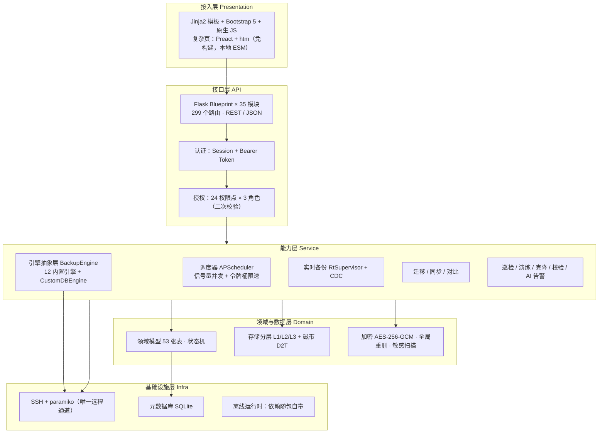

# AIDBM 产品设计说明书

> **AI 原生智能数据库灾备管理平台**
> AI-Native Database Backup & Disaster Recovery Management

| 项 | 内容 |
|---|---|
| 文档版本 | v1.0 |
| 产品版本 | v1.4.8 |
| 编写日期 | 2026-09-16 |
| 文档状态 | 基线发布（基于当前代码实况编写，非规划稿） |
| 配套文档 | `docs/design_philosophy_20260916.md`（设计思想）、`README.md`（用户视角功能总览） |
| 读者 | 产品、架构、研发、测试、交付与运维 |

> **本文的诚实约定**：所有模块、能力、数据均取自当前代码与实际测试记录；**未实现或仅部分实现的，一律在 §12 明示，不以"规划中"含糊带过**。凡引用性能数据，均标注实测来源。

---

## 1. 产品定位

### 1.1 一句话定义

面向**国产化与异构数据库混合环境**的企业级灾备管理平台，在**完全离线**环境下，以**服务端集中、客户端零安装**的方式，提供备份、恢复、PITR、迁移、同步、对比、克隆、演练、巡检与 AI 告警的一体化能力。

### 1.2 目标场景与边界

| 维度 | 定位 |
|---|---|
| 目标客户 | 政企、金融、能源等内网 / 隔离网环境；信创改造中多数据库并存的组织 |
| 部署形态 | 单机部署（当前）／Docker 单机（当前）／离线交付包（当前） |
| 保护对象 | 关系型（Oracle / MySQL / MariaDB / PostgreSQL / 金仓 / 达梦 / SQL Server）、NoSQL（Redis / MongoDB / Neo4j）、文件、虚拟机（PVE / KVM / ESXi / Hyper-V） |
| 非目标 | 不做存储底层（不替代 SAN/分布式存储）、不做数据库高可用（不替代主从/集群软件）、不做通用 ETL |

### 1.3 产品化目标（"标准化产品"的定义）

"标准化产品"在本平台语境下拆为 **6 条可验收标准**，每条在 §12 给出当前达成度：

| 编号 | 标准 | 含义 |
|---|---|---|
| S1 | **可复制交付** | 一个安装包在任意目标环境得到一致结果，不依赖实施人员个人经验 |
| S2 | **可预期运维** | 有健康检查、日志规范、指标、容量预测、升级路径 |
| S3 | **可验证质量** | 自动化测试覆盖核心链路，有回归基线与发布门禁 |
| S4 | **可管控安全** | 认证、授权、加密、审计四要素齐备且默认开启 |
| S5 | **可扩展兼容** | 新增数据库类型、新增存储后端不需改核心代码 |
| S6 | **可演进架构** | 支持从单机走向高可用而不推翻重来 |

---

## 2. 设计思想（摘要）

完整版见 `docs/design_philosophy_20260916.md`。此处仅列纲，便于理解后续设计：

1. **真实优先于好看** —— 不做仿真兜底，失败要如实失败（最高优先级）
2. **客户端零安装** —— 一切依赖在平台侧，数据库服务器零 agent
3. **离线自足** —— 运行时零联网，前端零构建
4. **可插拔优于硬编码** —— 新增数据库类型优先零代码
5. **契约先于实现** —— 跨层只通过显式契约通信
6. **能力声明优于乐观假设** —— 不支持就显式拒绝，不静默降级
7. **远端优先、本机回退** —— 双路径执行
8. **失败必须可读** —— 错误要带原因与修复指引
9. **安全内建** —— 凭据不入 argv、加密与权限默认开启
10. **可观测优先于"能跑"** —— 全链路留痕
11. **约束驱动的克制** —— 引入新依赖门槛极高

**裁决顺序**：真实优先 > 客户端零安装 > 离线自足 > 安全 > 可读/可观测 > 可插拔 > 性能体验 > 开发便利。

---

## 3. 总体架构

### 3.1 分层架构



### 3.2 技术选型（及选型理由）

| 层 | 选型 | 理由 | 代价（诚实标注） |
|---|---|---|---|
| 后端框架 | Flask | 轻量、依赖少、易被 PyInstaller 打包 | 无异步原生支持 |
| 元数据库 | **SQLite** | 零外挂依赖，契合离线与单机交付 | **单机写入、无法横向扩展、无 HA**（见 §12 G1） |
| 调度 | APScheduler（进程内） | 免中间件 | **不支持多节点分布式调度**（见 §12 G2） |
| 远程通道 | SSH + paramiko | 唯一通道，契合零安装 | 吞吐受网络约束 |
| 前端 | Jinja2 + Bootstrap 5 + 原生 JS | 零构建、离线可用 | 交互能力弱于 SPA |
| 复杂页 | Preact + htm（本地 ESM） | 组件化体验，零构建 | 仅 1 个页面试点 |
| 图表 | 内联 SVG | 零 CDN 依赖 | 图表能力需手写 |
| 打包 | PyInstaller + 离线 bundle | 完全离线交付 | 包体积较大 |

### 3.3 运行时进程模型

- 单进程（`start.sh` 启动 Flask + 进程内 APScheduler）；
- Web 多线程（`WEB_THREADED=1`），SQLite 连接 `timeout=30` + `busy_timeout=30000`；
- 备份执行在线程池，受全局信号量 `max_concurrent_backups`（**默认 2**）限流；
- 文件备份任务 `db_type=file` 立即返回 `202 Accepted` + 后台线程执行；
- 实时备份由 `RtSupervisor` 守护，配合 `rt_supervisor.lock` 的 flock 保证单实例。

---

## 4. 功能模块设计

### 4.1 模块矩阵

| 域 | 模块 | 核心文件 | 关键能力 |
|---|---|---|---|
| 备份 | 引擎抽象 | `core/engines/base.py` | 契约定义、压缩、限速、远端/本机双路径 |
| 备份 | 12 引擎 | `core/engines/*.py` | 见 §5.2 |
| 备份 | 自定义脚本 | `core/custom_scripts.py` | 全类型通用，`PLATFORM_*` 变量注入 |
| 备份 | 调度 | `core/scheduler.py` | cron / interval / 混合双调度 |
| 备份 | 策略 | `core/policy.py` | 保护策略、并行度 |
| 存储 | 存储管理 | `core/storage.py` | 生命周期、保留（份数+天数取严） |
| 存储 | 后端 | `core/storage_backends/` | local / minio / s3 / tape |
| 存储 | 分层复制 | `core/tier_replication.py` | L1→L2→L3→D2T 异步级联 |
| 存储 | 重删 | `core/global_dedup.py` | 分块 sha256 + 引用计数 |
| 存储 | 加密 | `core/crypto_pool.py` | AES-256-GCM 信封式，KMS 可插拔 |
| 恢复 | 恢复 | `core/engines/*`、`core/cross_host.py` | 本机/远端/跨主机恢复 |
| 恢复 | 恢复校验 | `core/restore_verify.py` | 深度校验（impdp SQLFILE / RMAN VALIDATE） |
| 恢复 | 演练 | `core/drill.py` | 定期演练计划与报告 |
| 实时 | RT 守护 | `core/rt_backup/`、`core/rt/` | 守护、恢复点、PITR |
| 实时 | CDC | `core/cdc/` | binlog / WAL / LogMiner / LogMnr 捕获 |
| 数据 | 迁移 | `core/db_migrate.py`、`core/migration.py` | precheck→migrate→verify→report |
| 数据 | 同步 | `core/sync/` | 全量/增量/实时/离线摆渡 |
| 数据 | 对比 | `core/data_compare.py` | 结构与数据比对 |
| 数据 | 摆渡 | `core/ferry_inbox.py` | 单向网闸场景 |
| 运维 | 巡检 | `core/inspection.py` | 周期巡检与记录 |
| 运维 | AI | `core/ai_agent/`、`core/ai_alert.py` | 会话式助手、风险预测、修复建议 |
| 运维 | 克隆 | `core/clone_service.py` | VDB 克隆（免审批直通） |
| 运维 | 容灾链路 | `core/disaster_link.py` | 链路真实检查（非模拟） |
| 平台 | RBAC | `core/rbac.py` | 24 权限点 × 3 角色 |
| 平台 | 审计 | `core/oplog.py`、`system_logs` | 操作留痕 |
| 平台 | 可插拔 | `core/db_adapters.py` | 界面新增数据库类型 |
| 平台 | 插件 | `core/plugin_catalog.py` 等 | 服务端插件市场、离线包安装 |
| 平台 | 资产 | `core/asset_inventory.py` | 资产盘点 |
| 平台 | 脱敏 | `core/sensitive_scan.py`、`core/synthesize.py` | 敏感扫描、数据脱敏导出 |
| 平台 | 虚拟机 | `core/vm/` | 纳管/保护策略/恢复点/还原/SureBackup 式验证 |

### 4.2 备份任务执行链路（已核对代码）

```
APScheduler job(task_<id>) → _job_wrapper → run_task_now
  └─ _execute_backup(信号量 acquire)
     └─ _execute_backup_core
        1. policy_service.resolve(task)            策略与并行度
        2. set_task_status("running") + create_record(status="running")
        3. oplog.OperationLog(kind="backup")       留痕开始
        4. get_engine(db_type, task, ...)          引擎解析（三级查找）
        5. engine.preflight()                      客户端/工具/脚本前置检查
        6. remote_dump.set_task_env_export()       任务级环境变量注入
        7. engine.run_backup(bt)                   执行（自定义脚本 / 原生）
           └─ _try_remote_then_local(远端, 本机) → 产物拉回（流式/断点续传）
              → pipe_compress(zstd > gzip) → 落盘
        8. BackupResult 回收集（size/checksum/duration/CDC 基线）
        9. UPDATE backup_records（status/size/path/checksum/compress_*）
       10. capture_*_cdc  CDC 位点更新
       11. _verify_backup() → mark_record_verified()
       12. set_task_status(finished, status)
       13. 避峰治理 + 限速 → upload_to_remote（二级存储）
           → apply_retention（份数+天数取严）→ replicate_async（L2/L3/D2T）
       14. 邮件/通知 + webhook + object_catalog 对象清单（供表级恢复）
       15. oplog.close()
     finally: 信号量 release
```

---

## 5. 领域模型设计

### 5.1 数据域划分（53 张表，按域归类）

| 域 | 表 |
|---|---|
| 任务与策略 | `backup_tasks`、`protection_policies`、`rt_tasks`、`backup_objects` |
| 记录与产物 | `backup_records`、`restore_records`、`backup_sets`、`recovery_journal`、`log_repository`、`rt_capture_state` |
| 存储 | `storage_targets`、`dedup_index`（生命周期策略由 `core/lifecycle.py` 驱动，无独立表） |
| 恢复与验证 | `restore_verify_policies`、`restore_test_reports`、`drills` |
| 实时 / CDC | `cdc_streams`、`cdc_events`、`recovery_journal` |
| 迁移同步 | `migration_plans`、`db_migration_plans`、`sync_tasks`、`sync_records` |
| 数据对比 | `data_compare_tasks`、`data_compare_reports` |
| 主机与资产 | `ssh_hosts`、`deployments`、`plugin_host_state`（资产盘点由 `core/asset_inventory.py` 计算，无独立表） |
| 灾备与克隆 | `disaster_links`、`clone_requests`、`vdb_instances` |
| 虚拟机 | `vm_hypervisors`、`vm_protected`、`vm_recovery_points`、`vm_jobs` |
| AI 与告警 | `ai_sessions`、`ai_messages`、`alert_predictions` |
| 运维 | `inspection_records`、`system_logs`、`system_config`、`itsm_tickets`、`hetero_jobs`、`anonymized_exports`、`data_scan_results` |
| 平台 | `users`、`db_adapters`、`api_tokens` |

> 说明：部分表在 `core/db.py` 中存在幂等的重复建表语句，去重后约 50 张实体表。元数据全部集中定义于 `core/db.py`，`init_db.py` 负责初始化。

### 5.2 核心状态机

| 实体 | 状态取值 |
|---|---|
| 备份记录 | `running` → `success` / `failed` / `simulated`（仿真已不产生） |
| 引擎返回 | `BackupStatus`：success / failed / simulated / running |
| 迁移计划 | `created` → `checking` → `migrating` → `verifying` → `completed` / `failed` |
| 克隆请求 | `pending` → `creating` → `ready` / `failed` |
| 虚拟机作业 | 由 `vm_jobs` 承载，恢复点见 `vm_recovery_points` |
| 实时任务模式 | `rt_mode ∈ {file_watch, db_cdc, mixed}` |

### 5.3 关键关系

- 一个 `backup_task` → 多条 `backup_records`（每次执行一条）；
- 多条 `backup_records` → 一个 `backup_set`（备份集，含 `synthetic_full` 合成全量）；
- 增量链：`backup_set.chain_status`（`merged` 表示已并入合成全量）；
- `recovery_journal` 记录实时备份的恢复点链，供 PITR 使用；
- `dedup_index` 以块 hash 建立全局引用，实现跨任务重删。

---

## 6. 关键机制设计

### 6.1 引擎抽象与可插拔

**抽象基类契约**（`core/engines/base.py`）：

| 类别 | 内容 |
|---|---|
| 必须声明 | `db_type`、`display_name`、`adapter_tier`、`required_clients`、`physical_bundled_tools`、`physical_external_plugins`、可选 `tool_check_user` |
| 必须实现 | `backup(backup_type)`、`restore(path, **kw)`、`synthesize_full(sets, tier, record_id)` |
| 可选覆盖 | `list_sets()`、`verify_record()`、`check_client()`、`preflight()`、`list_databases()` |
| 统一入口 | `run_backup()` / `run_restore()`（自动分流自定义脚本通道） |
| 公共设施 | 压缩（zstd>gzip）、限速（令牌桶+避峰）、网络重试（指数退避）、远端/本机双路径、`PLATFORM_*` 变量注入 |
| 唯一返回契约 | `BackupResult` dataclass |

**支持的数据库类型**（12 内置 + N 自定义）：

| 引擎 | 逻辑备份 | 物理备份 | 增量 | 备注 |
|---|---|---|---|---|
| MySQL | ✅ mysqldump | ✅ xtrabackup（推送式） | ✅ | 捕获 binlog 基线 |
| MariaDB | ✅ | ✅ mariabackup / xtrabackup-24 | ✅ | 自动跳过 `--set-gtid-purged` |
| PostgreSQL | ✅ pg_dump | ✅ pg_basebackup | ✅ | 捕获 WAL LSN |
| Oracle | ✅ expdp/impdp（含传统 exp/imp） | ✅ RMAN | ✅ | `tool_check_user="oracle"`，11g/19c 兼容 |
| Kingbase 金仓 | ✅ sys_dump | ✅ sys_basebackup | full | `tool_check_user="kingbase"` |
| Dameng 达梦 | ✅ dexp/dimp | ✅ dmrman | ✅ | `tool_check_user="dmdba"` |
| SQL Server | ✅ T-SQL via sqlcmd | ❌ | ✅(.trn) / diff(.diff) | 支持 Windows/Linux |
| Redis | ✅ `--rdb` 快照 | ❌ | 降级 snapshot | 流式拉回 |
| MongoDB | ✅ mongodump | ❌ | — | |
| Neo4j | ✅ 三通道 | ❌ 显式拒绝 | 仅企业版在线通道 | `preflight` 不静默降级 |
| File | — 文件级 | — | ✅ | 快照命名空间隔离 |
| VM | — API/SSH | — | 恢复点 PITR | 惰性注册 |

**自定义适配器**：用户在「数据库类型」页填写 7 类脚本模板 + 能力声明 → `build_engine_class()` 动态生成 `CustomDBEngine` → 注入注册表 → 与内置引擎同链路。校验规则：`db_type` 匹配 `^[a-z][a-z0-9_]{1,31}$`、不得占用内置类型、至少一条备份脚本、`backup_modes ⊆ {logical, physical}`。

### 6.2 调度机制

| 项 | 设计 |
|---|---|
| 框架 | APScheduler `BackgroundScheduler`（进程内单例） |
| 触发器 | `cron`（支持 `schedule_days` 覆盖 day_of_week）/ `interval` |
| 混合备份 | 拆为 `task_<id>_full` 与 `task_<id>_incremental` 两个 job |
| 错过执行 | `misfire_grace_time=3600`（停机 1 小时内补跑一次） |
| 并发控制 | 全局信号量 `max_concurrent_backups`（默认 2，配置变更自动重建） |
| 带宽治理 | 全局令牌桶 `bandwidth_cap_mbps` + 避峰窗口 `peak_hours` |
| 重载保护 | `_reload_lock` + 序号合并，批量建删任务 N 次重建合并为 1 次 |
| 内置周期任务 | 全局巡检、生命周期流转、克隆过期、AI 告警、演练、恢复验证、数据比对、合成全量、GFS 保留、摆渡、RT 守护及 3 个 RT 周期任务 |

> **已知缺口**：无 per-task 互斥锁（同一任务重叠触发仅靠全局信号量间接限流）——见 §12 G3。

### 6.3 存储与数据保护

- **分层**：L1（本地/MinIO 热）→ L2（S3 冷）→ L3（本地导出）→ D2T（磁带）；`StorageBackend` 抽象统一 `put/get/delete/get_info`；
- **复制**：`tier_replication.replicate_async()` 异步级联；目录型产物（xtrabackup 备份集）先 `tar.gz` 打包再复制，临时包用完即删；
- **保留**：份数与天数**取严者**；GFS 保留策略（`core/retention_gfs.py`）；
- **重删**：`global_dedup` 分块 sha256 + 引用计数；
- **加密**：`crypto_pool` AES-256-GCM 信封式，密钥来源环境变量 / 系统设置 / 外部 KMS；
- **对象清单**：`object_catalog` 扫描产物内部对象，支撑表级恢复。

### 6.4 实时备份（准 CDP）

- 守护：`RtSupervisor` + flock 单实例保证；
- 模式：`file_watch` / `db_cdc` / `mixed`；
- 真实日志流捕获支持：MySQL / MariaDB（binlog）、PostgreSQL（WAL）、Oracle（LogMiner）、Kingbase、Dameng（LogMnr）；
- 环境不支持时降级为 `SimulatedCDCDaemon`，**必须写入 `degrade_reason`** 并在界面可见；
- 恢复点落 `log_repository`，`recovery_journal` 组链，支持任意时间点恢复（PITR）。

### 6.5 安全设计

| 面 | 设计 |
|---|---|
| 认证 | Session（默认 8 小时超时）+ Bearer Token（API） |
| 口令 | PBKDF2-HMAC-SHA256，20 万轮迭代；失败 5 次锁 15 分钟 |
| 授权 | 24 权限点 × 3 角色（admin / operator / viewer），菜单收敛 + **API 层二次校验** |
| 凭据 | 一律环境变量或文件方式执行，**不进 argv**；SSH 凭据 `ssh_cred` 加密存储 |
| 加密 | 产物 AES-256-GCM 信封式加密，KMS 可插拔（**只防读，不防删/改**） |
| 不可变 | ❌ **当前无**：无保留锁定、无产物写保护、无周期完整性复检（见 §12 G13；方案见 `docs/benchmark_acronis_20260916.md` §5 P0） |
| 审计 | `oplog` 操作日志（上下文/阶段/命令/退出码）+ `system_logs` |
| 脱敏 | `sensitive_scan` 敏感扫描、`synthesize` 脱敏导出 |
| 已知坑（已固化） | MySQL 走 `MYSQL_PWD` 必须 `--no-defaults`；`sqlcmd` 必须 `-b` |

### 6.6 离线交付

- `scripts/offline/make_bundle.sh` 构建自包含离线包（镜像 + wheelhouse + 应用 + 安装器）；
- `scripts/offline/install.sh` 安装、`scripts/offline/healthcheck.sh` 健康检查；
- `backup_platform.spec` PyInstaller 打包；
- 依赖随包：JDBC jar、JRE、原生驱动、备份工具离线包、前端本地 ESM；
- 部署后自检脚本核对 8 项原生驱动 / JDBC 包 / JRE，输出缺失项与离线安装指引。

---

## 7. 接口设计

### 7.1 现状

| 项 | 现状 |
|---|---|
| 风格 | REST + JSON，Flask Blueprint（35 个模块，**299 个路由**） |
| 认证 | Session（Web）+ `Authorization: Bearer <token>`（外部调用，`api_tokens` 表） |
| 覆盖 | 备份/恢复/记录/任务/存储/主机/同步/迁移/对比/实时/演练/巡检/克隆/告警/用户/插件/数据库类型/虚拟机/磁带/日志 等 |
| 错误语义 | 参数问题 400、唯一性冲突 409、未认证 401、`/api` 异常统一转 JSON（全局 errorhandler） |

### 7.2 接口规范（2026-09-19 已统一，契约全文见 `docs/api_conventions.md`）

| 规范项 | 要求 | 当前状态 |
|---|---|---|
| 命名 | `/api/v1/<复数资源>[/<id>[/<动作>]]`，小写 kebab-case | ✅ `/api/v1` 与 `/api` 各 **249** 条路由；规则 R1–R3 已进门禁；存量 8 条历史名单数走**规范别名**收敛（`/migration-plans`、`/migration-protection-plans`），基线见 `docs/api_naming_baseline.md` |
| 分页 | `page/size`（推荐）+ `limit/offset`（兼容自动换算），上限 500 | ✅ 统一信封 `{items,total,page,size,has_more}`；`/api/v1` 恒返回，旧 `/api` 保持历史形状（`?envelope=1` 可切） |
| 错误码 | `code/message/details` 三段式 + HTTP 状态 | ✅ `core/error_codes.py` 六域 24 码；**任何** `/api` 错误响应必带 `code`（兜底映射），保留历史 `error` 字段零破坏（G4 已闭环） |
| 版本 | URL 前缀 `/api/v1/` | ✅ 双注册 + 弃用头（`Deprecation` / `Link: rel="successor-version"` / `Warning 299`）+ `X-API-Version`（G5 已闭环） |
| 文档 | OpenAPI 自动生成 | ✅ `GET /api/v1/openapi.json`（OpenAPI 3.0.3）+ 离线文档页 `GET /api/docs`（零 CDN），含 `x-success-envelope`、`x-error-codes` 扩展（G6 已闭环） |

---

## 8. 非功能性设计

### 8.1 性能（实测数据，来源 `docs/stress_test_report_20260915.md`）

| 指标 | 实测值 | 条件 |
|---|---|---|
| 建任务 QPS | 159.5 | 1200 任务、并发 150 |
| 触发备份 | 1200 全部 success | |
| 接口 QPS | 81.8 | 112 个接口压测 |
| 数据校验 | 18/18 通过 | |
| 备份吞吐 | 13~15 个/秒 | 瓶颈是单次固定开销，非并发度 |
| 内存峰值 | RSS 360MB / 线程 172 | |
| 5xx 错误 | 0 | |
| 并发配置建议 | `gunicorn -w 4 --threads 8` | 生产建议 |

> 说明：并发度从 2 提到 16 后 QPS 仍为 14.5，证实瓶颈在单任务固定开销。

### 8.2 可靠性

- 备份执行失败**如实失败**并记录原因，无仿真兜底；
- 断点续传：`BACKUP_RESUME_ENABLED`（默认开，TTL 12h）；
- 网络抖动重试：`BACKUP_RETRY_MAX=3` + 指数退避；
- 空闲超时保护：`BACKUP_IDLE_TIMEOUT=1800`；
- 产物校验：`verify_record()` 校验路径非空 + size>0 + SHA256 比对；
- 恢复校验：逻辑备份真实解析（impdp SQLFILE）、物理备份真实抽取数据文件作硬证据。

### 8.3 兼容性

- 数据库版本（**已真实端到端测试**）：MySQL 5.7/8.0、MariaDB 10.x、PostgreSQL 12~15、SQL Server 2019、金仓 V8/V9、达梦 DM8；
- **Oracle 11g 已真实端到端测试**（2026-09-17，192.168.220.168）：逻辑备份 expdp、物理备份 RMAN、恢复（impdp 真实导入，数据状态真实回退）、实时备份（LogMiner 真实捕获，含 redo/undo SQL）、恢复校验（RMAN `RESTORE VALIDATE` + 真实抽取数据文件；impdp `SQLFILE` 解析 DDL）五类全部通过，报告见 `docs/oracle_11g_e2e_report_20260917.md`；
- **Oracle 19c 仍为例外**：现有凭证只有 19c 连通性实测（`docs/oracle_backup_test_report_2026-08-12.md`）与类型映射冒烟，备份/恢复/RMAN/归档实时链路尚无端到端验证报告——代码已按 11g/19c 差异写了兼容分支（PDB 自动 OPEN、DATA_PUMP_DIR 按 service 连接查询、impdp 非致命错误容错），但 19c 分支未经真实环境闭环验证，不得作为已验证能力对外承诺；
- **Oracle PITR 未验证**：当前实现仅生成恢复脚本、未真实执行，不得承诺时间点恢复能力（见 `docs/feature_manifest_20260917.md` §9）。
- 客户端工具：动态发现 + `tool_path` 手动兜底，支持 Windows（cmd）与 Linux；
- 平台运行时：Python 3.10+。

### 8.4 安全

见 §6.5。

---

## 9. 部署设计

### 9.1 支持的部署形态

| 形态 | 说明 | 限制 |
|---|---|---|
| 源码启动 | `python init_db.py` + `bash start.sh` | 需 Python 环境 |
| Docker | `ghcr.io/zhh9126/backup-platform`（镜像含 JRE + JDBC 驱动） | 单机 |
| 离线交付包 | `make_bundle.sh` 构建 + `install.sh` 安装 | 目标 ≤2GB |
| PyInstaller 二进制 | `backup_platform.spec` | 完整打包 |

### 9.2 部署约束（重要）

1. **必须单实例运行**：调度器为进程内 APScheduler，多实例会导致**任务重复调度**；
2. 元数据库为 SQLite，**不支持多节点共享写入**；
3. 启动须用 `bash start.sh`（内置 `CODEBUDDY_SAFE_DELETE_ENABLED=0`，避免工作台 safe-delete 钩子误杀平台进程）；
4. 重启须确认旧进程完全退出——`rt_supervisor.lock` 的 flock 被旧进程占用时，新进程会跳过 RT 守护启动。

---

## 10. 数据一致性设计

### 10.1 一致性策略

- 记录先落 `running` 再更新为终态，避免"执行中无记录"；
- `status` 与 `last_status` 双写，列表展示以终态优先；
- SQLite 开 `busy_timeout` 与 `synchronous=NORMAL` 缓解写竞争（压测 1200 任务未出现 `database is locked`）。

### 10.2 指标口径（产品化要求：口径必须可解释）

以首页健康评分为例，v1.4.8 的口径为：

| 维度 | 权重 | 口径 |
|---|---|---|
| 保护覆盖率 | 25 | 启用任务中有成功备份的比例 |
| 备份成功率 | 30 | 近期成功/总数 |
| 调度配置 | 15 | 有调度的任务比例 |
| RPO 合规 | 20 | 按 `rpo_target_min` 判断 |
| 时效 | 10 | 最近备份新鲜度 |

> 该口径于 2026-09-16 重构：修正了"任务覆盖恒满分"的虚指标，以及 `datetime.utcnow()` 与 `+08:00` 时间戳比较导致的**恒定 8 小时偏差**。修正后评分由 89 降至真实的 64。

**口径披露原则**：所有展示指标必须在文档中说明计算方式，未校验的项需显式标注（如"恢复点数 = 成功记录条数，未逐条校验产物文件是否仍存在"）。

---

## 11. 质量保障设计

### 11.1 测试现状

| 类型 | 内容 |
|---|---|
| 单元测试 | `tests/` 共 32 个测试文件，覆盖 RT 日志、存储、加密、重删、CDC、Neo4j 注册、虚拟机编排、AI 告警等 |
| 基线 | pytest 全量 **526 用例：325 passed / 170 failed / 1 skipped / 30 errors**（绝大多数是缺真实数据库与 SSH 目标的**存量环境失败**，非本次回归；已固化为 `scripts/test_baseline.json`，快速门禁集为其中 145 条确定性用例） |
| 专项 | `test_rt_journal` 48 全过；`test_link_sources_contract` 契约测试；`test_api_contract` 16 条接口契约断言（错误码/分页/版本/OpenAPI/命名） |
| 压力 | `scripts/stress_test_full.py` 六阶段压测（可落盘 JSON 报告） |
| 契约 | 面板脚本依赖元素 id 校验；链路真实检查（非模拟）；前端契约断言走真实 HTTP（含未登录 401 + `AIDBM-1002`） |

> 回归判定方法（重要）：由于存在上述存量环境失败，"pytest 是否全绿"不是有效指标。
> 正确做法是 `git archive HEAD | tar -x -C /tmp/bp_base` 导出干净快照跑同命令比对，
> 或用 `scripts/gate_baseline.py` 与基线比对（失败数不增、通过数不减即零回归）。

### 11.2 质量门禁（2026-09-19 已建立）

入口：`scripts/test_gate.sh`（`--full` / `--ui` / `--all` / `--update-baseline`）

| 门禁 | 状态 |
|---|---|
| 提交前跑测试 | ✅ `scripts/hooks/pre-commit`（`bash scripts/install_git_hooks.sh` 安装）：契约检查 + 快速确定性用例（128 条）+ 覆盖率门槛；`SKIP_GATE=1` 可临时跳过但 CI 仍拦 |
| 覆盖率门槛 | ✅ `--cov-fail-under=17`（core+api，约 3.9 万行），报告 `artifacts/coverage.xml`；**该门槛是当前存量基线，只用于阻止下降**，每次版本须上调（目标每版 +5pt） |
| CI 自动跑测试 | ✅ `.github/workflows/ci.yml`：`contract`（契约+快速集+覆盖率）→ `regression`（全量与基线比对，禁新增失败）→ `frontend`（真实 chromium），结论汇总到 `gate-summary`；镜像流水线依赖该结论（G7 已闭环） |
| 前端自动化测试 | ✅ `scripts/frontend_smoke.py`：`browser` 模式跑真实 chromium（登录 + 全部页面 + 浏览器内 API 断言），`http` 模式无需浏览器用于本地/离线；纳入 CI（G8 已闭环）。本机 glibc < 2.27 跑不了 Playwright 的 Node 驱动，故本地只验证 `http` 模式（不覆盖 JS 运行时错误） |
| 发布前压测 | ⚠️ 仍按需：`scripts/stress_test_full.py` 保留手动触发，未进入自动门禁（真实压测需真实数据库与充足磁盘，暂不适合放进 CI） |
| 元数据库迁移锁 | ❌ 无（见 G1/G2/G3），不属于本轮门禁范围 |

---

## 12. 标准化产品化差距与路线图（诚实清单）

> 本节是"S1–S6 六条标准"的达成度自评。**❌ 表示当前不具备，不做任何含糊表述。**

### 12.1 达成度总表

| 标准 | 达成度 | 说明 |
|---|---|---|
| S1 可复制交付 | ⚠️ 70% | 离线包与 Docker 齐备，但缺乏**版本化升级**与**数据迁移**机制 |
| S2 可预期运维 | ⚠️ 55% | 有健康检查与日志，**无标准化指标导出**、无统一诊断包 |
| S3 可验证质量 | ⚠️ 70% | 2026-09-19 补齐 CI 门禁 + 覆盖率门槛 + 前端自动化 + 契约单测；扣分点：覆盖率**绝对值仍低**（core+api 约 17%）、压测未自动化、全量回归存量失败尚未消化 |
| S4 可管控安全 | ⚠️ 75% | 认证/授权/加密/审计齐备；但**缺不可变与防篡改（G13）**、缺**凭据旋转**与**密钥托管标准化** |
| S5 可扩展兼容 | ✅ 85% | 数据库类型与存储后端均可插拔 |
| S6 可演进架构 | ❌ 30% | **SQLite 单机 + 进程内调度**是高可用的结构性障碍 |

### 12.2 差距清单（G1–G12）

| 编号 | 差距 | 影响 | 建议方向 |
|---|---|---|---|
| **G1** | 元数据库仅 SQLite | 无法 HA、无法横向扩展、写并发上限受限 | 引入元数据库抽象层，支持 MySQL/PostgreSQL 作为元数据库（配置切换，SQLite 仍为默认） |
| **G2** | 调度器进程内 APScheduler | 多实例部署会重复调度；无法水平扩展 | 引入分布式锁或外部调度；至少增加"仅主节点调度"选举 |
| **G3** | 无 per-task 互斥锁 | 同一任务可能被重叠触发 | 增加任务级锁（DB 唯一约束或 Redis 锁） |
| ~~**G4**~~ | ~~无业务错误码体系~~ | — | ✅ **2026-09-19 已闭环**：`core/error_codes.py` 六域 24 码 + `api/contract.py:normalize_response` 归一化钩子，任何 `/api` 错误响应必带 `code/message/details` |
| ~~**G5**~~ | ~~无 API 版本前缀~~ | — | ✅ **已闭环**：`/api/v1` 规范前缀 + `/api` 兼容前缀（RFC 8594 弃用头），同蓝图双注册，249 条路由双双可用 |
| ~~**G6**~~ | ~~无 OpenAPI 文档~~ | — | ✅ **已闭环**：`api/openapi.py` 自动生成 OpenAPI 3.0.3（`/api/v1/openapi.json`）+ 离线文档页 `/api/docs`，零 CDN 依赖 |
| ~~**G7**~~ | ~~CI 未跑测试~~ | — | ✅ **已闭环**：`.github/workflows/ci.yml` 三阶段（契约+覆盖率 / 全量基线比对 / 前端），`scripts/test_gate.sh` 本地同款门禁 |
| ~~**G8**~~ | ~~前端无自动化测试~~ | — | ✅ **已闭环**：`scripts/frontend_smoke.py`（browser 真实 chromium + http 无浏览器双模式），已纳入 CI；本机 glibc < 2.27，本地仅验证 http 模式 |
| **G9** | 无多租户 | 无法一套平台服务多个客户/部门 | 视产品定位决定：若面向单客户交付可标记为 N/A |
| **G10** | 无 License 授权管理 | 无法做版本/容量/时限管控 | 若需商业化，需设计授权与校验机制 |
| **G11** | 无标准化指标导出 | 无法接入 Prometheus/客户监控体系 | 增加 `/metrics` 端点（离线环境也需可采集） |
| **G12** | 无国际化（仅中文） | 限制出海与多语言客户 | 抽取文案资源文件（工作量较大，按需求决策） |
| **G13** | **无不可变备份与防篡改**（无保留锁定、无产物写保护、无周期完整性复检） | 备份可被删除或覆盖，**抗勒索能力存在结构性缺口**（加密只防读、不防删） | 见 `docs/benchmark_acronis_20260916.md` §5 P0：保留锁定 + 周期复检 + 产物写保护 + 隔离副本包装 |

### 12.3 建议路线（按依赖顺序）

```
阶段一：工程规范化（低风险、高收益）
  G4 错误码体系 → G6 OpenAPI → G5 API 版本前缀 → G7 CI 跑测试 → G8 前端自动化

阶段二：可运维（面向交付与运维）
  G11 /metrics 指标导出 → 诊断包一键导出 → 统一日志规范 → 升级与回滚方案

阶段三：架构演进（面向高可用，最大工作量）
  G1 元数据库抽象（支持 MySQL/PG）→ G2 调度选举/分布式锁 → G3 任务级锁
  → 达成 S6，支持双节点 HA

阶段四：商业化配套（按市场决策）
  G10 License → G9 多租户 → G12 国际化
```

> 阶段一、二不改变架构，可独立于阶段三推进；阶段三必须在元数据库抽象完成后才能做调度层改造，否则会出现"调度已分布式、元数据仍单机"的错配。

---

## 13. 附录

### 13.1 术语表

| 术语 | 含义 |
|---|---|
| L1/L2/L3/D2T | 一级热存储 / 二级冷存储 / 三级本地导出 / 磁带归档 |
| 合成全量（synthetic full） | 由全量 + 增量链合并生成的新的全量备份集 |
| PITR | 任意时间点恢复（Point-In-Time Recovery） |
| CDP / 准 CDP | 持续数据保护；本平台实时备份为准 CDP |
| GFS 保留 | Grandfather-Father-Son 多周期保留策略 |
| VDB | 虚拟数据库，由备份产物快速克隆出的可读写实例 |
| 信封式加密 | 数据密钥加密数据、主密钥加密数据密钥的两层结构 |
| CustomDBEngine | 由脚本模板动态生成的自定义数据库引擎 |

### 13.2 规模一览

| 项 | 数量 |
|---|---|
| 数据表 | 53（去重后约 50） |
| API 路由 | 299 |
| 内置数据库引擎 | 12（+ 自定义适配器 N） |
| 权限点 | 24（× 3 角色） |
| 核心模块 | `core/` 约 60 个模块 |
| 测试文件 | 32 |

### 13.3 关键文件索引

| 关注点 | 文件 |
|---|---|
| 引擎契约 | `core/engines/base.py` |
| 引擎注册 | `core/engines/__init__.py` |
| 自定义类型 | `core/db_adapters.py` |
| 调度 | `core/scheduler.py` |
| 数据模型 | `core/db.py`、`core/models.py` |
| 存储 | `core/storage.py`、`core/storage_backends/`、`core/tier_replication.py` |
| 加密/重删 | `core/crypto_pool.py`、`core/global_dedup.py` |
| 权限 | `core/rbac.py`、`auth.py` |
| 配置 | `config.py` |
| 离线 | `scripts/offline/`、`backup_platform.spec` |

---

**文档维护**：本说明书随版本演进更新；架构或口径发生变化时，**必须同步修订 §5（领域模型）、§8（非功能）、§12（差距）三节**，避免文档与代码脱节。
